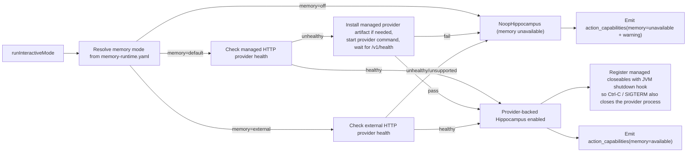
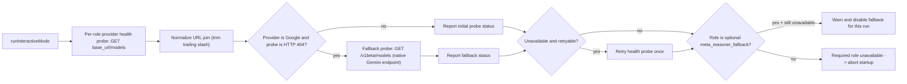
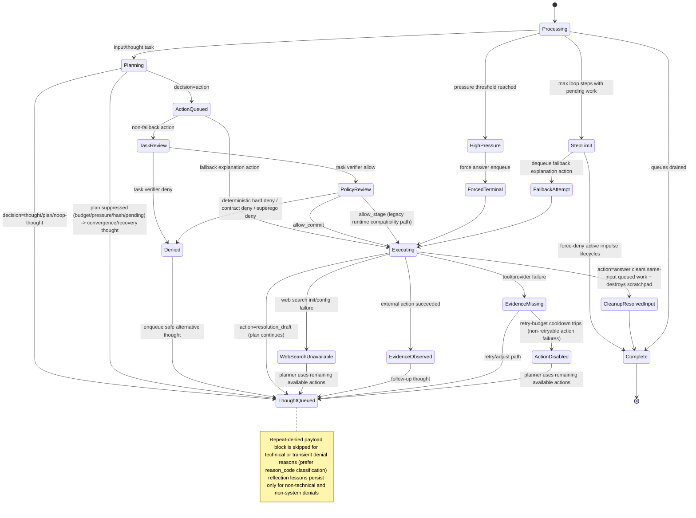
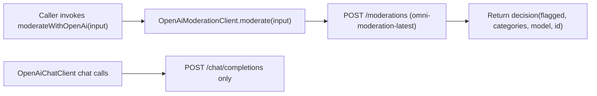

# Agent Logic Diagram (Living Document)

This file complements `AGENT_LOGIC_SUMMARY.md` with simple, editable Mermaid diagrams.
Keep diagrams high signal: small, readable, and updated as runtime logic evolves.

## 1) Component View

```mermaid
flowchart LR
    U["User / Web UI"] --> SC["SensoryCortex (typed cognitive stimuli ingress)"]
    TG["Telegram Owner Chat"] --> TWH["TelegramWebhookBridge"]
    TWH --> SC
    SC --> E["Ego Orchestrator"]
    NoteCtx["ConversationContext(sessionId required, unknown interlocutor resolved at sensory boundary, security context carried end-to-end)"] --> SC

    E --> AS["AttentionScheduler"]
    AS --> E
    ID["Id (Autonomous Drives)"] --> AS
    E --> ID

    E --> P["LlmEgoPlanner"]
    P --> GBR["Goal-Creation Branch"]
    P --> AV["Action Verifier LLM Call"]
    E --> TV["DecisionVerifier (Deterministic Task Gate)"]
    E --> S["Superego"]
    S --> S1["SingleStage Review Engine"]
    S --> S2["TwoStage Escalation Engine"]
    E --> ACP["ActionAuthorizationPolicy (YAML)"]
    E --> ACS["ActionControlService"]
    E --> ACW["ActionControlAutonomousWorker"]
    ACS --> ACDB["ActionControl SQLite (staged / auth / receipts)"]
    ACW --> ACS
    E --> AR["ActionRegistry (ServiceLoader Discovery)"]
    AR --> CR["Connector Runtime (curated catalog + local install state + stdio host)"]
    E --> M["MotorCortex"]
    E --> BG["LLM Token Budget Gate"]
    E --> MCat["Model Catalog (ROI token_weight)"]

    E --> DE["DeliberationEngine"]
    DE --> MR["LlmMetaReasoner"]
    MR -.-> MRF["MetaReasoner Fallback Model (optional, repeated technical failures: empty-content or schema-validation)"]

    E --> MC["MemorySystem"]
    MC --> MS["MemoryStore (Short-term)"]
    MC --> H["Hippocampus (Long-term facade: recall/imprint/health/consolidate stub)"]
    MC --> LTM["LlmLongTermMemoryAdvisor"]
    MC --> LB["Logbook (Episodic backend, SQLite+FTS5, grouped under long-term domain)"]
    LB -.->|"event-type narrative normalization: User timeline vs agent first-person memory/reflection"| MC
    MC --> RL["Reflection Lessons (Recall + Imprint Filters)"]
    MC -.->|"temporal intent → episodic recall + vector cues"| LB
    E --> TWS["ScratchpadStore (Ephemeral Per Request)"]
    E --> TWF["ScratchpadFinalizer (Noop or LLM)"]
    E --> PG["GoalsGateway (optional goal runtime boundary)"]
    PG --> PM["GoalManager / Goal Runtime"]
    PM --> PP["GoalPlanner"]
    PM --> PV["GoalStepVerifier"]
    PM --> AOR["AsyncOperationRegistry"]
    PM --> PS["GoalStateMachine + GoalStore"]

    AR --> AP["Action Plugins (self-described)"]
    CR --> AP
    AP --> M
    Note over CR,AP: Connector bundles are install presets only; goals compose primitive actions rather than executing bundle workflows directly
    AP -.->|"Actions emit structured effects; REFLECT emits durable-memory-save only on successful persistence"| MC

    M --> WS["Web Search Handler/Engine"]
    CfgWS["WebSearch Provider Config (provider/key/base/model)"] --> WS
    M --> MT["MCP Time Tool"]
    M --> MF["Fetch Tool"]
    M --> EM["Email Send (Microsoft Graph)"]
    M --> COG["ConversationOutputGateway"]
    COG --> TGA["Telegram Bot API"]
    WS --> PID["PromptInjectionDefense"]
    MT --> PID
    MF --> PID
    PID --> E

    BG --> P
    BG --> S
    BG --> MR
    BG --> LTM
    BG --> WS
    MCat --> S
    MCat --> LTM

    E --> I["InstrumentationBus + Metrics"]
    I --> DS["DashboardStateStore"]
    DS --> CP["Conversations Page (`/`) + Chat API (`/api/chat/*`)"]
    DS --> OP["Observability Page (`/dashboard`) + Obs API (`/api/obs/*`)"]
    DS --> OX["Action Control Page (`/action-control`)"]
    DS --> ACAPI["Action Control API (`/api/action-control/*`)"]
    Note over OX,ACAPI: Action control UI defaults to SIGNAL activity items and can opt into BACKGROUND or TRACE ledger visibility
    Note over TG,TWH: Telegram ingress is owner-only: POST webhook + shared secret + direct-chat restriction + owner chat/user allowlist
```

## 2) Loop Sequence (Per Input)

```mermaid
sequenceDiagram
    participant User
    participant SC as SensoryCortex
    participant Ego
    participant Sched as AttentionScheduler
    participant Planner as LlmEgoPlanner
    participant Sup as Superego
    participant Motor as MotorCortex
    participant Delib as DeliberationEngine
    participant Mem as MemorySystem
    participant TWS as ScratchpadStore
    participant Dash as DashboardStateStore/API

    User->>SC: Web chat input text
    SC->>Ego: StimulusReceived (linguistic stimulus)
    Note over SC,Ego: Stimulus carries ConversationContext(sessionId + security), provenance, rootInputId(identity), receivedAtMs(timing)
    Ego->>Sched: enqueue input opportunity

    loop While pending work and step limit not reached
        Ego->>Sched: nextTask()
        Sched-->>Ego: opportunity/thought/action
        Ego->>Ego: activateSession(task.conversationContext)
        Ego->>Delib: startStep()

        alt Task = impulse opportunity
    Note over Ego,Mem: Id-driven recall/planning can see shared ambient context: goals, scratchpad themes, useful updates, open loops, and recent exact learning topics
    Note over Ego,Mem: Ambient context is a cached best-effort snapshot, not a real-time synchronized view
            Ego->>Planner: decide(context + idState)
            Planner-->>Ego: thought/action/plan/noop
            Ego->>Sched: enqueue impulse-derived work with origin=ID
            Note over Ego,Sched: Impulse final result is deferred until all work for root_impulse_id drains
        else Task = goal-work opportunity
            Ego->>PG: finalizeGoalCycle(rootInputId) after queues drain for that goal root
            Note over Ego,PG: Goal runtime writes context/scratch/artifacts and may re-emit a goal runtime cue for resumable steps
        else Task = input opportunity or thought
            Ego->>Mem: recall and short-term summary
            Note over Ego,Mem: Planner context now includes targeted reflection-lesson recall
            Ego->>TWS: create or update request scratchpad and index summary
            Ego->>Dash: emit scratchpad_head (with optional debug snapshot)
            Note over Ego,Planner: For Id-origin thoughts, Ego reapplies Id convergence state and action filtering before planner decide
            Note over Ego,Planner: Planner-visible actions are prefiltered by conversation instruction trust and action contract metadata before prompt build
            Ego->>Planner: decide(context)
            Note over Ego,Planner: PromptBudgetAllocator reserves required-core/context floors with message-overhead accounting, trims optional first, and emits prompt_budget_allocation
            Note over Ego,Planner: Planner prompt includes conversation security summary and trigger provenance summary untrusted external content is framed as data, not instruction
            Note over Ego,Planner: Obvious persistent reminder / monitoring / goal-creation inputs route into a dedicated goal-creation branch before the generic planner path
            Note over Ego,Planner: Goal-creation branch uses a narrow schema prompt plus deterministic recurring schedule detection for supported forms like every N minutes / every N hours
            Note over Ego,Planner: Planner requests schema-enforced structured output the LLM layer owns compatibility degradation (strict json_schema -> relaxed json_schema -> prompt-only JSON) parse failures still do truncation-budget retry then strict-JSON retry before noop fallback
            Planner-->>Ego: thought/action/plan/noop
            Ego->>Delib: maybeApplyPressureOverride
            Ego->>Sched: enqueue thought/action/plan steps
            Note over Ego,Sched: Plans gated by budget → pressure → hash dedup → pending-plan check
            Note over Ego,Planner: Redundancy is planner-side soft cost control (prompt and verifier), with telemetry event external_action_redundancy_signal
            Note over Ego,Planner: Action verifier uses strict json_schema with relaxed-schema fallback parse failures do truncation-budget retry then strict retry and may trip temporary verifier bypass (scoped per root_input and action_type)
            Note over Ego,Planner: Follow-up thoughts carry structured origin metadata (originActionType + observedEvidence) verifier repairs back to the same evidence action are ignored for evidence-backed answers unless user asked refresh/retry no-op verifier repairs collapse to approve
            Note over Ego,Planner: For contact_user, verifier repairs are limited to meaning-preserving surface cleanup; semantic answer rewrites are ignored and the original answer is kept
            Note over Ego,Planner: Verifier rejects now preserve denied action metadata in noop-thoughts repeated non-technical reject of the same answer payload on a follow-up thought is treated as verifier disagreement planner keeps the answer and dispatcher does not re-block it as a normal repeated denied action
            Note over Ego,Planner: Follow-up evidence thoughts explicitly request one raw JSON planner decision and forbid tool/function wrappers
        else Task = action
            alt Fallback explanation action
                Ego->>Motor: execute (bypass Superego)
                Note over Ego,ACS: Bypass execution is still mirrored into durable staged/receipt state
            else Normal action
                Ego->>TV: review(action, evidence/recent dialogue)
                Note over Ego,TV: DecisionVerifier classifies intent + volatility; evidence required only for volatile/unknown factual intents
                alt decision verifier deny
                    TV-->>Ego: deny (with reason_code)
                    Ego->>Sched: enqueue safe-alternative thought
                    Ego->>Mem: maybeRecordReflectionLesson(filtered)
                else decision verifier allow
                    Note over Ego,TV: If volatile evidence is required but tools are unavailable, verifier returns graceful allow (TASK_EVIDENCE_UNAVAILABLE_GRACEFUL)
                    Ego->>Sup: deterministic checks + authorization policy
                    alt deterministic deny
                        Sup-->>Ego: deny (hard deny)
                        Ego->>Sched: enqueue safe-alternative thought
                        Ego->>Mem: maybeRecordReflectionLesson(filtered)
                    else deterministic pass
                        alt action = id-origin reflect
                            Note over Ego,Sup: Internal-only REFLECT bypasses LLM Superego review after deterministic payload validation
                            Sup-->>Ego: allow
                        else all other actions
                            Ego->>Sup: llm review(action)
                            Note over Ego,Sup: Stage-1 uses cheaper model from catalog when two-stage is enabled
                            Note over Ego,Sup: Superego prompt build uses same prompt allocator contract, includes action-origin context, and emits prompt_budget_allocation
                            Note over Ego,Sup: Escalate on low confidence, policy-risk, or technical fallback
                            Note over Ego,Sup: Superego completion max_tokens scales with prompt estimate (bounded floor/hard-cap) and model token_weight
                            Note over Ego,Sup: Structured output is schema-enforced (response_format=json_schema)
                            Note over Ego,Sup: Stage parse failures trigger one schema-enforced retry before default deny
                            Sup-->>Ego: allow or deny (with reason_code on deny)
                        end
                        alt allow
                            alt action = resolution_draft
                                Ego->>TWS: record resolution_draft section (internal chunk)
                                Note over Ego,TWS: Draft chunks are internal only no user-visible assistant turn
                            else action = contact_user
                                Ego->>TWS: final-pass compilation from workspace index/evidence
                                Ego->>TWF: rewrite candidate payload (if enabled)
                                Note over Ego,TWS: Final-pass skip requires both no evidence and insufficient drafts (< max(2, activation_min_plan_steps))
                        Note over Ego,TWF: Apply workspace-confidence gate first, then model-confidence gate
                            end
                            Ego->>ACS: stage / authorize / commit
                            alt stage required
                                ACS->>ACDB: save staged action
                                ACS->>ACDB: save signal/background ledger entry
                                ACS-->>Ego: staged action (`WAITING_AUTHORIZATION` or `READY`)
                                Ego->>Sched: enqueue approval-or-alternative thought
                                Note over ACW,ACS: Background autonomous worker polls SQL-filtered runnable `READY` actions, preserving same-thread order (`threadSequence`) and same-target serialization (`executionKey`) before atomic claim + execute
                            else direct commit allowed
                                ACS->>ACDB: save staged action + authorization
                                ACS->>Motor: execute(action, authorization)
                                Motor-->>ACS: outcome
                                ACS->>ACDB: save receipt + ledger + final staged status
                                ACS-->>Ego: executed outcome
                            end
                            Note over Ego,Motor: Actions may complete immediately or return WAITING + async operation handles
                            Note over Ego,Motor: `contact_user` delivery is channel-aware; Telegram sessions send through Bot API, dashboard sessions continue through local/dashboard delivery
                            Note over Ego,PG: Goal-origin WAITING without handles is rejected as a contract violation
                            Ego->>Ego: PromptInjectionDefense sanitize untrusted tool output
                            alt action = contact_user
                                Ego->>Sched: clear pending thought and action work for same root-session scope
                                Ego->>TWS: capture session digest for resolved input
                                Ego->>TWS: destroy workspace for resolved input
                                Note over Ego,Dash: Workspace telemetry carries root_input_id(identity) and root_input_received_at_ms(timing)
                                Ego->>Dash: drawer reads full snapshots via /api/obs/workspace/{rootId}
                                Ego->>Mem: maybeAssessLongTermMemory(post_terminal_answer, forced)
                            end
                            Ego->>TWS: record non-contact_user/non-resolution_draft action outcomes/evidence
                            Ego->>PG: onActionExecuted / allowFollowUp (generic action lifecycle observer)
                            Ego->>Sched: enqueue follow-up thought (for evidence actions)
                            Ego->>Mem: maybeAssessLongTermMemory(post_allowed_action, optional force)
                            Note over Ego,Mem: Blocked imprints emit long_term_memory_persistence_skipped (reason_code, reason_detail) for timeline visibility
                        else deny
                            Ego->>ACS: save durable denial/refusal ledger entry
                            Ego->>Sched: enqueue safe-alternative thought
                            Ego->>Mem: maybeRecordReflectionLesson(filtered)
                        end
                    end
                end
            end
        end

        Ego->>Delib: maybeForceTerminalAnswer
        Note over Ego,Delib: Deliberation state is session-scoped evidence and circuit state is scoped by root-session
        Note over Ego,Delib: Meta-reasoner output is schema-enforced; repeated empty-content or schema-validation failures can trigger optional fallback endpoint
        Ego->>Mem: maybeAssessLongTermMemory(interval or explicit remember-intent)
        Note over Ego,Mem: Episodic recall filters session/interlocutor only when explicitly requested by user input
        Note over Ego,Mem: Memory-advisor completion max_tokens scales with prompt estimate (bounded floor/hard-cap) and model token_weight
        Note over Ego,Mem: Long dialogue/recall blocks are compressed before advisor prompt
        Note over Ego,Mem: Saved durable memories are normalized to first-person agent perspective before imprint
        Note over Ego,Mem: Episodic logbook entries carry active channel/principal/policy-scope metadata
        Note over Ego,Mem: INTERNAL latest-salient turns switch long-term assessment into self-origin mode; reasons/tags/source are normalized away from user-preference framing
        Note over Ego,Mem: MCP fact/reference subject is stamped as "me" for agent-authored durable memories
        Note over Ego,Mem: Successful learning reflections track exact recent topic fingerprints; only learning retrieval uses them as freshness pressure, while other needs may still reuse the same topic context
    end

    Note over User,SC: Terminal stdin is control-only in interactive mode (exit command), non-command text is not enqueued as chat input
    Note over User,SC: Interactive linguistic ingress currently comes from dashboard chat sessions or owner-only Telegram webhook updates
```

## 2.1) Goals Boundary

```mermaid
flowchart LR
    TS["TimerScheduler"] --> PM["GoalManager"]
    WM["WaitConditionMonitor (timeouts + async poll/event restore)"] --> PM
    AOR["AsyncOperationRegistry / Provider Adapters"] --> WM
    PM --> PSM["GoalStateMachine"]
    PM --> PP["GoalPlanner"]
    PM --> PV["GoalStepVerifier"]
    PSM --> PCS["GoalCommand stream"]
    PCS -->|persist| Store["GoalStore / goal-events.jsonl + goal.json + goal-snapshot.json"]
    PCS -->|work ready| Sig["GoalRuntimeCue"]
    Note over PSM,Sig: Cron-backed goals do not emit initial work-ready on creation; first execution waits for a cron wake
    TS -->|"cron tick after completed/failed recurring goal"| PSM
    PSM -->|"reset plan steps + clear produced keys"| PCS
    Sig --> Ego["Ego"]
    Note over Sig,Ego: Goal work is re-entered with a trusted internal automation conversation/security context
    Ego -->|nextWorkFromCue| PM
    Ego -->|goal-origin action outcomes| PM
```

## 2.5) Interactive Startup Memory Gate



## 2.6) Interactive Startup LLM Provider Health Gate



## 3) Convergence and Fallback States



## 4) OpenAI Standalone Moderation Utility



## Edit Rules
- Keep this file synced with `AGENT_LOGIC_SUMMARY.md`.
- Prefer updating existing diagrams over adding a large monolith.
- If behavior changes, update only affected diagram sections and labels.
