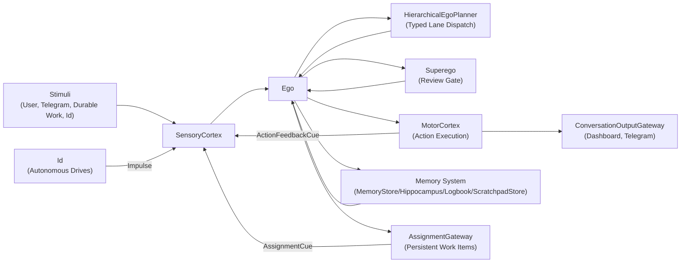
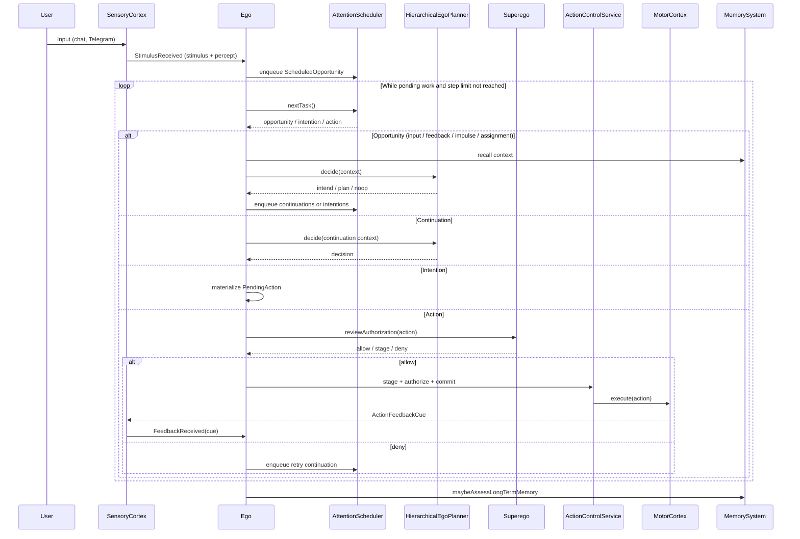

# Agent Logic Diagram (Living Document)

This file complements `AGENT_LOGIC_SUMMARY.md` with small, editable Mermaid diagrams.
Keep this file as the landing page for the diagram set. Put detailed subsystem diagrams in the split docs under `docs/agent-logic/`.

---

## L0: System-Level Component View

High-level view of the major subsystems and their interactions.

---

## L1: Main Loop Sequence (Simplified)

Clean overview of the per-input happy path without subsystem detail.

---

## Diagram Map

Detailed diagrams now live in separate area docs.

| Area | File | Scope |
|---|---|---|
| Input and thread binding | [docs/agent-logic/INPUT_AND_THREADING_DIAGRAM.md](docs/agent-logic/INPUT_AND_THREADING_DIAGRAM.md) | Channel ingress, security/context binding, thread creation, scheduler handoff |
| Planner | [docs/PLANNER_FLOW_DIAGRAM.md](docs/PLANNER_FLOW_DIAGRAM.md) | Typed trigger routing, L1/L2 planner lanes, post-planner dispatch |
| Split ego loop | [docs/agent-logic/EGO_LOOP_DIAGRAM.md](docs/agent-logic/EGO_LOOP_DIAGRAM.md) | Per-input loop split into queueing, planning branches, and completion |
| Action review and execution | [docs/agent-logic/ACTION_REVIEW_AND_EXECUTION_DIAGRAM.md](docs/agent-logic/ACTION_REVIEW_AND_EXECUTION_DIAGRAM.md) | Grounding, superego review, staging, approvals, execution, feedback re-entry |
| Durable work runtime | [docs/agent-logic/DURABLE_WORK_DIAGRAM.md](docs/agent-logic/DURABLE_WORK_DIAGRAM.md) | Assignment boundary, wake reasons, plan ownership, assignment feedback |
| Memory and startup gates | [docs/agent-logic/MEMORY_AND_STARTUP_DIAGRAM.md](docs/agent-logic/MEMORY_AND_STARTUP_DIAGRAM.md) | Memory subsystem wiring, per-loop recall/assessment, startup health gates |
| Convergence and fallback | [docs/agent-logic/CONVERGENCE_AND_FALLBACK_DIAGRAM.md](docs/agent-logic/CONVERGENCE_AND_FALLBACK_DIAGRAM.md) | Pressure, step limits, denial/retry, fallback terminal paths |

---

## Edit Rules
- Keep this file synced with `AGENT_LOGIC_SUMMARY.md`.
- Source of truth is the code, not this document.
- Keep this landing page small; detailed diagrams belong in the split area docs.
- If behavior changes, update only the affected diagrams and links.
