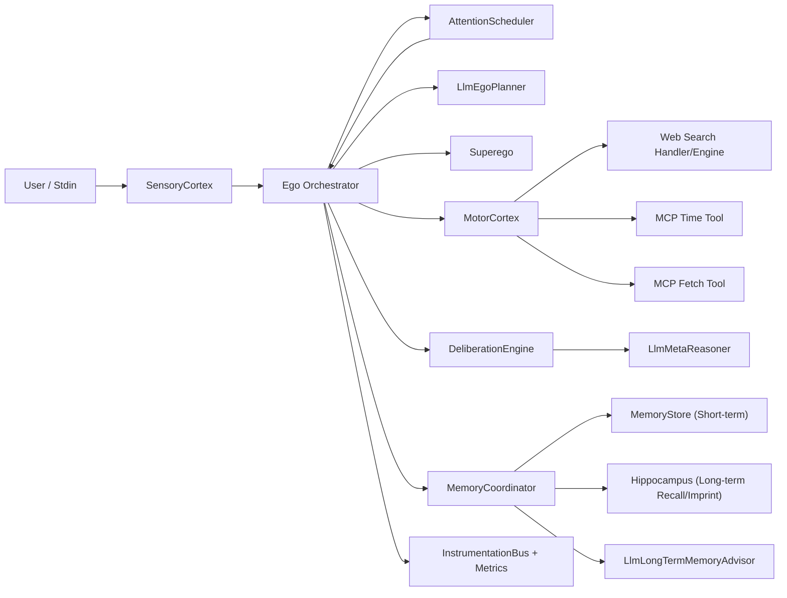
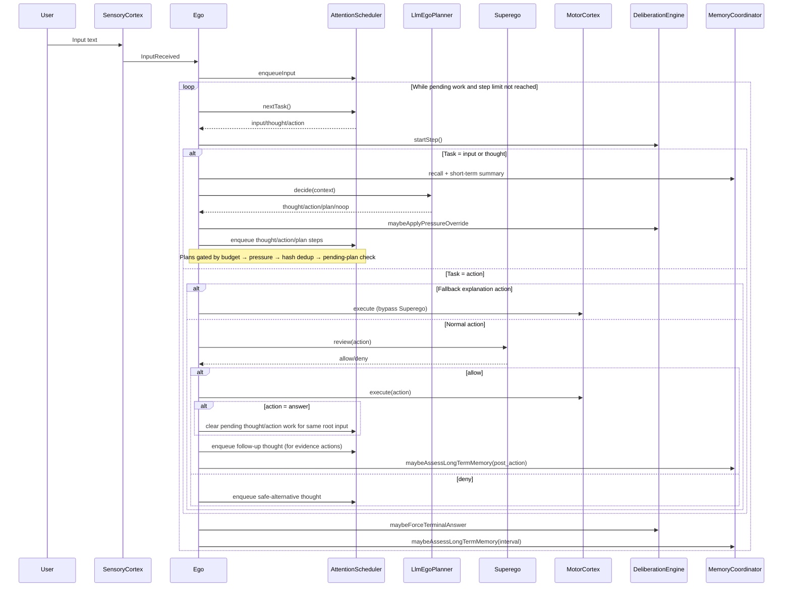
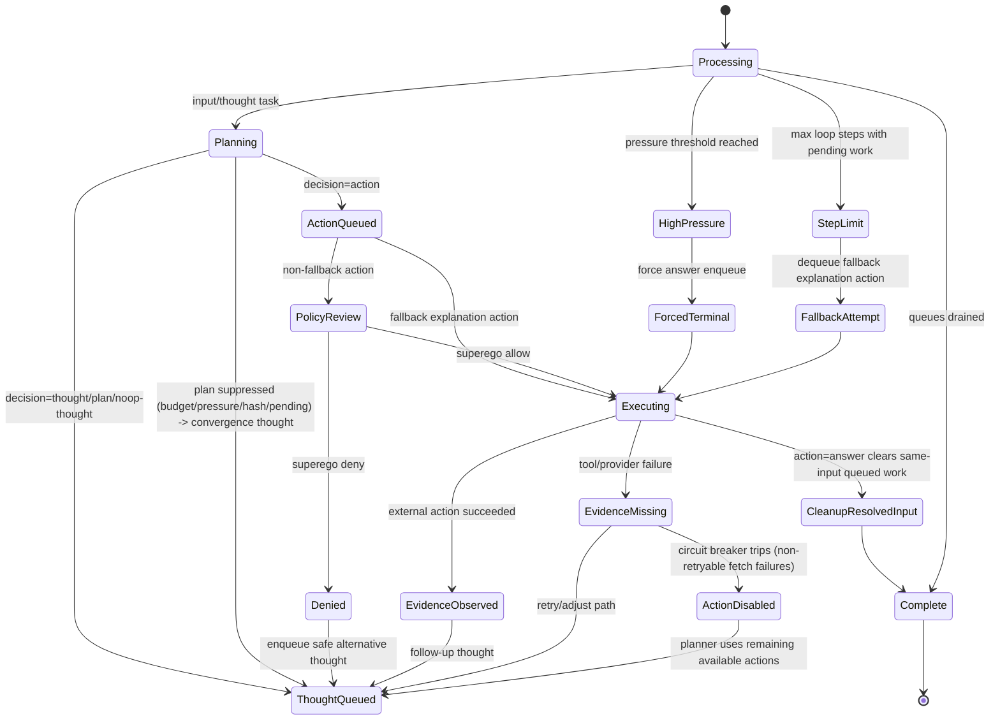

# Agent Logic Diagram (Living Document)

This file complements `AGENT_LOGIC_SUMMARY.md` with simple, editable Mermaid diagrams.
Keep diagrams high signal: small, readable, and updated as runtime logic evolves.

## 1) Component View

## 2) Loop Sequence (Per Input)

## 3) Convergence and Fallback States

## Edit Rules
- Keep this file synced with `AGENT_LOGIC_SUMMARY.md`.
- Prefer updating existing diagrams over adding a large monolith.
- If behavior changes, update only affected diagram sections and labels.
