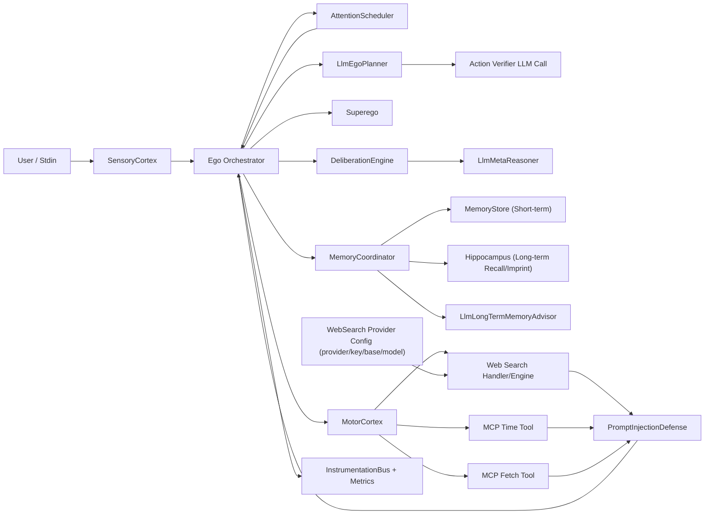
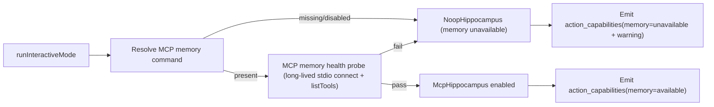
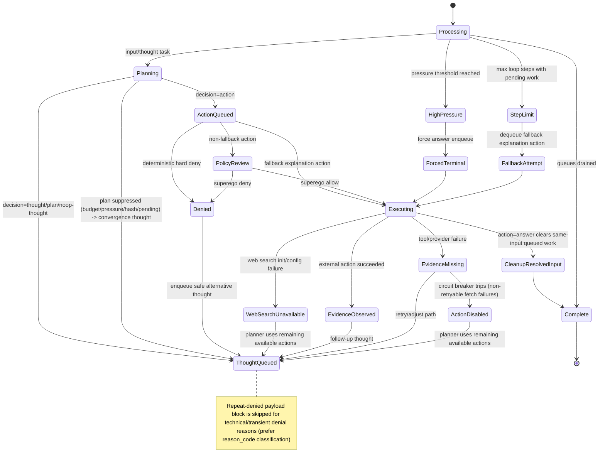

# Agent Logic Diagram (Living Document)

This file complements `AGENT_LOGIC_SUMMARY.md` with simple, editable Mermaid diagrams.
Keep diagrams high signal: small, readable, and updated as runtime logic evolves.

## 1) Component View



## 2) Loop Sequence (Per Input)

```mermaid
sequenceDiagram
    participant User
    participant SC as SensoryCortex
    participant Ego
    participant Sched as AttentionScheduler
    participant Planner as LlmEgoPlanner
    participant Sup as Superego
    participant Motor as MotorCortex
    participant Delib as DeliberationEngine
    participant Mem as MemoryCoordinator

    User->>SC: Input text
    SC->>Ego: InputReceived
    Ego->>Sched: enqueueInput

    loop While pending work and step limit not reached
        Ego->>Sched: nextTask()
        Sched-->>Ego: input/thought/action
        Ego->>Delib: startStep()

        alt Task = input or thought
            Ego->>Mem: recall + short-term summary
            Ego->>Planner: decide(context)
            Note over Ego,Planner: On non-parseable planner JSON, planner issues one strict-JSON retry before noop fallback
            Planner-->>Ego: thought/action/plan/noop
            Ego->>Delib: maybeApplyPressureOverride
            Ego->>Sched: enqueue thought/action/plan steps
            Note over Ego,Sched: Plans gated by budget → pressure → hash dedup → pending-plan check
            Note over Ego,Planner: Action verifier runs after action decisions; parse failures trigger one strict retry and may trip temporary verifier bypass (scoped per root_input + action_type)
        else Task = action
            alt Fallback explanation action
                Ego->>Motor: execute (bypass Superego)
            else Normal action
                Ego->>Sup: deterministic checks
                alt deterministic deny
                    Sup-->>Ego: deny (hard deny)
                    Ego->>Sched: enqueue safe-alternative thought
                else deterministic pass
                    Ego->>Sup: llm review(action)
                    Note over Ego,Sup: Superego parse failures trigger one strict-JSON retry before default deny
                    Sup-->>Ego: allow/deny (+ reason_code on deny)
                    alt allow
                        Ego->>Motor: execute(action)
                        Ego->>Ego: PromptInjectionDefense sanitize untrusted tool output
                        alt action = answer
                            Ego->>Sched: clear pending thought/action work for same root input
                            Ego->>Mem: maybeAssessLongTermMemory(post_terminal_answer, forced)
                        end
                        Ego->>Sched: enqueue follow-up thought (for evidence actions)
                        Ego->>Mem: maybeAssessLongTermMemory(post_allowed_action, optional force)
                        Note over Ego,Mem: Blocked imprints emit long_term_memory_persistence_skipped (reason_code + reason_detail) for timeline visibility
                    else deny
                        Ego->>Sched: enqueue safe-alternative thought
                    end
                end
            end
        end

        Ego->>Delib: maybeForceTerminalAnswer
        Ego->>Mem: maybeAssessLongTermMemory(interval or explicit remember-intent)
    end
```

## 2.5) Interactive Startup Memory Gate



## 3) Convergence and Fallback States



## Edit Rules
- Keep this file synced with `AGENT_LOGIC_SUMMARY.md`.
- Prefer updating existing diagrams over adding a large monolith.
- If behavior changes, update only affected diagram sections and labels.
