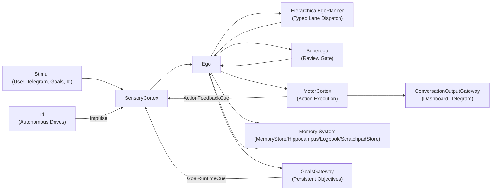
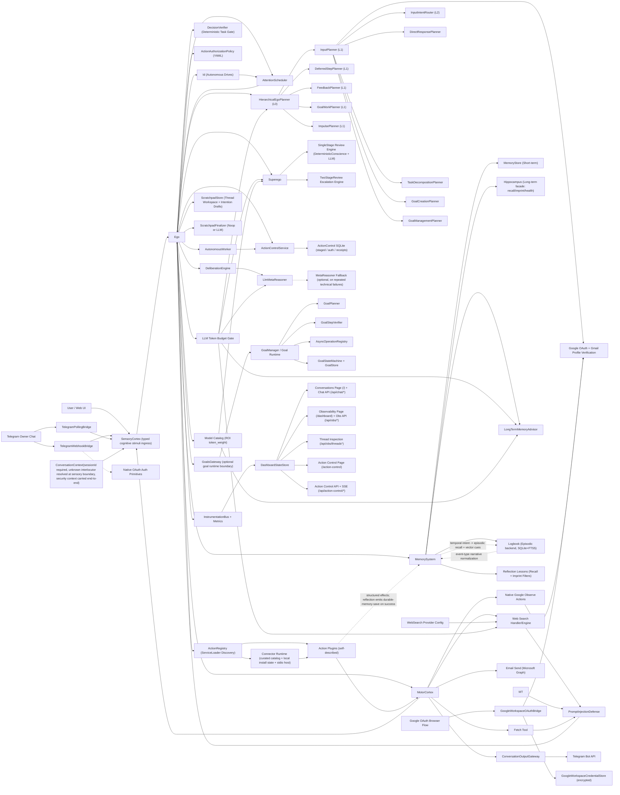
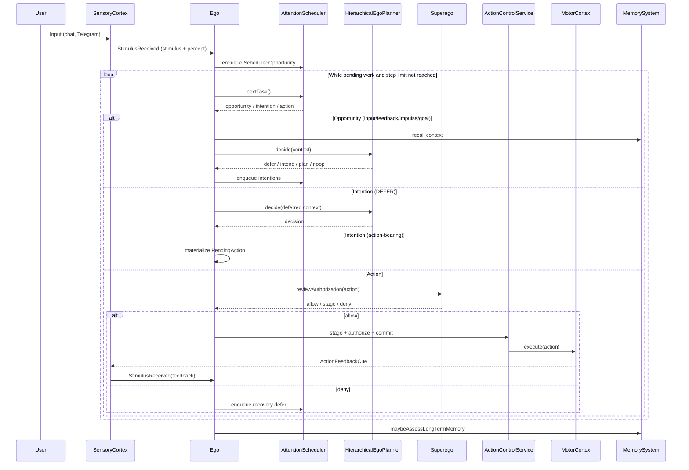
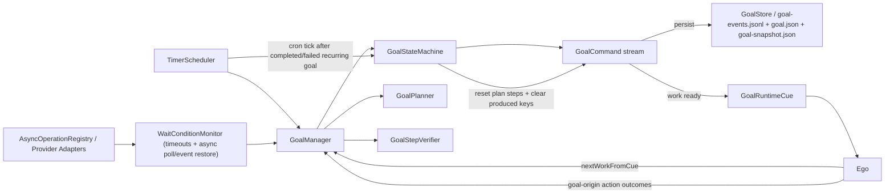
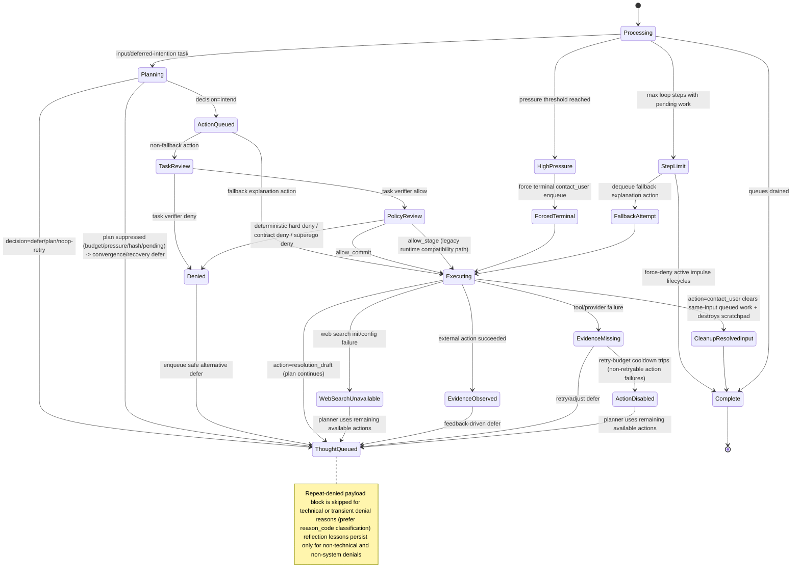
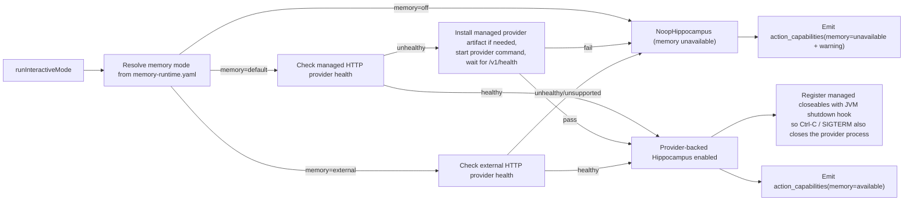
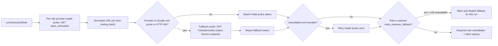

# Agent Logic Diagram (Living Document)

This file complements `AGENT_LOGIC_SUMMARY.md` with simple, editable Mermaid diagrams.
Keep diagrams high signal: small, readable, and updated as runtime logic evolves.

---

## L0: System-Level Component View

High-level view of the six major subsystems and their interactions.



---

## L1: Full Component View

Detailed component wiring showing all runtime components and their connections.



---

## L1: Main Loop Sequence (Simplified)

Clean overview of the per-input happy path without implementation detail.



---

## L2: Full Loop Sequence (Per Input)

Complete sequence with all notes and edge cases. Read L1 first for orientation.

```mermaid
sequenceDiagram
    participant User
    participant SC as SensoryCortex
    participant Ego
    participant Sched as AttentionScheduler
    participant Planner as HierarchicalEgoPlanner
    participant Sup as Superego
    participant AIR as ApprovalRuntime
    participant Motor as MotorCortex
    participant Delib as DeliberationEngine
    participant CTS as CognitiveThreadStore
    participant Mem as MemorySystem
    participant TWS as ScratchpadStore
    participant Dash as DashboardStateStore/API
    participant TG as Telegram Bot API

    User->>SC: Web chat input text
    SC->>Ego: StimulusReceived (stimulus + percept)
    Note over SC,Ego: Stimulus carries ConversationContext [sessionId + security], provenance, rootInputId [identity], receivedAtMs [timing]; session replay restores the recorded security frame instead of inferring a fresh default
    Ego->>CTS: bind percept to root-scoped cognitive thread
    CTS-->>Ego: cognitiveThreadId + thread trust state
    Ego->>Dash: emit cognitive_thread_updated
    CTS-->>Ego: policy-shaped Opportunity\n(intentions + commit modes + planner-visible action surface)
    Ego->>Sched: enqueue ScheduledOpportunity(opportunity + trigger)
    Ego->>Dash: emit opportunity_enqueued
    Note over CTS,Dash: Thread snapshots are retained for live and terminal roots and exposed through /api/obs/threads

    loop While pending work and step limit not reached
        Ego->>Sched: nextTask()
        Sched-->>Ego: ScheduledOpportunity/intention/action
        Ego->>Ego: activateSession(task.conversationContext)
        Ego->>Delib: startStep()

        alt Task = impulse opportunity
    Note over Ego,Mem: Id-driven recall/planning can see shared ambient context: goals, scratchpad themes, useful updates, open loops, and recent exact learning topics
    Note over Ego,Mem: Ambient context is a cached best-effort snapshot, not a real-time synchronized view
            Ego->>Planner: decide(context + idState)
            Planner-->>Ego: defer/intend/plan/noop
            Ego->>Sched: enqueue impulse-derived work with origin=ID
            Note over Ego,Sched: Impulse final result is deferred until all work for root_impulse_id drains
        else Task = goal work opportunity
            Ego->>PG: finalizeGoalCycle(rootInputId) after queues drain for that goal root
    Note over Ego,PG: Goal runtime now resumes from a stable per-step thread root, creates scratchpad state only when work is actually processed, and may re-emit a goal runtime cue for resumable steps
    Note over SC,Ego: StimulusIngressCoordinator classifies post-sensory stimuli into input, feedback, goal-work, or wake-only ingress before scheduler work begins
        else Task = input or feedback opportunity
            Ego->>Mem: recall and short-term summary
            Note over Ego,Mem: Planner context now includes targeted reflection-lesson recall
            Ego->>TWS: create or update thread workspace and index summary
            Ego->>Dash: emit scratchpad_head (with optional debug snapshot)
            Note over Ego,Planner: For Id-origin thoughts, Ego reapplies Id convergence state and action filtering before planner decide internalize without escalation removes contact_user and reflect_internal so planner-visible terminal reflection stays evidence-bound
            Note over Ego,Planner: Planner-visible actions are prefiltered by conversation instruction trust, current thread data trust, and action contract metadata before prompt build
            Note over Ego,Planner: Layered early policy shaping now also applies policy-scope, channel-surface, principal-role, and action-effect rules before proposal time control-plane actions are hidden from non-admin/non-internal surfaces and restricted scopes lose direct/autonomous commit semantics early
            Ego->>Planner: decide(context)
            Note over Ego,Planner: PromptBudgetAllocator reserves required-core/context floors with message-overhead accounting, trims optional first, and emits prompt_budget_allocation
            Note over Ego,Planner: Planner prompt includes conversation security summary, thread trust state, percept summary/family, opportunity summary/kind, allowed intentions/commit modes, and trigger provenance summary untrusted external content is framed as data, not instruction
            Note over Ego,Planner: HierarchicalEgoPlanner dispatches to typed L1 lanes based on trigger type (no text inspection)
            Note over Ego,Planner: InputPlanner uses InputIntentRouter (LLM classifier) then dispatches to typed L2 sub-planner
            Note over Ego,Planner: Goal creation and management use typed GoalCommand with LLM-resolved references (no regex heuristics)
            Note over Ego,Planner: Goal-operation payload boundary is canonical SerializedGoalCommand (command + typed goal_reference), consumed directly by GoalOperationActionPlugin
            Note over Ego,Planner: Planner requests schema-enforced structured output. LLM layer owns compatibility degradation from strict to relaxed to prompt-only JSON. Parse failures do truncation-budget retry then strict-JSON retry before noop fallback
            Planner-->>Ego: defer/intend/plan/noop
            Ego->>Delib: maybeApplyPressureOverride
            Note over Ego: Runtime opportunity guard rejects invalid intention kind, action surface, or commit-mode violations before scheduling execution work
            Ego->>Sched: enqueue explicit intentions (observe/prepare/stage/request_authorization/commit/defer)
            Note over Ego,Sched: Planner now forms explicit lifecycle-aware intentions directly; plan steps and recovery/follow-up work become deferred intentions, not first-class thought queue items
            Note over Ego,Sched: Plans gated by budget, pressure, hash dedup, pending-plan check
            Note over Ego,Planner: Redundancy is planner-side soft cost control [prompt and verifier], with telemetry event external_action_redundancy_signal
            Note over Ego,Planner: Action verifier has been removed from the planner architecture. Planner correctness is achieved through typed lane design, constraint validation, and existing runtime controls (superego review, action authorization policy). See docs/specs/TYPED_HIERARCHICAL_PLANNER_REDESIGN.md Rule 8
            Note over Ego,Planner: Follow-up evidence thoughts explicitly request one raw JSON planner decision and forbid tool/function wrappers
        else Task = intention
            alt Deferred continuation
                Ego->>Ego: rebuild deferred continuation context from DEFER intention
                Ego->>Planner: decide(context for deferred continuation)
                Note over Ego,Sched: Non-Id defer chains carry fallback permission by default; if repeated defers hit max passes, Ego converts the chain into a fallback contact_user action instead of ending silently
            else Action-bearing intention
                Ego->>Ego: materialize PendingAction with intention metadata
                Note over Ego: PendingAction now carries intentionId, intentionKind, and requestedCommitMode
            end
        else Task = action
            alt Fallback explanation action
                Ego->>Motor: execute (bypass Superego)
                Note over Ego,ACS: Bypass execution is still mirrored into durable staged/receipt state
            else Normal action
                Ego->>TV: review(action, evidence/recent dialogue)
                Note over Ego,TV: DecisionVerifier classifies intent + volatility. evidence required only for volatile/unknown factual intents
                alt decision verifier deny
                    TV-->>Ego: deny (with reason_code)
                    Ego->>Sched: enqueue safe-alternative thought
                    Ego->>Mem: maybeRecordReflectionLesson(filtered)
                else decision verifier allow
                    Note over Ego,TV: If volatile evidence is required but tools are unavailable, verifier returns graceful allow [TASK_EVIDENCE_UNAVAILABLE_GRACEFUL]
                    Ego->>Sup: deterministic checks + authorization policy
                    alt deterministic deny
                        Sup-->>Ego: deny (hard deny)
                        Ego->>Sched: enqueue safe-alternative thought
                        Ego->>Mem: maybeRecordReflectionLesson(filtered)
                    else deterministic pass
                        alt action = id-origin reflect
                            Note over Ego,Sup: Internal-only reflect_internal bypasses LLM Superego review after deterministic payload validation trusted-data only. reflect_evidence remains evidence-bound
                            Sup-->>Ego: allow
                        else all other actions
                            Ego->>Sup: llm review(action)
                            Note over Ego,Sup: Stage-1 uses cheaper model from catalog when two-stage is enabled
                            Note over Ego,Sup: Superego prompt build uses same prompt allocator contract, includes action-origin context, and emits prompt_budget_allocation
                            Note over Ego,Sup: Escalate on low confidence, policy-risk, or technical fallback
                            Note over Ego,Sup: Superego completion max_tokens scales with prompt estimate [bounded floor/hard-cap] and model token_weight
                            Note over Ego,Sup: Structured output is schema-enforced [response_format=json_schema]
                            Note over Ego,Sup: Stage parse failures trigger one schema-enforced retry before default deny
                            Sup-->>Ego: allow or deny (with reason_code on deny)
                        end
                        alt allow
                            alt action = resolution_draft
                                Ego->>TWS: record active draft-sequence chunk
                                Note over Ego,TWS: Draft chunks are internal only, excluded from planner prompt summaries, and no user-visible assistant turn is emitted
                            else action = contact_user
                                Ego->>TWS: final-pass compilation from thread workspace + active draft sequence
                                Note over Ego,CTS: Before clearing per-input ephemera, normal completion marks the owning cognitive thread RESOLVED and keeps a bounded terminal snapshot
                                Ego->>TWF: rewrite candidate payload (if enabled)
                                Note over Ego,TWS: Final-pass skip requires both no evidence and insufficient drafts [less than max of 2 or activation_min_plan_steps]; draft sequence resets when cognition leaves answer-drafting work
                        Note over Ego,TWF: Apply workspace-confidence gate first, then model-confidence gate
                            end
                            Ego->>ACS: stage / authorize / commit
                            alt stage required
                                ACS->>ACDB: save staged action
                                ACS->>ACDB: save signal/background ledger entry
                                ACS-->>Ego: staged action (WAITING_AUTHORIZATION or READY)
                                Note over Ego: Action review emits explicit intention transitions for STAGE and, when needed, REQUEST_AUTHORIZATION
                                Ego->>AIR: notify approval runtime
                                AIR->>ACDB: persist approval request + audit trail
                                AIR->>AIR: resolve owner channel (same-channel or shared resolver/default fallback)
                                Note over AIR: Telegram non-conversation routing counts as deliverable/live only after successful startup ACK delivery (approval-startup-ack)
                                AIR->>Dash: deliver chat-native approval prompt
                                AIR->>TG: deliver Telegram approval prompt (if selected channel)
                                Note over AIR,ACDB: If no eligible owner channel exists, AIR persists an unrouted fail-closed approval artifact and leaves the staged action blocked until expiry/manual resolution
                                Note over AIR,Owner: Refreshed prompts surface a short approval ref; replies to later prompt versions must include the current ref
                                Note over AIR,Owner: Approval/denial is hash-bound to the staged action; hash drift supersedes the request and issues a replacement prompt
                                Note over Sched,Ego: Blocked roots are skipped by the scheduler until the approval runtime resolves the request, then the root leaves BLOCKED on terminal denial/expiry
                                Note over Dash,ACAPI: Dashboard action-control page watches a dedicated SSE lane and refreshes on staged/authorization lifecycle updates rather than polling
                                Note over ACW,ACS: Background autonomous worker polls SQL-filtered runnable READY actions, preserving same-thread order [threadSequence] and same-target serialization [executionKey] before atomic claim + execute
                        else direct commit allowed
                                ACS->>ACDB: save staged action + authorization
                                ACS->>Motor: execute(action, authorization)
                                Motor-->>ACS: outcome
                                Motor->>SC: emit ActionFeedbackCue (non-contact outcomes)
                                SC->>Ego: StimulusReceived(feedback percept)
                                ACS->>ACDB: save receipt + ledger + final staged status
                                ACS-->>Ego: executed outcome
                            end
                            Note over Ego,Motor: Actions may complete immediately or return WAITING + async operation handles
                            Note over SC,Ego: Feedback continuations and terminal thread resolution are decided only after feedback re-enters through SensoryCortex, and WAITING outcomes suspend the thread instead of auto-queuing a continuation
                            Note over Ego,Motor: contact_user delivery is channel-aware. Telegram sessions send through Bot API, dashboard sessions continue through local/dashboard delivery
                            Note over ACAPI,Dash: Dashboard-approved staged executions can append a completion/answer message back into the originating chat session before root-session mapping is cleared
                            Note over Ego,PG: Goal-origin WAITING without handles is rejected as a contract violation
                            Ego->>Ego: PromptInjectionDefense sanitize untrusted tool output
                            alt action = contact_user
                                Ego->>Sched: clear pending thought and action work for same root-session scope
                                Ego->>TWS: capture session digest for resolved input
                                Ego->>TWS: destroy workspace for resolved input
                                Note over Ego,Dash: Workspace telemetry carries root_input_id [identity] and root_input_received_at_ms [timing]
                                Ego->>Dash: drawer reads full snapshots via /api/obs/workspace/{rootId}
                                Ego->>Mem: maybeAssessLongTermMemory(post_terminal_answer, forced)
                            end
                            Ego->>TWS: record non-contact_user/non-resolution_draft action outcomes/evidence
                            Note over Ego,TWS: External evidence is stored as typed artifacts first and rendered into scratchpad with trust/source labels
                            Ego->>PG: onActionExecuted / allowFollowUp (generic action lifecycle observer)
                            Note over Ego,Sched: Id-origin satisfying actions clear remaining same-root queued work before any follow-up can be enqueued
                            Ego->>Sched: enqueue follow-up defer (for evidence actions)
                            Ego->>Mem: maybeAssessLongTermMemory(post_allowed_action, optional force)
                            Note over Ego,Mem: Blocked imprints emit long_term_memory_persistence_skipped [reason_code, reason_detail] for timeline visibility
                        else deny
                            Ego->>ACS: save durable denial/refusal ledger entry
                            Ego->>Sched: enqueue safe-alternative thought
                            Ego->>Mem: maybeRecordReflectionLesson(filtered)
                        end
                    end
                end
            end
        end

        Ego->>Delib: maybeForceTerminalAnswer
        Note over Ego,Delib: Deliberation state is session-scoped evidence, root-session thread trust is sticky for the request, and action control rate limits are enforced per root-session scope
        Note over Ego,Delib: Meta-reasoner output is schema-enforced. repeated empty-content or schema-validation failures can trigger optional fallback endpoint
        Ego->>Mem: maybeAssessLongTermMemory(interval or explicit remember-intent)
        Note over Ego,Mem: Episodic recall filters session/interlocutor only when explicitly requested by user input
        Note over Ego,Mem: Memory-advisor completion max_tokens scales with prompt estimate [bounded floor/hard-cap] and model token_weight
        Note over Ego,Mem: Long dialogue/recall blocks are compressed before advisor prompt
        Note over Ego,Mem: Saved durable memories are normalized to first-person agent perspective before imprint
        Note over Ego,Mem: Episodic logbook entries carry active channel/principal/policy-scope metadata
        Note over Ego,Mem: INTERNAL latest-salient turns switch long-term assessment into self-origin mode. reasons/tags/source are normalized away from user-preference framing
        Note over Ego,Mem: MCP fact/reference subject is stamped as "me" for agent-authored durable memories
        Note over Ego,Mem: Successful learning reflections track exact recent topic fingerprints. only learning retrieval uses them as freshness pressure, while other needs may still reuse the same topic context
    end

    Note over User,SC: Terminal stdin is control-only in interactive mode [exit command]. non-command text is not enqueued as chat input
    Note over User,SC: Interactive linguistic ingress currently comes from dashboard chat sessions or owner-only Telegram webhook updates
    Note over Ego,GOBS: Gmail and Calendar are native read-only observe actions, intended for goals such as Morning Briefing and Inbox Management
```

---

## L1: Goals Boundary



---

## L1: Convergence and Fallback States



---

## L2: Startup Memory Gate



---

## L2: Startup LLM Provider Health Gate



---

## Edit Rules
- Keep this file synced with `AGENT_LOGIC_SUMMARY.md`.
- Source of truth is the code, not this document.
- Prefer updating existing diagrams over adding a large monolith.
- If behavior changes, update only affected diagram sections and labels.
