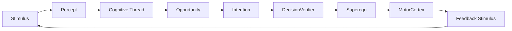
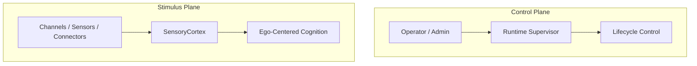
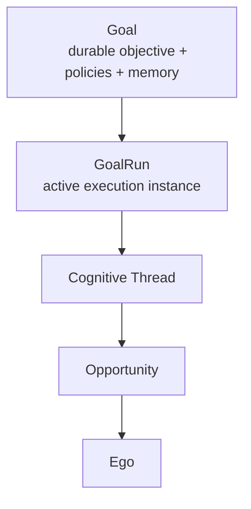
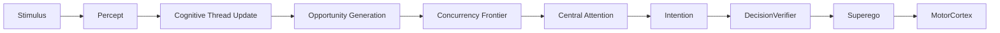

# NeoPsyke Agent Overview Draft

This document is a product- and architecture-oriented summary of NeoPsyke as
an agent system.

It is meant to be a basis for a future README rewrite and for external-facing
material such as a website or project overview. It focuses first on the
conceptual model and design philosophy, then on the concrete architecture,
runtime features, and comparison-relevant capabilities.

It is intentionally broader and more explanatory than:

- `AGENT_LOGIC_SUMMARY.md`
- `AGENT_LOGIC_DIAGRAM.md`
- `TEMP_COGNITIVE_ARCHITECTURE_NOTE.md`

Those files remain the implementation-oriented living docs. This one is the
high-level narrative.

## What NeoPsyke Is

NeoPsyke is an experimental cognitive agent architecture built around a
Freudian core:

- `Id`
- `Ego`
- `Superego`

Around that core, the system uses cortex-like modules, typed inputs,
deliberative planning, memory systems, safety review, goal-oriented background
work, and explicit action execution.

The project is not trying to be only:

- a chat wrapper around an LLM
- a generic "tool-calling agent"
- a workflow engine with anthropomorphic names

It is trying to build a coherent mind-like architecture in which:

- perception is distinct from control
- interpretation is distinct from transport
- internal drives are distinct from user requests
- executive choice is distinct from action execution
- durable goals are distinct from ephemeral turns
- judgment and safety are explicit architectural functions

That distinction is the point.

## Vision

The long-term vision is an agent that can behave like a coherent, continuous
mind rather than a series of disconnected prompt completions.

That implies several goals:

- The agent should have a stable internal vocabulary for cognition.
- Different classes of incoming information should remain distinguishable.
- Long-running background behavior should be modeled as durable commitments,
  not hacked in as special-case prompts.
- The system should scale from text/chat to richer sensory modalities such as
  screen vision, DOM observation, async completions, and external event cues.
- The architecture should stay understandable even as it becomes more capable.

In practice, NeoPsyke wants to sit somewhere between:

- an LLM-native reasoning agent
- an autonomy-capable background assistant
- a cognitively legible architecture for future research and product work

## Design Philosophy

Several principles drive the whole system.

### 1. Cognitive clarity over generic orchestration

The system prefers meaningful cognitive concepts over neutral workflow terms.
That is why it uses terms like:

- `stimulus`
- `percept`
- `cognitive thread`
- `opportunity`
- `intention`

instead of flattening everything into queue items, tasks, or workflow nodes.

### 2. Hard boundaries matter

NeoPsyke deliberately keeps certain distinctions explicit:

- stimulus plane vs control plane
- user input vs internal drive vs goal cue vs action feedback
- thinking vs acting
- verifying vs judging
- memory vs active continuity

This is not just naming hygiene. Those boundaries prevent bad architectural
collapse later.

### 3. The agent is one mind, not a bag of workers

NeoPsyke can use concurrency, but it does not want multiple competing Egos.
Parallel preparation is acceptable; final executive commitment remains
centralized.

### 4. Architecture first, backwards compatibility later

This codebase currently prioritizes conceptual correctness over compatibility
shims. Terms are expected to change when better concepts emerge.

### 5. Best-effort context is better than intrusive consistency

Not every subsystem needs strong consistency. Ambient context, for example, is
best-effort and eventually consistent because it is advisory, not execution
critical.

## The Core Psychological Model

NeoPsyke is organized around the classic Freudian triad.

### Id

The `Id` is the source of internal drives, pressures, impulses, and need
activation. It is responsible for:

- growing internal needs over time
- deciding when a need becomes salient enough to surface
- emitting internal pressure into the rest of cognition

The `Id` does not directly act on the world. It produces pressure that the
rest of the system must interpret and arbitrate.

### Ego

The `Ego` is the executive integrator. It is the center of:

- attention
- deliberation
- intention formation
- coordination of memory, planning, verification, and action

The `Ego` is where user requests, internal drives, goal work, and action
feedback become organized behavior.

### Superego

The `Superego` is not a router or generic governor. Its role is judgment.

It evaluates candidate intentions and actions in terms of:

- policy
- safety
- alignment with user-sanctioned commitments
- acceptable external behavior

The right verb for the `Superego` is: it judges.

## The Cognitive Vocabulary

The current canonical vocabulary is:

- `stimulus`
- `percept`
- `cognitive thread`
- `opportunity`
- `intention`
- `goal`

These terms define the main conceptual flow of the system.

### Stimulus

A `stimulus` is something arriving at the sensory boundary before the system
has interpreted what it means.

Examples:

- a chat message
- a timer wake
- an async completion
- a goal runtime cue
- a browser observation
- a future screen-vision observation

### Percept

A `percept` is the interpreted meaning of a stimulus.

Examples:

- a request percept
- an observation percept
- a feedback percept
- a state-change percept
- a drive activation percept

This is the point where transport becomes semantics.

### Cognitive Thread

A `cognitive thread` is the continuity unit of the mind. It is an ongoing
matter that persists across time, interruption, waiting, and resumption.

Examples:

- a conversation thread
- a drive thread
- a goal-directed thread
- a suspended action thread

This replaces the idea that continuity must be represented only through
ad hoc queue state or workflow state.

### Opportunity

An `opportunity` is a currently ready opening for attention and action. It is
surfaced by the current state of a cognitive thread.

Examples:

- answer this request
- resume this blocked goal step
- integrate this completion
- ask a clarification question
- defer until more evidence

### Intention

An `intention` is the candidate course of action formed by the Ego in response
to an opportunity.

Examples:

- answer now
- search first
- ask for clarification
- continue a goal run
- wait and revisit later

### Goal

A `goal` is the durable objective model for long-running or recurring agent
activity.

It is broader than a one-off project. A goal may represent:

- a standing monitor
- a recurring digest
- a maintenance loop
- a search/watch process
- a finite planful objective

## The Canonical Flow

The basic cognitive sequence is:

`stimulus -> percept -> cognitive thread -> opportunity -> intention`

After intention formation:

- `DecisionVerifier` evaluates adequacy and sufficiency
- `Superego` judges acceptability
- `MotorCortex` executes the allowed action
- feedback returns as new stimulus

This loop is the core of NeoPsyke.

## Planes And Boundaries

One of the most important architecture rules is that control and cognition are
separate.

### Stimulus plane

This is the plane of things the mind should perceive:

- user messages
- internal drive cues
- goal runtime cues
- tool feedback
- async completions
- observations

All such inputs should arrive through the `SensoryCortex`.

### Control plane

This is the plane of things that operate the runtime itself:

- shutdown
- pause
- restart
- reload
- diagnostics toggles
- supervisor intervention

These should not masquerade as cognitive stimuli.

This split protects the cognitive model from being polluted by runtime concerns.

## The Main Modules

### SensoryCortex

The `SensoryCortex` is the ingress boundary for all cognitive input.

Its job is not to decide the whole meaning of the world. Its job is to:

- normalize typed incoming stimuli
- attach source metadata
- preserve trust and origin information
- keep all cognitive ingress passing through one place

It is the unified sensory boundary.

### Perceptual Appraisal

Perceptual appraisal turns incoming stimuli into semantically typed percepts.

This is where the system decides:

- what kind of thing this is
- whether it is a request, observation, cue, or feedback
- what family of meaning it belongs to

### Cognitive Thread Binding

This layer attaches percepts to existing ongoing continuity or starts new
continuity when needed.

This is essential for:

- suspension and resumption
- maintaining local context
- keeping long-running activity coherent
- avoiding full replanning from scratch after every event

### Attention Scheduler

The scheduler is not just a generic queue. It is the attention system.

Its job is to rank surfaced opportunities and decide what the Ego should attend
to next.

NeoPsyke currently keeps final attention selection centralized.

### Planner

The `Planner` is the deliberative reasoning component inside the Ego. It turns
context plus an opportunity into candidate intentions.

It is not the architecture itself. It is a capability used by the Ego.

### DecisionVerifier

The `DecisionVerifier` checks whether a candidate intention is warranted,
sufficient, or adequately supported.

Its role is distinct from the Superego:

- the verifier checks whether the decision makes sense
- the Superego checks whether the decision should be allowed

### Superego

The `Superego` judges whether a candidate action or intention is acceptable.

It is the explicit normative gate in the architecture.

### MotorCortex

The `MotorCortex` executes actions against the world.

This includes:

- user-facing responses
- tools
- MCP-backed operations
- web search
- future browser control and other motor capabilities

### MemorySystem

The `MemorySystem` is responsible for recall, summarization, episodic support,
long-term memory interaction, and memory-oriented advisory behavior.

It is not the owner of active execution continuity.

### Scratchpad

The `Scratchpad` is the working notebook of the agent.

It is a layered working space used for:

- intermediate evidence
- drafts
- execution notes
- compiled answer context

It is separate from both:

- short-term dialogue memory
- durable long-term memory

## Stimulus Families

NeoPsyke uses generalized top-level stimulus families so new modalities can be
added without ontology explosion.

Current top-level families:

- `linguistic stimulus`
- `observation stimulus`
- `feedback stimulus`
- `cue stimulus`

Why this matters:

- chat input and future screen vision are not the same source, but both can fit
  under a clean sensory taxonomy
- async completions and tool results belong together as feedback
- goal wakes and internal pulses belong together as cues

This makes the architecture extensible.

## Percept Families

Percepts are also grouped by cognitive function, not by integration source.

Current top-level percept families:

- `request percept`
- `observation percept`
- `feedback percept`
- `state-change percept`
- `drive activation percept`

This avoids a future taxonomy like:

- browser percept
- screen percept
- DOM percept
- project percept
- email percept

which would not scale cleanly.

## Goals As Durable Commitments

One of the biggest architectural shifts in NeoPsyke is the move from
`Project` to `Goal`.

This is more than a rename.

The old `project` concept was too narrow for the intended future of the agent.
The system needs a top-level concept that can represent:

- recurring syntheses
- standing monitors
- search/watch loops
- maintenance behaviors
- planful finite tasks

That concept is `Goal`.

### Examples of goals

Examples the architecture is explicitly meant to support:

- morning briefing generation
- inbox management
- CI/CD monitoring
- dependency and security scanning
- apartment search
- SEC / earnings watch
- calendar management

Some of these are finite. Many are not. A `Goal` can contain planful
execution, but it is not defined only by planfulness.

### Goal and GoalRun

The architecture distinguishes:

- `Goal`
- `GoalRun`

A goal is the durable objective and policy container.

A goal run is the active execution/resumption instance when work is currently
underway.

This preserves the useful properties of the state-machine runtime while giving
the concept a broader shape.

## Why Goals Are Not A Separate Sensory Kingdom

Goals should influence cognition, but they should not become a permanent,
special sensory species.

Instead:

- goals are durable state and policy
- goal-triggered readiness appears as cue stimuli
- goal state changes appear as state-change percepts
- goal work binds into cognitive threads

That keeps the sensory model general.

## Concurrency Philosophy

NeoPsyke is intentionally conservative about concurrency.

The architecture does not want multiple independent executive selves. It wants
one coherent executive center with optional parallel preparation.

### Concurrency frontier

The current rule is:

`opportunity generation is the concurrency frontier`

That means:

- work up to opportunity generation may be parallelized where ownership is clear
- from Ego attention onward, execution remains centralized

This gives speed where it is cheap without giving up coherence where it matters.

### What can parallelize naturally

Examples:

- perceptual appraisal
- thread-local updates
- memory retrieval
- observation processing
- async wait monitoring
- thread-local opportunity generation

### What stays centralized

Examples:

- final attention selection
- final intention formation/commitment
- final verification acceptance
- Superego judgment
- MotorCortex dispatch of side effects

## Memory Philosophy

NeoPsyke does not treat all memory as one thing.

It distinguishes:

- short-term conversational context
- scratchpad working state
- episodic memory
- long-term durable memory
- live cognitive-thread state

This matters because many agents collapse these into one retrieval buffer or
one vague "memory" concept.

NeoPsyke instead treats them as different cognitive roles.

### Short-term memory

Used for current dialogue continuity and recent context.

### Scratchpad

Used for active working material during a request or intention attempt.

### Episodic memory

Used for past events and experience-oriented recall.

### Long-term memory

Used for durable retained knowledge and lessons.

### Live thread state

Owned by thread-oriented state, not by generic memory services.

## Ambient Context

Ambient context is advisory context built from current and recent activity.

It can include:

- active goals
- recent scratchpad themes
- recent useful actions or updates
- unresolved loops
- recently explored learning topics

Its role is to bias recall and planning toward relevance without becoming a
critical dependency.

This is why it is intentionally:

- best-effort
- eventually consistent
- non-blocking

The system explicitly rejects strong synchronization here because ambient
context should not intrude on the main flow.

## Reasoning Features

NeoPsyke has a fairly rich reasoning stack compared to many simple tool agents.

Some notable features:

- explicit planner role
- explicit decision verifier role
- explicit superego role
- typed action model
- follow-up thought chaining
- fallback handling
- deliberation pressure tracking
- meta-reasoner under pressure
- structured-output planning
- evidence-aware answer gating
- memory advisory and long-term consolidation

These features make it meaningfully more than:

- direct ReAct prompting
- one-pass tool use
- plain chat plus function calling

## Autonomous Features

NeoPsyke is also moving toward genuine background agency.

Important autonomous features include:

- an active `Id` that generates internal drive pressure
- durable goals
- timer and wait-based resumptions
- async operation restoration
- background monitoring possibilities
- policy-aware external action control

This means the project is not only about better single-turn reasoning. It is
also about ongoing, structured autonomous behavior.

## Safety And Judgment

Safety in NeoPsyke is not just a hidden prompt instruction. It is made
architectural.

Key parts:

- `DecisionVerifier` for sufficiency/correctness
- `Superego` for judgment
- action registry and dispatchability boundaries
- origin-aware policies
- explicit handling of denial and fallback

This is useful both practically and conceptually:

- practically, because safety becomes inspectable and tunable
- conceptually, because judgment is a first-class function of the architecture

## Observability

The system treats observability as a first-class concern.

Architecturally:

- `instrumentation` is the main event pipeline
- `metrics` are derived from that pipeline
- `telemetry` is just a helper/emitter role, not a separate subsystem

This matters because the architecture is complex enough that it must remain
inspectable if it is to be evolved safely.

## What Makes NeoPsyke Distinct

Compared to many other agent systems, NeoPsyke is unusually explicit about:

- psychological metaphor as architecture, not branding
- typed ingress through a sensory boundary
- separation of stimulus, percept, continuity, opportunity, and intention
- explicit safety/judgment modules
- durable goal-oriented background work
- memory differentiation
- centralized executive coherence with bounded concurrency

Many agents optimize first for raw task throughput or simple function-calling.
NeoPsyke optimizes first for conceptual coherence of an agent mind.

That does not make it universally better. It does make it distinct.

## Comparison Axes For Other Agents

When comparing NeoPsyke to other agent systems, the most relevant axes are:

- Does the system distinguish transport from semantics?
- Does it have a real continuity model, or only prompt history?
- Does it distinguish internal drives from external requests?
- Is safety an architectural function or only a prompt convention?
- Does it support durable background commitments?
- Does it have typed action feedback and resumption?
- Is concurrency allowed to fracture executive coherence?
- Does it differentiate kinds of memory?
- Does it model long-running monitoring and recurring work cleanly?

These axes are more revealing than asking only:

- what tools it can call
- how many benchmarks it passes
- whether it uses one model or many

## Potential Future Directions

Natural future directions include:

- richer observation modalities such as screen and DOM vision
- broader goal policies and autonomy controls
- stronger cognitive-thread storage and replay
- more sophisticated intention formation and revision
- better thread-level concurrency preparation
- stronger supervisor/operator tooling
- richer self-modeling and introspection

The existing vocabulary is designed so those features can be added without
breaking the conceptual shape of the system.

## Glossary

### Id

The subsystem that generates internal drive pressure and need-based impulses.

### Ego

The executive subsystem that attends, deliberates, forms intentions, and
coordinates behavior.

### Superego

The subsystem that judges candidate intentions and actions in normative,
safety, and alignment terms.

### SensoryCortex

The single ingress boundary for all cognitive stimuli.

### Stimulus

An incoming cognitive signal before interpretation.

### Percept

The interpreted meaning of a stimulus.

### Cognitive Thread

The continuity unit for an ongoing matter across time and interruption.

### Opportunity

A currently surfaced opening for attention and possible action.

### Intention

The candidate course of action formed by the Ego.

### Goal

The durable objective model for long-running or recurring background activity.

### GoalRun

An active execution/resumption instance associated with a goal.

### Planner

The deliberative reasoning component used by the Ego to form candidate
intentions.

### DecisionVerifier

The component that evaluates whether a candidate decision is sufficiently
grounded or warranted.

### MotorCortex

The execution subsystem that performs actions against the outside world.

### MemorySystem

The subsystem responsible for recall, summarization, episodic support, and
durable memory interaction.

### Scratchpad

The working notebook used for drafts, evidence, and intermediate working state.

### Ambient Context

Best-effort advisory relevance context derived from current and recent activity.

### Control Plane

The non-cognitive runtime management plane for lifecycle and supervision.

### Stimulus Plane

The plane of information that the agent should perceive cognitively.

## Closing Summary

NeoPsyke is best understood as an attempt to build a cognitively legible agent
architecture rather than merely an LLM workflow.

Its key ideas are:

- perception before planning
- continuity before execution
- opportunity before intention
- judgment before action
- durable goals instead of narrow projects
- one coherent executive center, with carefully bounded parallelism

That combination is what gives the project its shape.
