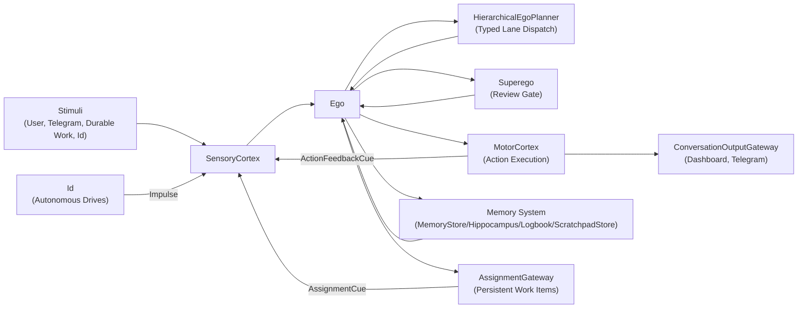
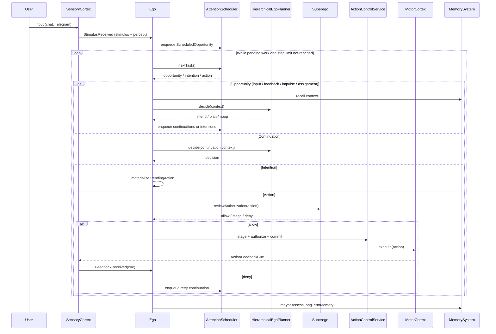

# Agent Runtime Logic (Living Document)

This file is the unified human-readable map of NeoPsyke's interactive runtime.
It combines the old high-level summary with the system-level diagrams and acts as the entrypoint for the detailed area documents under `docs/agent-logic/`.

## Scope
- Interactive runtime path only (`runInteractiveMode`), not eval harness internals.
- Source of truth is code under `src/main/kotlin/ai/neopsyke/**`.
- Keep this file architecture-first. Area-specific detail belongs in the linked documents.

---

## L0: System Overview

NeoPsyke is an autonomous cognitive agent built around a Freudian-inspired architecture. The system processes stimuli through a deliberation loop that plans, reviews, and executes actions.

See details:
[Input and Threading](docs/agent-logic/INPUT_AND_THREADING_DIAGRAM.md),
[Ego Loop](docs/agent-logic/EGO_LOOP_DIAGRAM.md),
[Id and Impulses](docs/agent-logic/ID_AND_IMPULSE_DIAGRAM.md),
[Planner Flow](docs/agent-logic/PLANNER_FLOW_DIAGRAM.md),
[Action Review and Execution](docs/agent-logic/ACTION_REVIEW_AND_EXECUTION_DIAGRAM.md),
[Memory and Startup](docs/agent-logic/MEMORY_AND_STARTUP_DIAGRAM.md),
[Durable Work](docs/agent-logic/DURABLE_WORK_DIAGRAM.md),
[Dashboard and Observability](docs/agent-logic/DASHBOARD_AND_OBSERVABILITY_DIAGRAM.md).

### Major Subsystems
1. **SensoryCortex** — Receives external stimuli (user messages, Telegram updates, assignment/Id wake signals) and internal typed feedback cues, sanitizes and enriches stimulus envelopes, resolves conversation identity/security, and transforms envelope stimuli into typed `Percept` objects.
2. **Ego** — The central deliberation loop. Pulls percepts from SensoryCortex, schedules cognitive work via `AttentionScheduler`, delegates planning to the Planner, routes actions through the review/execution pipeline, tracks `DecisionPressure`, and manages thread/session lifecycle.
3. **Superego** — Three-layer action review gate: deterministic hard-deny checks, configuration-based `ActionAuthorizationPolicy`, and LLM semantic review with optional two-stage escalation. Every non-fallback action must pass all applicable layers.
4. **MotorCortex** — Discovers action plugins at startup, executes authorized actions through `ActionControlService`, and routes output through `ConversationOutputGateway`. Typed action feedback re-enters through SensoryCortex and `StimulusIngressCoordinator`.
5. **Id** — Autonomous drive module. Maintains configurable needs that grow over time and emit impulses into the Ego loop when tension exceeds threshold. Impulses are processed like other opportunities but with convergence constraints.
6. **Memory System** — Four tiers: short-term context buffer (`MemoryStore`), long-term vector recall (`Hippocampus`), episodic journal (`Logbook`), and per-request scratchpad workspace (`ScratchpadStore`).

### Supporting Subsystems
- **Assignment Runtime** (`AssignmentGateway` / `AssignmentRuntime`) — Persistent multi-step objective manager with event-sourced `WorkItemStateMachine`, cron scheduling via `TimerScheduler`, and async wait conditions via `WaitConditionMonitor`.
- **DeliberationEngine** — Tracks `DecisionPressure`, coordinates `MetaReasoner` assessments, enforces action retry budgets, and can force terminal answers under sustained pressure.
- **Dashboard and Observability** (`DashboardServer` / `DashboardStateStore`) — Web UI for conversations, observability, and action control with SSE-based live updates.
- **PromptCatalog** — Hot-reloadable prompt/schema asset loader. Runtime prompts, prompt fragments, and migrated structured-output schemas are loaded from `config/prompts/**` or `NEOPSYKE_PROMPTS_DIR`, with bundled resources as packaged defaults.

## L0: System-Level Component View

See details:
[Input and Threading](docs/agent-logic/INPUT_AND_THREADING_DIAGRAM.md),
[Planner Flow](docs/agent-logic/PLANNER_FLOW_DIAGRAM.md),
[Action Review and Execution](docs/agent-logic/ACTION_REVIEW_AND_EXECUTION_DIAGRAM.md),
[Memory and Startup](docs/agent-logic/MEMORY_AND_STARTUP_DIAGRAM.md),
[Durable Work](docs/agent-logic/DURABLE_WORK_DIAGRAM.md).



### Core Data Flow

```text
Stimulus -> SensoryCortex (sanitize, appraise) -> Percept
  -> Ego (schedule, plan, review, execute)
    -> Planner (defer / intend / plan / noop)
    -> Superego (deterministic + policy + LLM review)
    -> ActionControlService (stage / authorize / commit)
    -> MotorCortex (plugin dispatch)
  -> ActionFeedbackCue -> SensoryCortex -> StimulusIngressCoordinator -> Ego
```

---

## L0: Runtime Wiring

See details:
[Memory and Startup](docs/agent-logic/MEMORY_AND_STARTUP_DIAGRAM.md),
[Planner Flow](docs/agent-logic/PLANNER_FLOW_DIAGRAM.md),
[Action Review and Execution](docs/agent-logic/ACTION_REVIEW_AND_EXECUTION_DIAGRAM.md),
[Dashboard and Observability](docs/agent-logic/DASHBOARD_AND_OBSERVABILITY_DIAGRAM.md).

- Entry: `Application.kt` -> `AppModeRunners.kt#runInteractiveMode`
- `runInteractiveMode` assembles all major runtime components before starting the Ego loop:
  - `ChatModelClient` instances per `CognitiveRole` from `llm-runtime.yaml`
  - Memory system from `memory-runtime.yaml`
  - Id from `id-runtime.yaml`
  - Assignment runtime behind `config.assignment.enabled`
  - Telegram ingress, Google Workspace OAuth, instrumentation, metrics, token-budget gating
  - `DashboardServer` with chat, observability, and action-control APIs

### L2: LLM Provider Configuration

See details:
[Memory and Startup](docs/agent-logic/MEMORY_AND_STARTUP_DIAGRAM.md),
[Planner Flow](docs/agent-logic/PLANNER_FLOW_DIAGRAM.md),
[Action Review and Execution](docs/agent-logic/ACTION_REVIEW_AND_EXECUTION_DIAGRAM.md).

- Each cognitive role can use an independent provider, API key, base URL, and model from `llm-runtime.yaml`.
- Supported providers: `anthropic`, `groq`, `google`, `mistral`, `ollama`, `openai`.
- `meta_reasoner_fallback` is optional and used only on repeated primary meta-reasoner technical failures.
- Optional `model_catalog` provides per-provider model ROI metadata (`tier`, `token_weight`, cost fields).
- Superego and `LongTermMemoryAdvisor` read `token_weight` for dynamic completion-budget scaling.
- When two-stage superego review is enabled, runtime resolves a cheaper primary model from the catalog and keeps the configured model for escalation.
- Planner runtime inserts the `StructuredOutputMode` adapter in the LLM layer. Compatibility degradation is handled there, not in planner lanes.
- Prompt text and migrated JSON schemas are prompt assets, not Kotlin literals. The runtime checks file mtimes before render; a valid edit replaces the active in-memory asset immediately, while an invalid edit logs `prompt_catalog.reload_failed` and keeps the current valid asset.
- Migrated LLM metadata includes prompt/schema identity (`prompt_id`, `prompt_version`, `prompt_hash`, `schema_id`, `schema_hash`) so behavior can be correlated with prompt revisions.
- `web_search` routing is configured independently via `web_search.provider`.
- `TokenBudgetGate` can short-circuit outbound model calls using hard per-run, per-provider, and per-role caps.

---

## L1: Main Loop Sequence (Simplified)

See details:
[Ego Loop](docs/agent-logic/EGO_LOOP_DIAGRAM.md),
[Planner Flow](docs/agent-logic/PLANNER_FLOW_DIAGRAM.md),
[Action Review and Execution](docs/agent-logic/ACTION_REVIEW_AND_EXECUTION_DIAGRAM.md),
[Convergence and Fallback](docs/agent-logic/CONVERGENCE_AND_FALLBACK_DIAGRAM.md),
[Memory and Startup](docs/agent-logic/MEMORY_AND_STARTUP_DIAGRAM.md),
[Durable Work](docs/agent-logic/DURABLE_WORK_DIAGRAM.md),
[Id and Impulses](docs/agent-logic/ID_AND_IMPULSE_DIAGRAM.md).



---

## Area Documents

Each secondary document now carries both the prose summary for its area and the focused diagrams for that area.

| Area | File | Moved summary topics |
|---|---|---|
| Input and thread binding | [docs/agent-logic/INPUT_AND_THREADING_DIAGRAM.md](docs/agent-logic/INPUT_AND_THREADING_DIAGRAM.md) | SensoryCortex, security context, Telegram ingress, OAuth, percept/thread binding |
| Ego loop | [docs/agent-logic/EGO_LOOP_DIAGRAM.md](docs/agent-logic/EGO_LOOP_DIAGRAM.md) | `runInteractive`, `runLoop`, scheduler model, continuation/intention flow, queueing |
| Id and impulses | [docs/agent-logic/ID_AND_IMPULSE_DIAGRAM.md](docs/agent-logic/ID_AND_IMPULSE_DIAGRAM.md) | Need pulse loop, ambient context, denial/backoff behavior |
| Planner | [docs/agent-logic/PLANNER_FLOW_DIAGRAM.md](docs/agent-logic/PLANNER_FLOW_DIAGRAM.md) | L0/L1/L2 planner architecture, decision types, plan refinement, prompt/runtime behavior |
| Action review and execution | [docs/agent-logic/ACTION_REVIEW_AND_EXECUTION_DIAGRAM.md](docs/agent-logic/ACTION_REVIEW_AND_EXECUTION_DIAGRAM.md) | Grounding gate, superego, staging, motor execution, feedback, available actions |
| Durable work runtime | [docs/agent-logic/DURABLE_WORK_DIAGRAM.md](docs/agent-logic/DURABLE_WORK_DIAGRAM.md) | Assignment runtime, work-state machine, wakes, plan ownership, operator surface |
| Memory and startup | [docs/agent-logic/MEMORY_AND_STARTUP_DIAGRAM.md](docs/agent-logic/MEMORY_AND_STARTUP_DIAGRAM.md) | Memory tiers, startup gates, provider health, scratchpad behavior |
| Convergence and fallback | [docs/agent-logic/CONVERGENCE_AND_FALLBACK_DIAGRAM.md](docs/agent-logic/CONVERGENCE_AND_FALLBACK_DIAGRAM.md) | Pressure, meta-reasoner, forced terminal answers, retry budgets |
| Dashboard and observability | [docs/agent-logic/DASHBOARD_AND_OBSERVABILITY_DIAGRAM.md](docs/agent-logic/DASHBOARD_AND_OBSERVABILITY_DIAGRAM.md) | DashboardStateStore, APIs, SSE lanes, thread/workspace inspection |

---

## Safety and Fallback Patterns

See details:
[Convergence and Fallback](docs/agent-logic/CONVERGENCE_AND_FALLBACK_DIAGRAM.md),
[Planner Flow](docs/agent-logic/PLANNER_FLOW_DIAGRAM.md),
[Action Review and Execution](docs/agent-logic/ACTION_REVIEW_AND_EXECUTION_DIAGRAM.md),
[Memory and Startup](docs/agent-logic/MEMORY_AND_STARTUP_DIAGRAM.md).

- LLM callers use retry loops with bounded attempts.
- Prompt/schema hot reload is fail-soft after startup: invalid edits do not replace the current valid prompt/schema and are logged with asset id, path, active version/hash, and validation failure. Startup still fails when no valid asset exists.
- `TokenBudgetGate` can short-circuit projected over-budget model calls before dispatch.
- Required JSON fields are validated after deserialization.
- Blank assistant content is treated as transport/protocol failure and enters retry/fallback handling.
- `PromptInjectionDefense` and `ExternalContentPipeline` sanitize untrusted external content and preserve trust tagging outside Superego.
- Untrusted external content is framed as data rather than instruction before follow-up planning.
- Long-term recall is wrapped as untrusted data when injected back into prompts.
- Fail-safe defaults by area:
  - Planner -> noop fallback
  - Superego -> deny fallback
  - Meta-reasoner -> continue fallback
  - Memory advisor -> skip persistence
  - Scratchpad finalizer -> keep original payload

---

## Edit Rules
- Source of truth is the code, not this document.
- Keep this file aligned with the relevant documents under `docs/agent-logic/`.
- When behavior changes, update this file for L0/system-wide changes and update the affected area docs in the same patch.
