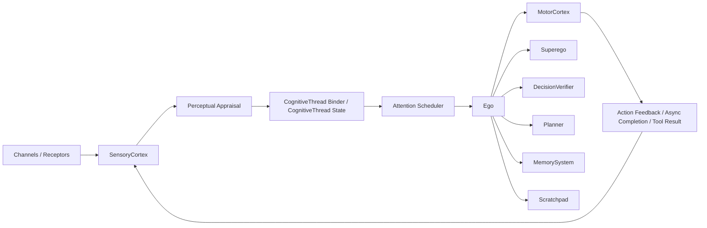

# Cognitive Architecture Design Baseline

This document captures the target design for the NeoPsyke cognitive
input/orchestration refactor.

It does not describe the current runtime as-is. The source of truth for the
current runtime remains:

- `AGENT_LOGIC_SUMMARY.md`
- `AGENT_LOGIC_DIAGRAM.md`

## Purpose

The goal is to simplify the Ego input/orchestration flow while preserving:

- cognitive clarity
- safety boundaries
- strict separation between cognitive stimuli and runtime control
- typed ingress
- separation of user, internal, goal, and async semantics
- the core Freudian architecture: `Id`, `Ego`, and `Superego`

This direction is explicitly not based on "make everything a normal input".
Instead, the system unifies at the level of cognition:

`stimulus -> percept -> cognitive thread -> opportunity -> intention`

## Confirmed Vocabulary

The canonical vocabulary is:

- `stimulus`
- `percept`
- `cognitive thread`
- `opportunity`
- `intention`
- `goal`

Associated module names and concepts:

- `Planner` stays `Planner`
- `DecisionVerifier` becomes `DecisionVerifier`
- `MemorySystem` becomes `MemorySystem`
- `ScratchpadStore` / `ScratchpadFinalizer` become `Scratchpad`
- `Superego` stays `Superego`
- `MotorCortex` stays `MotorCortex`
- `Id`, `Ego`, and `Superego` remain the core architecture and are not displaced by neutral engineering names

Terminology clarifications:

- `Superego` judges; it does not "govern"
- `DecisionVerifier` is used instead of `ConvergenceVerifier`
- `opportunity` replaces `affordance` for readability and intuition
- `intention` replaces earlier ideas like `executive decision`
- `Goal` is the top-level name for durable objective/stateful background work; `Goal` is too narrow

## Core Flow

All cognitive signals arrive through the `SensoryCortex`.

Runtime/operator control does not enter the `SensoryCortex`. Control belongs
to a separate control plane outside the cognitive loop.

High-level target flow:



Canonical cognitive sequence:

1. A `stimulus` reaches the `SensoryCortex`.
2. The system appraises it into a typed `percept`.
3. The percept is attached to an existing `cognitive thread` or starts a new one.
4. The cognitive thread emits one or more `opportunity` items for attention.
5. The `Ego` attends to one opportunity and forms an `intention`.
6. The intention is checked by the `DecisionVerifier`.
7. The `Superego` judges the candidate intention.
8. If allowed, the `MotorCortex` executes it.
9. Execution feedback re-enters the system as new typed stimuli.

Concurrency boundary:

- up to `opportunity` generation, work may be parallelized where ownership is
  clear
- from `Ego` attention onward, execution remains centralized for now

## Architectural Layer Mapping

Earlier engineering language maps to the cognitive architecture like this:

- `EventIngress` -> `SensoryCortex`
- `WorkflowEngine` -> `Perceptual Appraisal + CognitiveThread Binder / CognitiveThread State`
- `Scheduler` -> `Attention Scheduler`
- `EgoWorker` -> `Ego`

The word `workflow` is not used as the long-term architectural metaphor.
The phrase `cognitive thread` is used because it better matches ongoing cognitive
continuity across interruption, suspension, and resumption.

## What Each Term Means In This Architecture

### Stimulus

A typed arrival at the sensory boundary before semantic interpretation.

Examples:

- web chat message
- Id pulse
- goal/runtime state cue
- timer cue
- async completion feedback
- tool/environment feedback

### Percept

The semantically interpreted meaning of a cognitive stimulus.

Control-plane events do not become percepts.

Examples:

- request percept
- drive activation percept
- state-change percept
- feedback percept

Percepts are typed by the top-level percept families defined in this document.
Leaf percept subtypes may expand during implementation, but they stay under
those fixed families.

### Cognitive Thread

A coherent ongoing cognitive continuity unit. A cognitive thread persists across time and
can accumulate context, suspend, resume, and terminate.

Control-plane events do not create cognitive threads.

Examples:

- conversation thread
- drive thread
- goal-directed thread
- suspended action thread

A goal may be represented as a cognitive thread or as context/state attached
to one, but not as its own permanent sensory family.

### Opportunity

A currently available opening for Ego attention and action. An opportunity is
not the same thing as a thought. It is a ready-to-handle possibility surfaced
by the current state of a cognitive thread.

Examples:

- respond to the user
- resume a blocked thread
- integrate async completion
- clarify missing information
- emit a final answer

### Intention

The candidate course of action formed by the Ego in response to an opportunity.
An intention may be accepted, revised, blocked, deferred, or executed.

Examples:

- answer now
- ask a clarifying question
- perform web search
- continue goal work
- wait for more evidence

`thought` is not a first-class scheduler queue item in the target design.
Thoughts are internal Ego deliberation artifacts used during intention
formation, revision, and evaluation.

## Stimulus And Percept Families

To keep the architecture extensible, top-level stimulus/percept categories
reflect cognitive function rather than integration source.

This is important because NeoPsyke is expected to grow new external input
capabilities over time, including examples like:

- screen vision
- DOM vision
- richer browser control feedback
- additional tool/environment observations

Goals do not become a permanent unique sensory species. They are
represented through generalized families that scale cleanly as
new input capabilities are added.

### Stimulus Families

Top-level stimulus families:

- `linguistic stimulus`
- `observation stimulus`
- `feedback stimulus`
- `cue stimulus`

Intended meaning:

- `linguistic stimulus`: language-bearing input such as chat/user text
- `observation stimulus`: perceived world/application state such as screen or
  DOM observations
- `feedback stimulus`: action/tool/environment results, including async
  completions
- `cue stimulus`: non-observational triggers that signal salience or readiness,
  such as timer wakes, goal wakes, or drive-threshold crossings

Examples:

- web chat message -> `linguistic stimulus`
- screen vision frame -> `observation stimulus`
- DOM snapshot -> `observation stimulus`
- tool result -> `feedback stimulus`
- async completion -> `feedback stimulus`
- timer wake -> `cue stimulus`
- goal wake/resume -> `cue stimulus`
- Id threshold crossing / pulse-ready signal -> `cue stimulus`

### Percept Families

Top-level percept families:

- `request percept`
- `observation percept`
- `feedback percept`
- `state-change percept`
- `drive activation percept`

Intended meaning:

- `request percept`: interpreted request expressed in language
- `observation percept`: interpreted observation of environment/application state
- `feedback percept`: interpreted result of an attempted action or external
  process
- `state-change percept`: interpreted cue that some tracked matter has changed
  state or become ready for continuation
- `drive activation percept`: interpreted rise or activation of an internal need

Examples:

- user asks a question -> `request percept`
- browser DOM indicates a button is now visible -> `observation percept`
- web search completed with evidence -> `feedback percept`
- goal run became ready to resume -> `state-change percept`
- async wait resolved -> `state-change percept` or `feedback percept`
- Id need crosses salience threshold -> `drive activation percept`

### Design Rule

Top-level types model cognitive role, not source-specific plumbing.

For example:

- `screen`
- `dom`
- `browser`
- `goal runtime`
- `tool output`

are modeled as modality/source metadata under a broader stimulus
or percept family, rather than each becoming its own top-level ontology branch.

### Goals

Goals are treated as cognitive thread context and cognitive
thread state, not as their own permanent sensory family.

Treatment:

- goal wake/resume enters as a generalized `cue stimulus`
- appraisal turns it into a `state-change percept`
- the percept updates the relevant `cognitive thread`
- the cognitive thread emits a new `opportunity`

This keeps goals compatible with future modalities like screen vision
and DOM vision without creating ontology sprawl.

## Concrete Goal Model

`Goal` is the single top-level concept for durable objective-bearing
background work. It replaces `Goal` as the conceptual center of this
subsystem.

Why `Goal`:

- it covers finite multi-step efforts
- it covers recurring scheduled behavior
- it covers standing monitors/watchers
- it covers long-lived maintenance loops
- it fits the cognitive architecture better than `Goal`

Examples that fit under `Goal`:

- morning briefings
- inbox management
- CI/CD monitoring
- dependency/security review
- apartment search
- SEC/earnings tracking
- calendar management

### Goal Types

Goal kinds:

- `SYNTHESIS`
- `MONITORING`
- `MAINTENANCE`
- `SEARCH`
- `AUDIT`
- `OPTIMIZATION`
- `EXECUTION`

These are not sensory types. They are goal behavior/policy hints.

### Goal Model

```kotlin
data class Goal(
    val id: String,
    val title: String,
    val objective: String,
    val kind: GoalKind,
    val priority: GoalPriority,
    val lifecycle: GoalLifecycle,
    val triggerPolicy: GoalTriggerPolicy,
    val sourceBindings: List<GoalSourceBinding> = emptyList(),
    val outputPolicy: GoalOutputPolicy = GoalOutputPolicy(),
    val autonomyPolicy: GoalAutonomyPolicy = GoalAutonomyPolicy(),
    val memoryPolicy: GoalMemoryPolicy = GoalMemoryPolicy(),
    val recurrencePolicy: GoalRecurrencePolicy? = null,
    val activeRunId: String? = null,
    val createdAt: Instant,
    val lastActivatedAt: Instant? = null,
    val lastCompletedAt: Instant? = null,
    val metadata: Map<String, String> = emptyMap(),
)

enum class GoalKind {
    SYNTHESIS,
    MONITORING,
    MAINTENANCE,
    SEARCH,
    AUDIT,
    OPTIMIZATION,
    EXECUTION,
}

enum class GoalPriority {
    LOW, MEDIUM, HIGH, CRITICAL
}

enum class GoalLifecycle {
    DORMANT,
    ACTIVE,
    BLOCKED,
    SUSPENDED,
    COMPLETED,
    FAILED,
    ARCHIVED,
}

data class GoalRecurrencePolicy(
    val enabled: Boolean = false,
    val scheduleSpec: String? = null,
)
```

### Goal Triggering

```kotlin
data class GoalTriggerPolicy(
    val triggers: List<GoalTrigger>,
    val cooldown: GoalCooldownPolicy? = null,
    val dedupe: GoalDedupePolicy? = null,
)

data class GoalCooldownPolicy(
    val minInterval: String? = null,
)

data class GoalDedupePolicy(
    val fingerprintScope: String = "goal",
    val suppressWindow: String? = null,
)

sealed interface GoalTrigger {
    data class Schedule(val spec: String) : GoalTrigger
    data class ExternalEvent(val source: String, val filter: Map<String, String> = emptyMap()) : GoalTrigger
    data class SourcePoll(val sourceId: String, val interval: String) : GoalTrigger
    data class StateCondition(val condition: String) : GoalTrigger
    data class AsyncResume(val providerType: String) : GoalTrigger
    data class Manual(val label: String = "manual") : GoalTrigger
}
```

This supports:

- scheduled goals like morning briefings
- webhook/event-driven goals like CI alerts
- polling goals like apartment or filing watchers
- state-based goals like "only if something changed"
- async-resume-driven goals

### Goal Connectors / Data Sources

```kotlin
data class GoalSourceBinding(
    val sourceId: String,
    val sourceType: String,
    val accessMode: GoalSourceAccessMode,
    val query: String? = null,
    val metadata: Map<String, String> = emptyMap(),
)

enum class GoalSourceAccessMode {
    READ,
    READ_WRITE,
}
```

This is where goals declare the external systems they depend on:

- calendar
- email
- weather
- news
- GitHub/GitLab/Jenkins
- package registries / CVE feeds
- apartment listing sites
- SEC feeds
- browser / DOM / screen

### Goal Output / Autonomy Policies

```kotlin
data class GoalOutputPolicy(
    val notifyMode: GoalNotifyMode = GoalNotifyMode.BATCH,
    val channel: String = "default",
    val onlyIfChanged: Boolean = true,
    val minPriorityToNotify: GoalPriority = GoalPriority.MEDIUM,
)

enum class GoalNotifyMode {
    IMMEDIATE,
    BATCH,
    DIGEST,
    SILENT,
}

data class GoalAutonomyPolicy(
    val mayDraft: Boolean = true,
    val mayNotify: Boolean = true,
    val mayActWithoutApproval: Boolean = false,
    val mayFinalizeWithoutReview: Boolean = false,
)
```

This is required because different goals have very different output semantics:

- morning briefing -> digest
- inbox management -> draft for review
- CI failure -> immediate alert
- apartment search -> notify only on qualifying new matches
- calendar management -> suggest, and sometimes act with approval

### Goal Memory / Novelty Tracking

```kotlin
data class GoalMemoryPolicy(
    val retainSeenFingerprints: Boolean = true,
    val retainCheckpoints: Boolean = true,
    val retainLastNotification: Boolean = true,
    val noveltyWindow: String? = null,
)

data class GoalMemoryState(
    val seenFingerprints: Set<String> = emptySet(),
    val checkpoints: Map<String, String> = emptyMap(),
    val lastNotificationFingerprint: String? = null,
    val lastRunSummary: String? = null,
)
```

This is necessary for long-term goal behavior such as:

- telling old apartment listings from new ones
- not re-alerting the same CI failure repeatedly
- remembering which filings or emails were already handled
- sending only changed briefings when appropriate

### Goal Runs

A `Goal` is durable. A `GoalRun` is a concrete activation/execution instance of
that goal.

```kotlin
data class GoalRun(
    val id: String,
    val goalId: String,
    val triggerCause: String,
    val cognitiveThreadId: String,
    val status: GoalRunStatus,
    val plan: GoalExecutionPlan? = null,
    val waitingOn: List<GoalWaitCondition> = emptyList(),
    val startedAt: Instant,
    val lastUpdatedAt: Instant,
)

enum class GoalRunStatus {
    CREATED,
    ACTIVE,
    BLOCKED,
    SUSPENDED,
    DONE,
    FAILED,
}

data class GoalWaitCondition(
    val type: String,
    val timeoutAt: Instant? = null,
    val metadata: Map<String, String> = emptyMap(),
)
```

This is the key shift:

- `Goal` is the durable objective/policy/memory container
- `GoalRun` is the specific execution/resumption instance
- `GoalRun` binds into cognition through `cognitiveThreadId`
- goal work keeps its strong state-machine behavior in `Goal`/`GoalRun`, not by
  becoming a separate permanent scheduler lane or sensory family

## Goal Access Architecture

Normal user-facing interaction with goals is agent-mediated.

Rule:

- the user does not directly create/update/pause/resume goals through a
  side-door UI mutation path
- user requests about goals enter through the `SensoryCortex`
- the `Ego` interprets those requests and, if appropriate, forms an intention
  that updates goal state

This preserves a strong cognitive principle:

- the agent is the intermediary for its own durable commitments

### Allowed Direct Access

Read-oriented direct access is allowed for:

- goal monitoring
- observability
- instrumentation
- dashboards
- reporting

These direct reads are acceptable because they do not bypass cognition to
change durable commitments.

### Narrow Exception

A narrow non-cognitive supervisor/admin path may still exist for:

- emergency disable
- migration
- repair of broken persisted state
- operator recovery

This is not a normal product flow. It is a backstop.

### Architectural Split

Architectural split:

- normal user goal interaction -> agent-mediated
- monitoring/instrumentation -> direct read access is acceptable
- supervisor/admin override -> direct write access only as an emergency/maintenance path

### Goal Changes And Cognitive Consistency

If a goal is changed outside the normal agent-mediated path, the runtime must
not silently bypass cognition.

Any change that affects ongoing cognition is surfaced back into the
agent as a typed goal/runtime cue so that live cognitive state stays coherent.

### Optional Planful Execution

Not every goal needs a plan. Plan/step execution remains available, but
as an optional strategy rather than the identity of the subsystem.

```kotlin
data class GoalExecutionPlan(
    val steps: List<GoalStep>,
    val generatedAt: Instant,
    val revisedAt: Instant? = null,
)

data class GoalStep(
    val id: String,
    val description: String,
    val acceptanceCriteria: String,
    val status: GoalStepStatus,
    val requires: Set<String> = emptySet(),
    val produces: Set<String> = emptySet(),
)

enum class GoalStepStatus {
    PENDING,
    READY,
    IN_PROGRESS,
    BLOCKED,
    DONE,
    FAILED,
    SKIPPED,
}
```

This preserves the useful current goal machinery for planful work while
allowing:

- standing monitors with no finite plan
- recurring digests with run-specific synthesis
- repeated search/watch loops with novelty memory

## Cognitive Thread State And Memory Boundaries

Live operational thread state lives in a dedicated cognitive-thread store.
`MemorySystem` provides recall, compression, episodic support, and durable
memory services, but it is not the primary owner of active thread state.

Boundary:

- `CognitiveThread` store owns live thread state, waits, status, local context,
  and thread identity
- `MemorySystem` owns recall, summarization, episodic/durable storage, and
  support for thread reconstruction when needed

This keeps execution state distinct from memory services and avoids conflating
working continuity with durable memory.

## Scratchpad Scope

`Scratchpad` is layered.

Layers:

- thread-scoped scratchpad for ongoing working context attached to a cognitive
  thread
- intention-scoped scratchpad for ephemeral drafts, evidence shaping, and
  intermediate artifacts produced during one executive attempt

The thread-scoped layer persists across suspension/resumption. The
intention-scoped layer is disposable and may be recreated on each new intention.

## Mapping Current Goal Runtime To Target Goal Runtime

The current goal runtime is a useful base. The redesign keeps the durable
state-machine core while changing how that subsystem connects into the
cognitive flow.

### Keep

- event-sourced durable state transitions
- timer and async wait handling
- persist/restore behavior
- resumable blocked work
- workspace/artifact persistence
- step/acceptance logic for planful execution

### Change

- current `Goal` entity remains `Goal`
- `GoalManager` remains `GoalManager`
- `GoalsGateway` remains `GoalsGateway`
- current `GoalState` remains `GoalState`
- current execution session shape becomes explicit `GoalRun`
- current `GoalPlan` becomes optional `GoalExecutionPlan`
- `PlanStep` -> `GoalStep`
- current goal work-ready signal becomes a generalized goal/runtime
  cue that is appraised into a `state-change percept`
- current goal activation work unit becomes goal-run activation context rather than a
  permanently special scheduler lane

### Existing To Future Mapping

- current finite goal with title/instruction/priority/completion criteria:
  becomes a `Goal` with objective, policies, lifecycle, and optional execution plan
- current goal steps:
  stay as optional planful run steps
- current blocked wait conditions:
  stay and become goal-run wait conditions
- current goal workspace path and artifacts:
  stay as goal workspace/artifact support
- current cron/timer/wait concepts:
  stay, but live under goal trigger policy / run waiting state

### Conceptual Shift

Current model:

- a goal is mostly treated as a finite plan being advanced

Target model:

- a goal is a durable objective with triggers, policies, memory, and optional runs
- some goals are finite and planful
- some goals are recurring and synthetic
- some goals are standing watchers
- some goals are maintenance loops

## Long-Horizon Goal Examples

The target goal system supports goals such as:

- morning briefing
- inbox management
- CI/CD and release monitoring
- dependency/security review
- apartment search
- SEC/earnings tracking
- calendar management

These examples reinforce that the subsystem must support:

- recurrence
- standing monitoring
- multi-source synthesis
- novelty tracking
- connector-bound external observation
- selective notification
- approval-sensitive action
- durable memory/checkpointing across long time horizons

## Separation Of Transport From Semantics

This is a central design constraint.

The `SensoryCortex` normalizes transport, not full cognitive
meaning. It answers questions like:

- where did this arrive from?
- when did it arrive?
- what identifiers or correlation data came with it?
- what is its trust level?
- what raw payload is present?

It does not directly decide:

- this is ordinary user input
- this becomes a planner pass
- this bypasses into goal work
- this behaves like an internal thought

Those meanings belong to later stages:

- `Perceptual Appraisal`
- `CognitiveThread Binder / CognitiveThread State`
- `Attention Scheduler`
- `Ego`

## Control Plane vs Stimulus Plane

This architecture maintains a hard separation between:

- the `stimulus plane`
- the `control plane`

### Stimulus Plane

The stimulus plane contains things the cognitive system can perceive and reason
about.

Examples:

- user messages
- Id pulses
- async completions
- goal wake/resume signals
- timer-based cognitive cues
- tool/action feedback

These enter through the `SensoryCortex`.

### Control Plane

The control plane contains things that manage the runtime itself rather than
things the cognitive architecture interprets.

Examples:

- start
- stop
- shutdown
- pause/resume runtime
- reload config
- diagnostics toggles
- operator/debug commands

These do not enter the `SensoryCortex` and are not modeled as
stimuli, percepts, opportunities, or intentions.

### Long-Term Direction

The clean long-term split is:

- `Runtime Supervisor`
- `Agent Runtime`

Where:

- the `Runtime Supervisor` owns lifecycle, health, shutdown, pause/resume,
  config reload, and operational controls
- the `Agent Runtime` owns the cognitive flow:
  `SensoryCortex -> Perceptual Appraisal -> CognitiveThread State -> Attention Scheduler -> Ego -> MotorCortex`

Shutdown, stop, and other operator commands interrupt or drain the
runtime from outside the cognitive loop rather than intrude into the flow of
stimuli.

## Observability

The architecture treats observability as a single pipeline.

Clean rule going forward:

- `instrumentation` = the generic event emission and sink pipeline
- `metrics` = derived counters/aggregates, often computed from instrumentation events
- `telemetry` = at most a helper/emitter role, not a separate architectural subsystem

Implication:

- the system does not model instrumentation and telemetry as two independent
  observability systems
- helper emitters may still exist for convenience, but they emit into
  the same instrumentation pipeline

Implementation direction:

- keep one generic instrumentation/event bus
- allow small domain-specific helper emitters where useful
- avoid treating `telemetry` as a separate architectural boundary

## Current Runtime To Target Direction

Current runtime shape, simplified:

`signal -> enqueueInput / enqueueImpulse / enqueueProjectWork -> runLoop -> processInput/processImpulse/processGoalWork/processThought/processAction`

Target shape:

`stimulus -> percept -> cognitive thread update -> opportunity -> Ego forms intention -> DecisionVerifier -> Superego judgment -> MotorCortex -> feedback stimulus`

This means the redesign is not limited to the `SensoryCortex -> Ego` boundary.
It changes the orchestration inside the Ego loop as well.

## What Changes Most

The main redesign target is the orchestration layer.

### To Be Reworked Heavily

- source-specific signal dispatch at the top of `Ego`
- separate queue types for inputs, impulses, goal work, thoughts, and actions
- hardcoded branching like `processInput`, `processImpulse`, and `processGoalWork` as the primary organizing abstraction

### To Be Largely Preserved Conceptually

- `Planner`
- `DecisionVerifier`
- `Superego`
- `MotorCortex`
- `MemorySystem`
- `Scratchpad`

These components stay, but they become subordinate to the new orchestration
model rather than defining top-level control flow.

## Role Of Core Components Inside Ego

Within the `Ego`:

- `Planner` helps form or refine intentions from an attended opportunity
- `DecisionVerifier` checks whether a candidate intention is justified,
  sufficient, grounded, or premature
- `Superego` judges the intention against policy, safety, and normative limits
- `MemorySystem` provides recall, compression, and durable/episodic support
- `Scratchpad` holds active working state, intermediate drafts, evidence, and
  structured progress for the current cognitive thread

This keeps these systems as parts of the `Ego`, not as parallel top-level
architectural replacements for it.

## Why Not "Everything Is Input"

The architecture does not flatten internal impulses, goal resumptions, and
async completions into ordinary user input.

That would risk:

- polluting user dialogue and memory with internal events
- breaking distinct semantics for Id-driven activity
- blurring trust boundaries between user content and tool feedback
- weakening async resume logic
- coupling resumption to fake user-like replanning

The system unifies typed ingress, not meanings.

## Async Direction

Async completion re-enters through the `SensoryCortex` as typed stimuli,
not as ordinary user messages.

Model:

1. action starts
2. action returns immediate acknowledgement and correlation handle
3. cognitive thread enters waiting state
4. later completion/timeout/failure arrives as typed stimulus
5. percept updates cognitive thread
6. cognitive thread emits a new opportunity
7. Ego forms a new intention from that opportunity

All action outcomes are modeled semantically as typed feedback stimuli,
including synchronous outcomes. Implementation may optimize immediate local
delivery for synchronous results, but the cognitive model remains uniform:
action result -> feedback stimulus -> percept -> cognitive thread update.

## Concurrency Direction

The architecture introduces concurrency only where it is natural, clear,
and does not require a deconfliction layer to preserve correctness.

Primary rule:

- `opportunity` generation is the concurrency frontier

Current decision:

- allow concurrency in naturally isolated, read-heavy, or thread-local stages
- keep executive commitment and side-effect commitment centralized for now
- avoid introducing multiple independent `Ego` executors
- avoid parallelism that requires conflict arbitration, duplicate suppression,
  or complex shared-state reconciliation in the first concurrency pass

### Good Early Candidates For Concurrency

These are good candidates because they are naturally isolated or mostly
read-oriented:

- perceptual appraisal of incoming stimuli
- cognitive-thread-local state updates where ownership is unambiguous
- memory retrieval and recall preparation
- scratchpad reads and preparation work
- observation processing
- async wait monitoring
- external read-only or observational tool work
- opportunity generation and local salience estimation per cognitive thread

### Keep Centralized For Now

These remain centralized until a stronger commit/ownership model exists:

- Ego attention
- final intention selection
- final `DecisionVerifier` acceptance
- final `Superego` judgment
- `MotorCortex` dispatch approval for side effects

### Working Rule

Parallelize:

- read paths
- analysis/preparation paths
- thread-local computation

Keep centralized:

- final arbitration
- final commitment
- external side-effect approval

In short:

- cognitive threads may prepare in parallel
- the `Ego` still commits centrally

Operational split:

- parallel preparation path:
  `stimulus -> percept -> cognitive thread update -> opportunity generation`
- centralized executive path:
  `Ego attention -> intention -> DecisionVerifier -> Superego -> MotorCortex`

## Naming Decisions

Confirmed:

- keep `Id`
- keep `Ego`
- keep `Superego`
- keep `MotorCortex`
- keep `Planner`
- use `Goal` as the single top-level durable objective term
- rename `DecisionVerifier` -> `DecisionVerifier`
- rename `MemorySystem` -> `MemorySystem`
- move `Scratchpad*` toward `Scratchpad`
- use `cognitive thread` instead of `workflow`
- use `opportunity` instead of `affordance`
- use `intention` instead of `executive decision`

Rejected or deprioritized:

- "everything becomes `PendingInput`"
- `workflow` as the main metaphor
- `ConvergenceVerifier` as the general verifier name
- `affordance` as the public-facing central term

## Implementation Summary

The target architecture is a cognitive orchestration model centered on:

- typed stimuli entering through the `SensoryCortex`
- semantic appraisal into percepts
- continuity tracked as cognitive threads
- attention surfacing opportunities
- Ego forming intentions
- DecisionVerifier and Superego judging candidate intentions
- MotorCortex executing allowed intentions
- feedback returning as new stimuli

This direction aims to simplify control flow while preserving the distinct roles
of the `Id`, `Ego`, `Superego`, and the cortexes.
