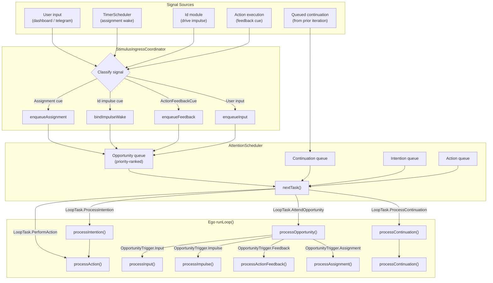
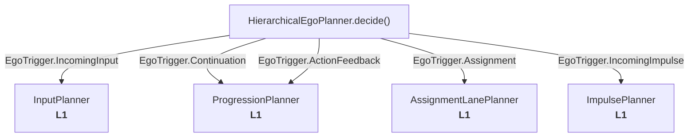
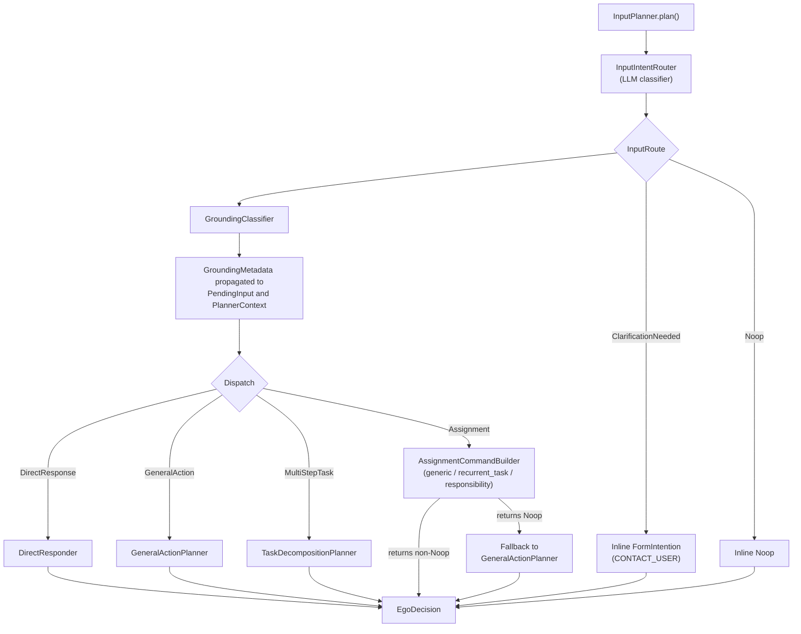
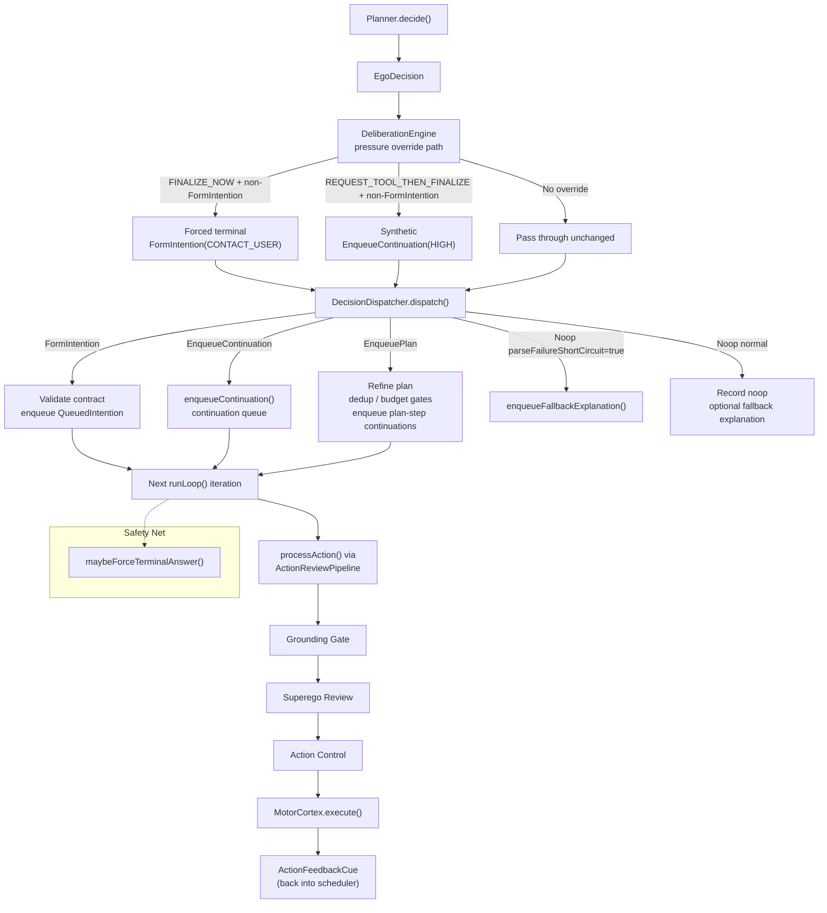
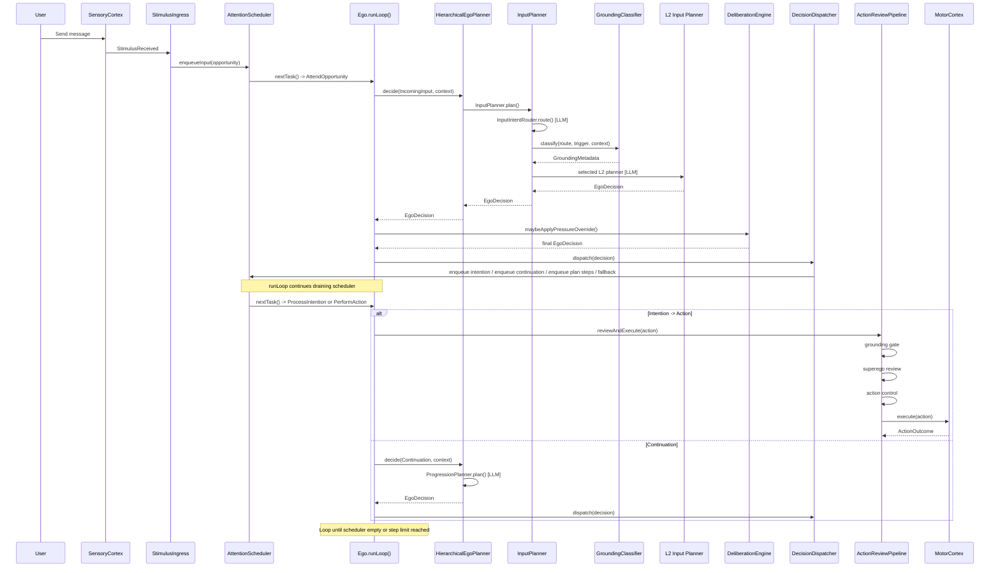

# Planner Flow Diagram

Current planner architecture as of 2026-04-18.

This file describes the runtime planner flow implemented under
`src/main/kotlin/ai/neopsyke/agent/ego/planner/**`.

## Signal-to-Planner Pipeline

External events enter through `SensoryCortex`, are routed by
`StimulusIngressCoordinator`, queued in `AttentionScheduler`, and dispatched by
`Ego` to the planner. The planner returns an `EgoDecision`, which
`DecisionDispatcher` turns into queued continuations, queued intentions, plan
step continuations, or fallback explanation behavior.

## HierarchicalEgoPlanner (L0 Router)

Each `Ego.process*()` method creates an `EgoTrigger` and calls
`planner.decide(trigger, context)`. `HierarchicalEgoPlanner` deterministically
routes on the sealed trigger type. It does not inspect free text.

### Trigger-to-Lane Mapping

| Trigger | Origin | L1 Lane | LaneId |
|---------|--------|---------|--------|
| `IncomingInput` | User / external chat ingress | `InputPlanner` | `INPUT_INTENT_ROUTER` |
| `Continuation` | Internal queue | `ProgressionPlanner` | `PROGRESSION` |
| `ActionFeedback` | Motor/action result cue | `ProgressionPlanner` | `PROGRESSION` |
| `Assignment` | Durable-work wake / step activation | `AssignmentLanePlanner` | `ASSIGNMENT` |
| `IncomingImpulse` | Id drive activation | `ImpulsePlanner` | `IMPULSE` |

## InputPlanner (L1) -- Router, Grounding, L2 Dispatch

`InputPlanner` is the only L1 lane with an internal semantic routing stage. It:

1. Calls `InputIntentRouter`
2. Always calls `GroundingClassifier`
3. Dispatches to the selected L2 planner or handles inline clarification/noop

### InputIntentRouter Routes

`InputIntentRouter` maps free-text user input to typed routes. The router may
also set an assignment target for the `Assignment` route.

| Route | Target / Meaning | L2 handling | Typical result |
|-------|------------------|-------------|----------------|
| `DirectResponse` | Answer directly from current context | `DirectResponder` | `FormIntention(CONTACT_USER)` or `Noop` |
| `GeneralAction` | One explicit next action | `GeneralActionPlanner` | `FormIntention(...)` or `Noop` |
| `MultiStepTask` | Ordered multi-stage task | `TaskDecompositionPlanner` | `EnqueuePlan` or `Noop` |
| `Assignment` | Persistent work interaction | `AssignmentCommandBuilder` | `FormIntention(ASSIGNMENT_OPERATION)` or `FormIntention(CONTACT_USER)` or `Noop` |
| `ClarificationNeeded` | Route ambiguity or missing user intent | inline | `FormIntention(CONTACT_USER)` |
| `Noop` | No actionable intent | inline | `Noop` |

For `Assignment`, `assignment_target` is one of:

- `generic`
- `recurrent_task`
- `responsibility`

### GroundingClassifier

`GroundingClassifier` runs after route selection and before L2 dispatch.

- Deterministic `NOT_REQUIRED` prefilter:
  - `InputRoute.Assignment`
  - `InputRoute.ClarificationNeeded`
  - `InputRoute.Noop`
- LLM classification:
  - `InputRoute.DirectResponse`
  - `InputRoute.GeneralAction`
  - `InputRoute.MultiStepTask`

The result is propagated onto the grounded `PendingInput` and copied into
`PlannerContext.groundingMetadata`.

## L1 Lane Decision Capabilities

Planner lanes do not currently emit `EgoDecision.EnqueueContinuation`
themselves. That shape is introduced later by deliberation-pressure overrides.

| EgoDecision | InputPlanner | ProgressionPlanner | AssignmentLanePlanner | ImpulsePlanner |
|-------------|:-----------:|:------------------:|:----------------------:|:-------------:|
| `FormIntention` | via L2 | yes | yes | yes |
| `EnqueuePlan` | via L2 | yes | yes | no |
| `Noop` | via L2 | yes | yes | yes |
| `EnqueueContinuation` | no | no | no | no |

### L2 Input Sub-Planner Capabilities

| L2 planner | Returns |
|-----------|---------|
| `DirectResponder` | `FormIntention(CONTACT_USER)` or `Noop` |
| `GeneralActionPlanner` | `FormIntention(...)` or `Noop` |
| `TaskDecompositionPlanner` | `EnqueuePlan` or `Noop` |
| `AssignmentCommandBuilder` | `FormIntention(ASSIGNMENT_OPERATION)` or `FormIntention(CONTACT_USER)` or `Noop` |

## Post-Planner Pipeline

After `planner.decide(...)`, `Ego` lets `DeliberationEngine` apply pressure
overrides, then passes the final `EgoDecision` to `DecisionDispatcher`.

## Full End-to-End Flow (Single Input)

## Circuit Breaker Coverage

Only some planner lanes use the per-root parse-failure circuit breaker in
`PlannerRuntime`.

| LaneId | Circuit breaker |
|--------|:---------------:|
| `INPUT_INTENT_ROUTER` | no |
| `DIRECT_RESPONSE` | no |
| `GENERAL_ACTION` | yes |
| `TASK_DECOMPOSITION` | no |
| `ASSIGNMENT_GENERIC` | no |
| `ASSIGNMENT_RECURRENT_TASK` | no |
| `ASSIGNMENT_RESPONSIBILITY` | no |
| `PROGRESSION` | yes |
| `ASSIGNMENT` | yes |
| `IMPULSE` | yes |
| `GROUNDING_CLASSIFIER` | no |
| `PLAN_REFINER` | no |

When a circuit-backed lane trips, it returns
`Noop(parseFailureShortCircuit = true)`, which sends the flow directly to the
fallback-explanation path instead of normal noop handling.

## File Index

| Component | File |
|-----------|------|
| `HierarchicalEgoPlanner` | `src/main/kotlin/ai/neopsyke/agent/ego/planner/HierarchicalEgoPlanner.kt` |
| `PlannerLane` | `src/main/kotlin/ai/neopsyke/agent/ego/planner/PlannerLane.kt` |
| `LaneId` | `src/main/kotlin/ai/neopsyke/agent/ego/planner/LaneId.kt` |
| `InputPlanner` | `src/main/kotlin/ai/neopsyke/agent/ego/planner/lane/InputPlanner.kt` |
| `ProgressionPlanner` | `src/main/kotlin/ai/neopsyke/agent/ego/planner/lane/ProgressionPlanner.kt` |
| `AssignmentLanePlanner` | `src/main/kotlin/ai/neopsyke/agent/ego/planner/lane/AssignmentLanePlanner.kt` |
| `ImpulsePlanner` | `src/main/kotlin/ai/neopsyke/agent/ego/planner/lane/ImpulsePlanner.kt` |
| `InputIntentRouter` | `src/main/kotlin/ai/neopsyke/agent/ego/planner/input/InputIntentRouter.kt` |
| `GroundingClassifier` | `src/main/kotlin/ai/neopsyke/agent/ego/planner/input/GroundingClassifier.kt` |
| `DirectResponder` | `src/main/kotlin/ai/neopsyke/agent/ego/planner/input/DirectResponder.kt` |
| `GeneralActionPlanner` | `src/main/kotlin/ai/neopsyke/agent/ego/planner/input/GeneralActionPlanner.kt` |
| `TaskDecompositionPlanner` | `src/main/kotlin/ai/neopsyke/agent/ego/planner/input/TaskDecompositionPlanner.kt` |
| `AssignmentCommandBuilder` | `src/main/kotlin/ai/neopsyke/agent/ego/planner/input/AssignmentCommandBuilder.kt` |
| `InputRoute` | `src/main/kotlin/ai/neopsyke/agent/ego/planner/model/InputRoute.kt` |
| `EgoTrigger` / `EgoDecision` | `src/main/kotlin/ai/neopsyke/agent/model/CognitionModels.kt` |
| `DecisionDispatcher` | `src/main/kotlin/ai/neopsyke/agent/ego/DecisionDispatcher.kt` |
| `DeliberationEngine` | `src/main/kotlin/ai/neopsyke/agent/ego/DeliberationEngine.kt` |
| `ActionReviewPipeline` | `src/main/kotlin/ai/neopsyke/agent/ego/ActionReviewPipeline.kt` |
