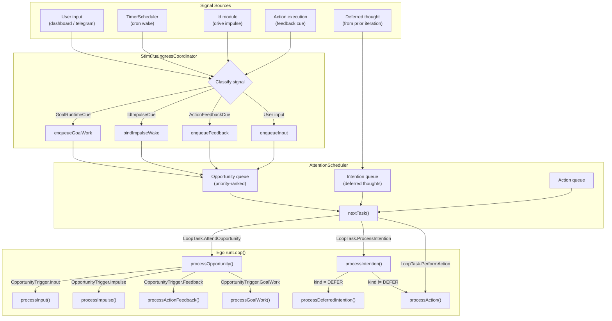
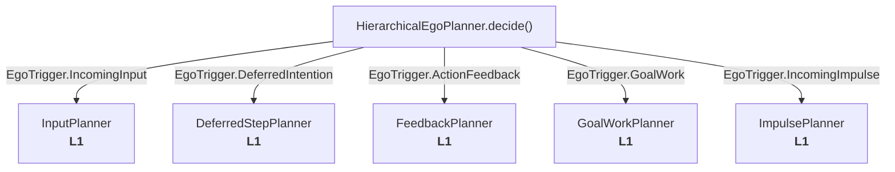
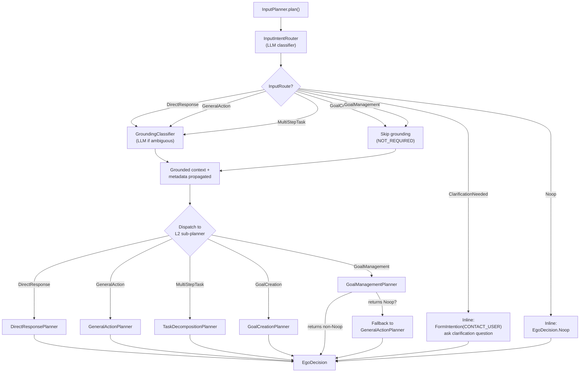
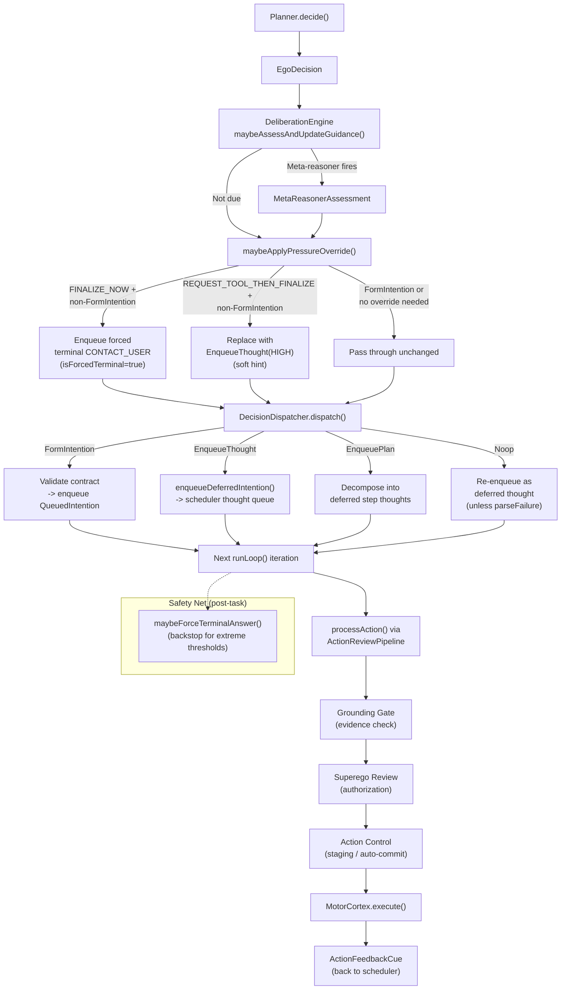
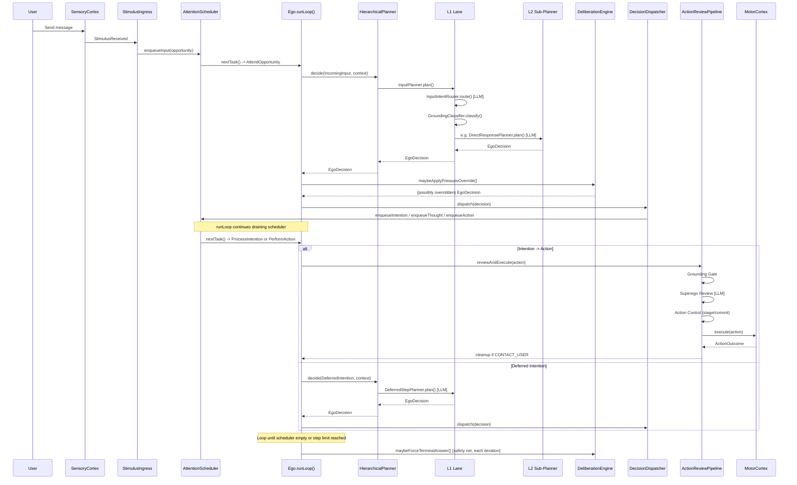

# Planner Flow Diagram

Current planner architecture as of 2026-04-10.

## Signal-to-Planner Pipeline

External events enter through `SensoryCortex`, get classified by
`StimulusIngressCoordinator`, queued in `AttentionScheduler`, and dispatched
by `Ego` to the planner. The planner returns an `EgoDecision` which the
`DecisionDispatcher` converts into scheduled work (thoughts, intentions, or
actions).

## HierarchicalEgoPlanner (L0 Router)

Each `Ego.process*()` method creates an `EgoTrigger` and calls
`planner.decide(trigger, context)`. The `HierarchicalEgoPlanner` dispatches
to one of five L1 lanes based on the trigger type. This is deterministic
routing on typed runtime facts -- no text inspection.

### Trigger-to-Lane Mapping

| Trigger | Origin | L1 Lane | LaneId |
|---------|--------|---------|--------|
| `IncomingInput` | User (dashboard, telegram) | InputPlanner | `INPUT_INTENT_ROUTER` |
| `DeferredIntention` | Internal queue (prior iteration) | DeferredStepPlanner | `DEFERRED_STEP` |
| `ActionFeedback` | Motor cortex (execution result) | FeedbackPlanner | `FEEDBACK` |
| `GoalWork` | Goal cue (cron, step advance) | GoalWorkPlanner | `GOAL_WORK` |
| `IncomingImpulse` | Id module (drive activation) | ImpulsePlanner | `IMPULSE` |

## InputPlanner (L1) -- Two-Stage Routing

InputPlanner is the only L1 lane with a sub-routing stage. It runs two
sequential LLM classifiers then dispatches to one of five L2 sub-planners.

### InputIntentRouter Routes

The router is an LLM classifier that maps free-text user input to one of
seven typed routes. Dispatch from route to sub-planner is deterministic on
the typed result.

| Route | L2 Sub-Planner | Grounding | Typical Decision |
|-------|---------------|-----------|------------------|
| `DirectResponse` | DirectResponsePlanner | LLM-classified | `EnqueueThought` or `FormIntention(CONTACT_USER)` |
| `GeneralAction` | GeneralActionPlanner | LLM-classified | `FormIntention` (any action type) |
| `MultiStepTask` | TaskDecompositionPlanner | LLM-classified | `EnqueuePlan` |
| `GoalCreation` | GoalCreationPlanner | NOT_REQUIRED | `FormIntention(CONTACT_USER)` with goal params |
| `GoalManagement` | GoalManagementPlanner | NOT_REQUIRED | `FormIntention(CONTACT_USER)` with goal op |
| `ClarificationNeeded` | (inline) | NOT_REQUIRED | `FormIntention(CONTACT_USER)` |
| `Noop` | (inline) | NOT_REQUIRED | `EgoDecision.Noop` |

### GroundingClassifier

Determines whether the input requires fresh external evidence before a
response can be delivered.

- **Deterministic NOT_REQUIRED**: GoalCreation, GoalManagement, ClarificationNeeded, Noop
- **Requires LLM classification**: DirectResponse, GeneralAction, MultiStepTask

Result is propagated as `GroundingMetadata` on the input envelope and the
planner context, consumed downstream by the grounding gate in
`ActionReviewPipeline`.

## L1 Lane Decision Capabilities

Each L1 lane parses an LLM response into one of the `EgoDecision` variants.
Not all lanes support all decision types.

| EgoDecision | InputPlanner | DeferredStep | Feedback | GoalWork | Impulse |
|-------------|:---:|:---:|:---:|:---:|:---:|
| `EnqueueThought` (defer) | via L2 | yes | yes | yes | yes |
| `FormIntention` (intend) | via L2 | yes | yes | yes | yes |
| `EnqueuePlan` (plan) | via L2 | yes | yes | yes | **no** |
| `Noop` (noop) | via L2 | yes | yes | yes | yes |

## Post-Planner Pipeline

After the planner returns an `EgoDecision`, the Ego applies meta-reasoning
pressure and dispatches the decision.

## Full End-to-End Flow (Single Input)

## Circuit Breaker Coverage

Each lane tracks consecutive parse failures per `rootInputId`. When the
circuit opens, the lane returns `Noop(parseFailureShortCircuit = true)` which
bypasses the normal noop re-enqueue and goes directly to fallback
explanation.

| LaneId | Circuit Breaker |
|--------|:-:|
| `INPUT_INTENT_ROUTER` | no (delegates to L2) |
| `DIRECT_RESPONSE` | no |
| `GENERAL_ACTION` | yes |
| `TASK_DECOMPOSITION` | no |
| `GOAL_CREATION` | no |
| `GOAL_MANAGEMENT` | no |
| `DEFERRED_STEP` | yes |
| `FEEDBACK` | yes |
| `GOAL_WORK` | yes |
| `IMPULSE` | yes |
| `GROUNDING_CLASSIFIER` | no |

## File Index

| Component | File |
|-----------|------|
| `Ego.Planner` interface | `agent/ego/Ego.kt:103-110` |
| `HierarchicalEgoPlanner` | `agent/ego/planner/HierarchicalEgoPlanner.kt` |
| `PlannerLane` interface | `agent/ego/planner/PlannerLane.kt` |
| `LaneId` enum | `agent/ego/planner/LaneId.kt` |
| `InputPlanner` | `agent/ego/planner/lane/InputPlanner.kt` |
| `DeferredStepPlanner` | `agent/ego/planner/lane/DeferredStepPlanner.kt` |
| `FeedbackPlanner` | `agent/ego/planner/lane/FeedbackPlanner.kt` |
| `GoalWorkPlanner` | `agent/ego/planner/lane/GoalWorkPlanner.kt` |
| `ImpulsePlanner` | `agent/ego/planner/lane/ImpulsePlanner.kt` |
| `InputIntentRouter` | `agent/ego/planner/input/InputIntentRouter.kt` |
| `GroundingClassifier` | `agent/ego/planner/input/GroundingClassifier.kt` |
| `DirectResponsePlanner` | `agent/ego/planner/input/DirectResponsePlanner.kt` |
| `GeneralActionPlanner` | `agent/ego/planner/input/GeneralActionPlanner.kt` |
| `TaskDecompositionPlanner` | `agent/ego/planner/input/TaskDecompositionPlanner.kt` |
| `GoalCreationPlanner` | `agent/ego/planner/input/GoalCreationPlanner.kt` |
| `GoalManagementPlanner` | `agent/ego/planner/input/GoalManagementPlanner.kt` |
| `InputRoute` sealed interface | `agent/ego/planner/model/InputRoute.kt` |
| `EgoTrigger` sealed interface | `agent/model/CognitionModels.kt:127-133` |
| `EgoDecision` sealed interface | `agent/model/CognitionModels.kt:135-164` |
| `DeliberationEngine` | `agent/ego/DeliberationEngine.kt` |
| `DecisionDispatcher` | `agent/ego/DecisionDispatcher.kt` |
| `ActionReviewPipeline` | `agent/ego/ActionReviewPipeline.kt` |
