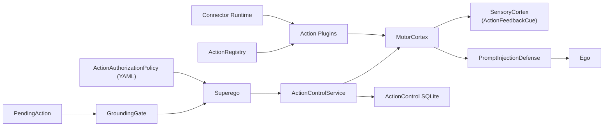
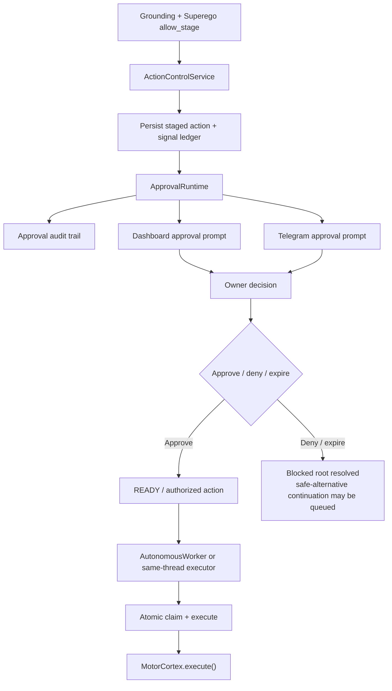
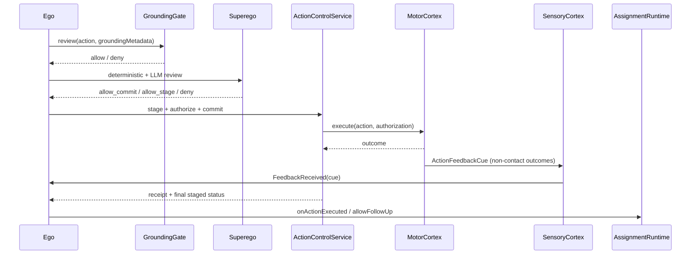

# Action Review and Execution Diagram

This file covers the path from `PendingAction` to staged or committed execution and feedback re-entry.
For the unified runtime entrypoint, see [../../AGENT_RUNTIME_LOGIC.md](../../AGENT_RUNTIME_LOGIC.md). For dashboard-side action control, see [DASHBOARD_AND_OBSERVABILITY_DIAGRAM.md](DASHBOARD_AND_OBSERVABILITY_DIAGRAM.md).

## L1: Action Execution Path

- `processAction(action)` delegates to `ActionReviewPipeline.reviewAndExecute(action)`.
- Pipeline stages: grounding gate, Superego, `ActionControlService`, `MotorCortex`, feedback re-entry.

### Special Cases
- `resolution_draft` records an active draft-sequence entry and does not emit a user-visible turn.
- `contact_user` runs scratchpad final-pass processing before execution.
- Fallback explanation actions bypass the review pipeline.

## L1: Review and Execution Stack

### L2: Grounding Gate

- File: `src/main/kotlin/ai/neopsyke/agent/ego/DecisionVerifier.kt`
- Typed post-gate enforcing that evidence was gathered when grounding is required.
- Applies only to `contact_user` actions.
- Reads:
  - `PendingAction.groundingMetadata`
  - `DeliberationEngine.ExternalEvidenceProgress`
  - evidence action availability
  - `isForcedTerminal`
- Outcomes:
  - not required -> allow
  - evidence gathered -> allow
  - evidence unavailable -> graceful allow
  - technical failure -> deny
  - no evidence yet -> deny
- Forced terminal answers can degrade past technical grounding failures with a disclaimer.
- Grounding classification happens at input intake via `GroundingClassifier`; assignment work uses per-step typed grounding policy.

### L2: Superego Review

- File: `src/main/kotlin/ai/neopsyke/agent/superego/Superego.kt`
- Review phases:
  1. deterministic checks
  2. authorization policy
  3. conditional LLM semantic review
- Deterministic checks validate action shape, enforce Id-origin allowlists, and allow plugin-specific deterministic review.
- `ActionAuthorizationPolicy` evaluates instruction trust, principal role, argument data trust, and per-action overrides.
- Public commits, recurring assignment operations, and assignment deletes receive stricter handling.
- LLM review:
  - can be bypassed for Id-origin `reflect_internal`
  - uses prompt/schema assets for review instructions, retry text, and response schema `{ allow, reason, reason_code, confidence, policy_risk }`
  - runs at temperature `0.0`
  - uses schema-enforced structured output and retry
  - defaults to deny on repeated parse failure
  - can escalate through the optional two-stage flow, including `twoStageLowConfidenceThreshold`
  - uses a fixed `max_tokens` cap as a safety net, not output guidance

## L1: Allow-Stage Approval Path

### L2: Action Control and Staging

- File: `src/main/kotlin/ai/neopsyke/agent/cortex/motor/actions/control/ActionControlService.kt`
- Handles both `ALLOW_STAGE` and `ALLOW_COMMIT`.
- Persists staged actions, commit authorizations, receipts, and ledger entries.
- Enforces centralized per-root-input rate limits across action families.
- Fallback-bypass executions are still mirrored into durable staged/receipt records.

#### Approval Runtime
- Creates durable approval request artifacts.
- Resolves the owner-facing delivery channel.
- Sends approval prompts through dashboard chat or Telegram.
- `StagedAction.approvalContext` carries display-only labeled context blocks.
- Approval interpretation is LLM-based, including `DENY_AND_REISSUE`.
- Approval or denial is hash-bound to the staged action.
- Hash drift supersedes the previous request and issues a replacement prompt.
- Expiry and clarification exhaustion deny the staged action and unblock the root.
- Telegram non-conversation routing requires successful startup ACK delivery before it is treated as live.

#### AutonomousWorker
- Background coroutine that polls for `READY` staged actions.
- Uses SQL-driven same-thread and same-target serialization.
- Claims work atomically at execution time.

## L1: Direct Commit and Feedback Re-entry

### L2: MotorCortex Execution

- File: `src/main/kotlin/ai/neopsyke/agent/cortex/motor/MotorCortex.kt`
- Performs the final no-bypass authorization check for side-effecting actions.
- Delegates to `ActionRegistry.execute()` which routes to discovered plugins.
- `contact_user` delivery is channel-aware.
- Native Google observe actions use encrypted credentials with on-demand token refresh.
- Actions can return immediate outcomes or async wait contracts.

### L2: Feedback Re-entry and Continuation

- Non-`contact_user` outcomes emit `ActionFeedbackCue` and re-enter through SensoryCortex.
- `processActionFeedback()` binds the feedback percept to the existing thread, updates deliberation evidence and cooldowns, and only then allows continuation decisions.
- `WAITING` suspends the thread rather than auto-queuing continuation work.
- Assignment-origin `WAITING` without handles is a contract violation.
- For `contact_user`, the runtime clears pending work for the same root/session scope, captures the session digest, destroys the scratchpad, and forces a post-terminal memory assessment.
- Feedback executors no longer tag the feedback with a verdict; continuation decisions only happen after cognition sees the typed feedback cue again.

## L1: Action Execution Surface (Available Actions)

- File: `src/main/kotlin/ai/neopsyke/agent/cortex/motor/MotorCortex.kt`
- Discovery uses `ServiceLoader<AgentActionPluginFactory>` plus the optional connector runtime.
- Each plugin self-describes through `ActionDescriptor`.
- `MotorCortex.availableActionTypes()` filters by both `dispatchable` and `available`, so planner prompts only see runtime-available actions.
- Built-in action planner descriptions, payload guidance, payload examples, follow-up prefixes, and Superego directives are prompt-backed descriptor fragments under `config/prompts/actions/**`.

### Built-in Action Plugins
- `contact_user` -> user-facing output, private commit
- `resolution_draft` -> internal synthesis chunk
- `web_search` -> external search, gathers evidence
- `website_fetch` -> fetch URL content, gathers evidence
- `reflect_internal` -> internal durable-memory action
- `reflect_evidence` -> evidence-bound reflection
- `assignment_operation` -> recurrent-task and responsibility lifecycle actions
- `email_send` -> Microsoft Graph adapter when enabled
- `gmail_observe_search`, `gmail_observe_message`, `calendar_observe_events` -> native Google read-only observe actions

### Connector-Backed Actions
- Optional and fail-closed behind `config.connectors.enabled`.
- Loaded from curated catalog plus local installed state.
- Require local enablement, allowlisting, capability validation, and tool-description pinning.
- Subprocesses run with explicit minimal env and declared secret handles only.
- Non-observe connector actions are treated as staged-by-default.
