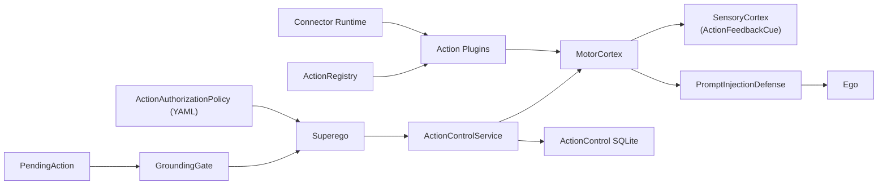
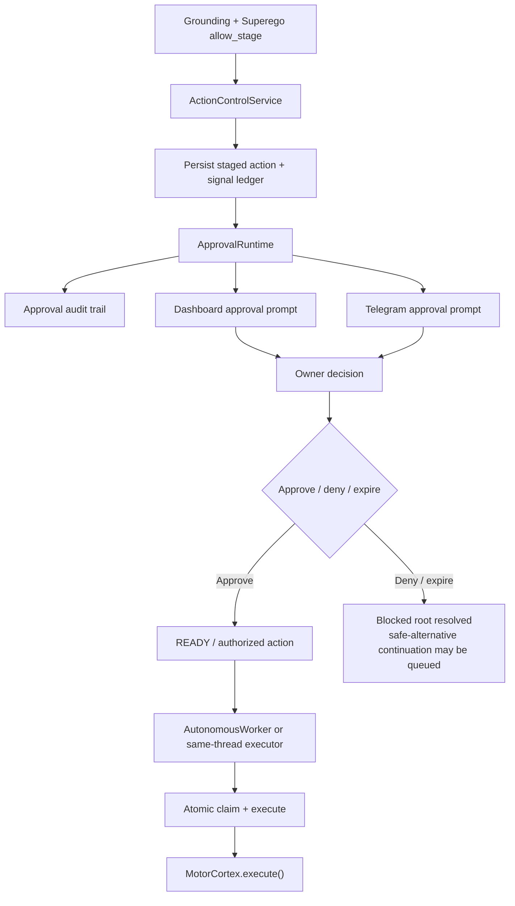
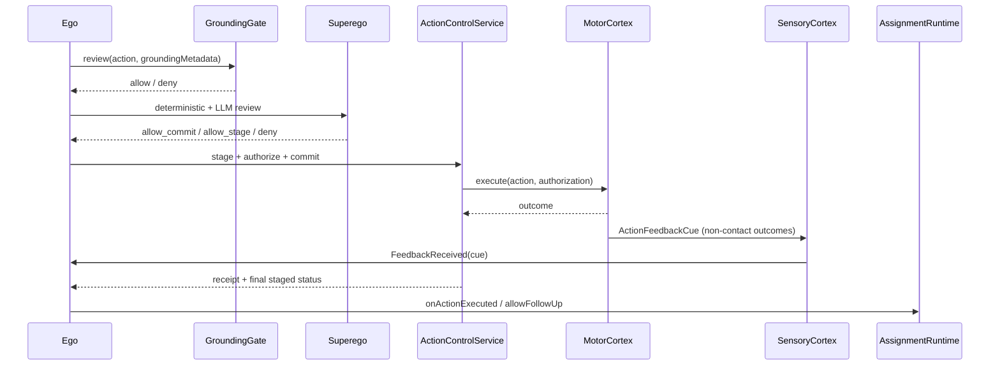

# Action Review and Execution Diagram

This file covers the path from `PendingAction` to staged or committed execution and feedback re-entry.
For the loop context around this path, see [EGO_LOOP_DIAGRAM.md](EGO_LOOP_DIAGRAM.md).

## L1: Review and Execution Stack

## L1: Allow-Stage Approval Path

## L1: Direct Commit and Feedback Re-entry

