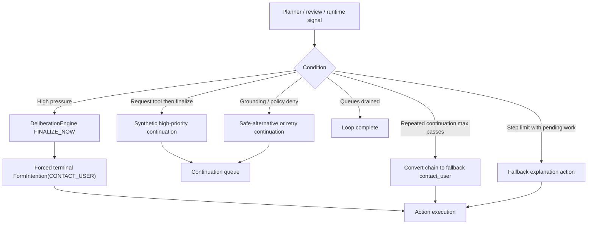

# Convergence and Fallback Diagram

This file covers how the loop ends, retries, and forces terminal behavior.
For planner dispatch mechanics, see [../PLANNER_FLOW_DIAGRAM.md](../PLANNER_FLOW_DIAGRAM.md).

## L1: Convergence and Fallback States

```mermaid
stateDiagram-v2
    [*] --> Processing

    Processing --> Planning: input / continuation task
    Planning --> ActionQueued: decision=intend
    Planning --> ContinuationQueued: decision=continuation / plan / noop-retry
    Planning --> ContinuationQueued: plan suppressed (budget / pressure / hash / pending) -> convergence / recovery continuation

    ActionQueued --> GroundingReview: non-fallback action
    ActionQueued --> Executing: fallback explanation action
    GroundingReview --> Denied: grounding gate deny

    GroundingReview --> PolicyReview: grounding gate allow
    PolicyReview --> Denied: deterministic hard deny / contract deny / superego deny
    Denied --> ContinuationQueued: enqueue safe alternative continuation
    Note right of ContinuationQueued: Repeat-denied payload block is skipped for technical or transient denial reasons; reflection lessons persist only for non-technical and non-system denials

    PolicyReview --> Executing: allow_commit
    PolicyReview --> Executing: allow_stage (legacy runtime compatibility path)
    Executing --> ContinuationQueued: action=resolution_draft (plan continues)
    Executing --> EvidenceObserved: external action succeeded
    Executing --> EvidenceMissing: tool / provider failure
    Executing --> WebSearchUnavailable: web search init / config failure
    WebSearchUnavailable --> ContinuationQueued: planner uses remaining available actions
    EvidenceObserved --> ContinuationQueued: feedback-driven continuation
    EvidenceMissing --> ContinuationQueued: retry / adjust continuation
    EvidenceMissing --> ActionDisabled: retry-budget cooldown trips (non-retryable action failures)
    ActionDisabled --> ContinuationQueued: planner uses remaining available actions

    Processing --> HighPressure: pressure threshold reached
    HighPressure --> ForcedTerminal: force terminal contact_user enqueue
    ForcedTerminal --> Executing

    Processing --> StepLimit: max loop steps with pending work
    StepLimit --> FallbackAttempt: dequeue fallback explanation action
    StepLimit --> Complete: force-deny active impulse lifecycles
    FallbackAttempt --> Executing

    Executing --> CleanupResolvedInput: action=contact_user clears same-input queued work + destroys scratchpad
    CleanupResolvedInput --> Complete
    Processing --> Complete: queues drained
    Complete --> [*]
```

## L1: Endgame Trigger Map


