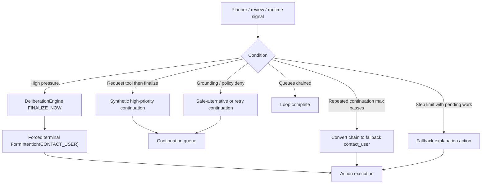

# Convergence and Fallback Diagram

This file covers how the loop measures progress, increases pressure, retries, and forces terminal behavior.
For the unified runtime entrypoint, see [../../AGENT_RUNTIME_LOGIC.md](../../AGENT_RUNTIME_LOGIC.md).

## L1: Deliberation and Convergence

- Files: `src/main/kotlin/ai/neopsyke/agent/ego/DeliberationEngine.kt`, `DeliberationProgressMonitor.kt`, `MetaReasoner.kt`

### Pressure Tracking
- `DeliberationState` tracks:
  - step index
  - `DecisionPressure`
  - stale streak
  - progress score
  - denial count
  - steps since new evidence
  - repeat signature hits
  - noop streak
  - model error streak
- `DecisionPressure` combines baseline pressure with step, stale, denial, repeat, noop, model error, and evidence-gap pressure, then subtracts progress relief.
- Decision signatures are tracked over a sliding window to detect loops.

### Pressure Drives
- `MetaReasoner` runs on cadence based on step count, interval, and pressure.
- `maybeApplyPressureOverride()` can:
  - force terminal answer now
  - request one more tool-oriented continuation before finalizing
  - let the planner decision pass through unchanged
- `maybeForceTerminalAnswer()` acts as the backstop when circular pressure, model-error streak, or noop streak crosses the configured limits.

### Action Retry Budget
- Per-input-scope cooldown and circuit breaker for action types.
- Non-retryable failures increment the counter.
- Reaching the budget disables the action type for a cooldown window.

### State Scoping
- Deliberation state is session-scoped.
- Evidence progress and action cooldowns are scoped by `(rootInputId, sessionId)`.

## L1: Convergence and Fallback States

```mermaid
stateDiagram-v2
    [*] --> Processing

    Processing --> Planning: input / continuation task
    Planning --> ActionQueued: decision=intend
    Planning --> ContinuationQueued: decision=continuation / plan / noop-retry
    Planning --> ContinuationQueued: plan suppressed (budget / pressure / hash / pending) -> convergence / recovery continuation

    ActionQueued --> GroundingReview: non-fallback action
    ActionQueued --> Executing: fallback explanation action
    GroundingReview --> Denied: grounding gate deny

    GroundingReview --> PolicyReview: grounding gate allow
    PolicyReview --> Denied: deterministic hard deny / contract deny / superego deny
    Denied --> ContinuationQueued: enqueue safe alternative continuation
    Note right of ContinuationQueued: Repeat-denied payload block is skipped for technical or transient denial reasons; reflection lessons persist only for non-technical and non-system denials

    PolicyReview --> Executing: allow_commit
    PolicyReview --> Executing: allow_stage (legacy runtime compatibility path)
    Executing --> ContinuationQueued: action=resolution_draft (plan continues)
    Executing --> EvidenceObserved: external action succeeded
    Executing --> EvidenceMissing: tool / provider failure
    Executing --> WebSearchUnavailable: web search init / config failure
    WebSearchUnavailable --> ContinuationQueued: planner uses remaining available actions
    EvidenceObserved --> ContinuationQueued: feedback-driven continuation
    EvidenceMissing --> ContinuationQueued: retry / adjust continuation
    EvidenceMissing --> ActionDisabled: retry-budget cooldown trips (non-retryable action failures)
    ActionDisabled --> ContinuationQueued: planner uses remaining available actions

    Processing --> HighPressure: pressure threshold reached
    HighPressure --> ForcedTerminal: force terminal contact_user enqueue
    ForcedTerminal --> Executing

    Processing --> StepLimit: max loop steps with pending work
    StepLimit --> FallbackAttempt: dequeue fallback explanation action
    StepLimit --> Complete: force-deny active impulse lifecycles
    FallbackAttempt --> Executing

    Executing --> CleanupResolvedInput: action=contact_user clears same-input queued work + destroys scratchpad
    CleanupResolvedInput --> Complete
    Processing --> Complete: queues drained
    Complete --> [*]
```

### L2: Meta-Reasoner Details

- Uses schema-enforced structured output.
- Locally clamps `reason` length.
- Can retry with relaxed schema after schema-validation failures.
- Uses empty-content retry with adaptive completion-budget increase.
- Can fail over to the optional `meta_reasoner_fallback`.
- Completion budget is a fixed safety cap rather than output guidance.
- Verdicts:
  - `CONTINUE`
  - `CONTINUE_WITH_CONSTRAINTS`
  - `FINALIZE_NOW`
  - `REQUEST_TOOL_THEN_FINALIZE`

## L1: Endgame Trigger Map


