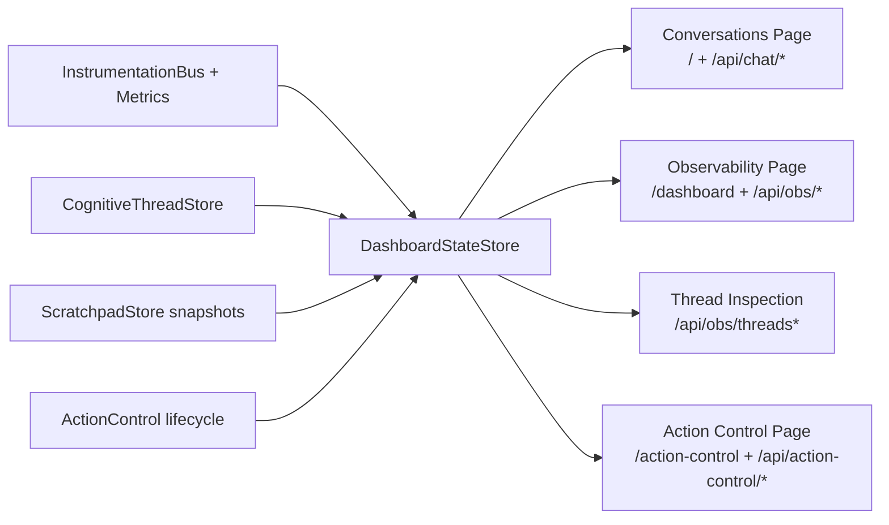
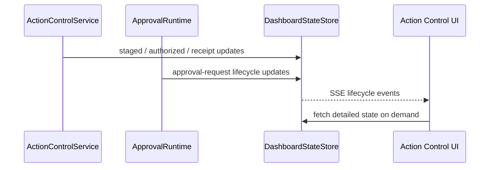

# Dashboard and Observability Diagram

This file covers the web surfaces, observability state store, and action-control/event streams.
For the main runtime entrypoint, see [../../AGENT_RUNTIME_LOGIC.md](../../AGENT_RUNTIME_LOGIC.md). For staged execution behavior, see [ACTION_REVIEW_AND_EXECUTION_DIAGRAM.md](ACTION_REVIEW_AND_EXECUTION_DIAGRAM.md).

## L1: Dashboard and Observability

- Files: `src/main/kotlin/ai/neopsyke/dashboard/DashboardStateStore.kt`, `DashboardServer.kt`
- UI routes:
  - Conversations (`/`)
  - Observability (`/dashboard`)
  - Action Control (`/action-control`)
- API namespaces:
  - Chat (`/api/chat/*`)
  - Observability (`/api/obs/*`)
  - Action Control (`/api/action-control/*`)
- Thread inspection endpoints:
  - `/api/obs/threads`
  - `/api/obs/threads/{threadId}`
- Observability SSE streams lightweight events; heavy workspace snapshots are served on demand via `/api/obs/workspace/{rootId}`.
- Action-control lifecycle updates use a dedicated SSE lane instead of polling.
- Chat submission responses return the authoritative stored payload and distinguish `recorded` from `enqueued`.
- Root-input to chat-session routing is retained until staged work reaches a terminal state.

## L1: State Store and UI Surfaces

## L2: Workspace and Thread Inspection

- Thread snapshots retain latest percept, latest opportunity, latest intention, wait state, and terminal summary.
- Workspace telemetry carries `root_input_id` and `root_input_received_at_ms`.
- Heavy snapshots stay out of SSE. The UI fetches them explicitly through `/api/obs/workspace/{rootId}`.

## L2: Action-Control Event Flow

