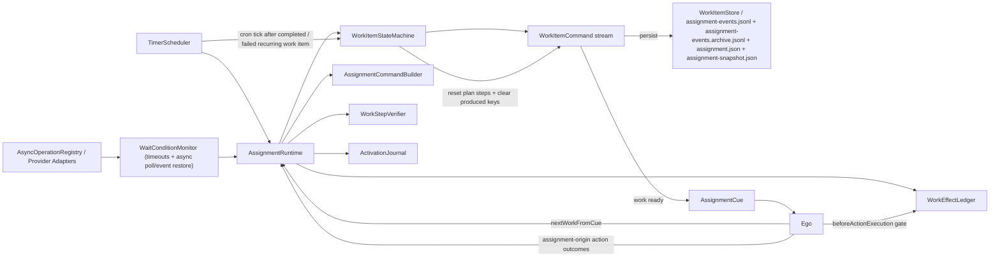
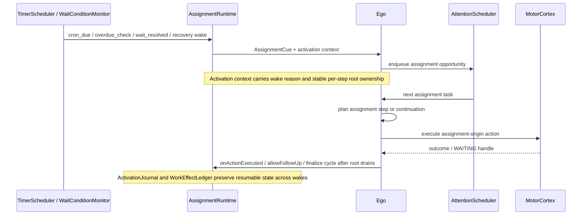

# Durable Work Diagram

This file covers assignment/runtime ownership, work-state transitions, wake reasons, and plan handoff.
For the unified runtime entrypoint, see [../../AGENT_RUNTIME_LOGIC.md](../../AGENT_RUNTIME_LOGIC.md). For planner-side assignment routing, see [PLANNER_FLOW_DIAGRAM.md](PLANNER_FLOW_DIAGRAM.md).

## L1: Durable Work Runtime

- Files: `src/main/kotlin/ai/neopsyke/agent/assignments/AssignmentGateway.kt`, `AssignmentRuntime.kt`, `WorkItemStateMachine.kt`, `AssignmentPlanBuilder.kt`, `WorkStepVerifier.kt`
- Feature flag: `config.assignment.enabled=false` -> `NoopAssignmentGateway`

### Plan Ownership
- `CREATE` -> Ego planner generates plan steps as part of the decision payload and the steps pass through `PlanRefiner`.
- `REVISE_PLAN` -> Ego produces the revised plan with current work-item context and runtime applies the supplied plan.
- The old LLM plan builder has been deleted.
- `DeterministicAssignmentPlanBuilder` remains only as an explicit recovery and migration fallback.

### Boundary
- Ego uses the gateway for:
  - `pendingWorkSummary()`
  - `reviewableResponsibilities()`
  - `nextWorkFromCue(AssignmentCue)`
  - action lifecycle callbacks
  - `finalizeAssignmentCycle(rootInputId)`

### Event-Sourced State Machine
- `transition(state, event) -> (newState, commands)`
- `WorkItemStatus`: `CREATED`, `PLANNING`, `ACTIVE`, `BLOCKED`, `SUSPENDED`, `COMPLETED`, `FAILED`, `STALLED`, `NEEDS_ATTENTION`, `RETIRED`
- `WorkItemKind`: `RECURRENT_TASK`, `RESPONSIBILITY`
- Responsibilities are open-ended and do not auto-complete when the current plan is exhausted.
- Events include creation, plan generation/revision, step execution, wait resolution, suspension/resume, cron cycles, completion, retirement, failure, priority changes, delivery lifecycle, review lifecycle, and effect-intent lifecycle.
- Commands include work-ready emission, wake scheduling, wait-condition registration, persistence, and user notifications.

### Phase-2 Runtime-Owned State
- Delivery state tracks digest windows, suppression reasons, and delivered delta fingerprints.
- Monitor state tracks source cursors, bounded seen-item records, bounded change history, and review history.
- Responsibility items persist review policy plus `lastReviewAt` and `nextReviewAt`.

### PlanStep and Scheduling
- `PlanStep` status: `PENDING -> READY -> IN_PROGRESS -> DONE/BLOCKED/SKIPPED/FAILED`
- Dependency tracking uses `requires` and `produces`.
- `TimerScheduler` registers cron expressions or absolute timestamps.
- `WaitConditionMonitor` polls async operations and emits satisfaction events.
- Work-step roots stay stable per `work:<workItemId>:<stepId>` for thread and scratchpad continuity.
- `AssignmentCue` carries typed `WakeReasonType` data.

## L1: Plan Refinement and Durable Work Plan Ownership

```mermaid
flowchart TD
    subgraph "Inline Ego Plans"
        P1["Planner lane returns<br/>EgoDecision.EnqueuePlan"] --> PR1["PlanRefiner.refine()"]
        PR1 --> DD["DecisionDispatcher<br/>(hash / dedup / enqueue)"]
    end

    subgraph "Durable Work CREATE"
        GP["Assignment planner generates<br/>AssignmentCommand.Create<br/>with planSteps"] --> PR2["PlanRefiner.refine()"]
        PR2 --> FI["EgoDecision.FormIntention<br/>(CREATE payload with refined plan)"]
        FI --> AC["ActionControlService<br/>(stage with approvalContext)"]
        AC --> AR["ApprovalRuntime<br/>(shows plan in prompt)"]
        AR -->|"APPROVE"| DWR["AssignmentRuntime<br/>(uses pre-built plan)"]
        AR -->|"DENY_AND_REISSUE"| RI["Reissue to Ego<br/>(re-plan with feedback)"]
    end

    subgraph "Durable Work REVISE_PLAN"
        REV["Ego builds revised plan<br/>from work-item context"] --> PR3["PlanRefiner.refine()"]
        PR3 --> FI2["EgoDecision.FormIntention<br/>(REVISE_PLAN with plan)"]
        FI2 --> DWR2["AssignmentRuntime<br/>(applies supplied plan)"]
    end
```

## L1: Durable Work Boundary

### Scheduling and Activation Notes
- Cron-backed work items do not emit initial work-ready on creation.
- Completed or failed cron-backed work items reset plan-step state on the next cron cycle.
- Responsibility review timers are runtime-owned and feed `computeNextWakeAt()`.
- Manual operator reviews emit `MANUAL_REVIEW`; Id-origin "be useful" reviews emit `ID_REVIEW`.
- Activations use trusted internal automation `ConversationContext`.
- `WorkContextLoader.buildWorkUnit()` builds typed activation context with wake reasons, review hints, delivery hints, and runtime facts.
- Assignment step execution is conversation-independent, so assignment planning strips dialogue-specific ambient context while preserving durable memory and prior execution history.
- Memory recall for assignment work does not receive ambient context; recall cues are derived from the trigger and episodic vector cues.
- Scratchpads are created when work is actually processed, not when cues are ingested.
- Assignment-origin `WAITING` without async handles is a contract violation.
- `ActivationJournal` records `STARTED`, `STEP_SELECTED`, `CONTEXT_MATERIALIZED`, `NEXT_WAKE_SCHEDULED`, `FINISHED`, and `RECOVERED`.
- `WorkEffectLedger` guards mutating assignment actions through `effectIntentId`.
- Long-lived workloads use segmented JSONL rollover and persist `assignment-events.jsonl`, `assignment-events.archive.jsonl`, `assignment.json`, and `assignment-snapshot.json`.

### Channel Routing and Contact Policy
- Assignment activation contexts use `provider = "assignment-runtime"` with `surface = AUTOMATION`.
- `preferred_channel` is carried as a hint, not a transport address.
- Delivery goes through `RoutedConversationOutputGateway` and `DefaultUserContactChannelResolver`.
- `contactChannel` is set through planner payload `contact_channel` and uses user-facing keys such as `dashboard` and `telegram`.
- Only owner-initiated assignment operations may change `contactChannel`.

### Planner Split and Operator Surface
- `InputIntentRouter` remains the only semantic router.
- Assignment routing now includes typed targets: `GENERIC`, `RECURRENT_TASK`, `RESPONSIBILITY`.
- LLM lane config exposes `assignment_generic`, `assignment_recurrent_task`, and `assignment_responsibility`.
- `AssignmentCommandBuilder` supports `review` and `retire` in addition to the earlier lifecycle operations.
- Responsibility creation uses a bounded thread-scoped intake draft.
- Successful `assignment_operation` executions report `TASK_PROGRESS`, which lets Id treat accepted assignment work as satisfying "be useful" actions.

## L2: Wake to Execution Feedback Loop

