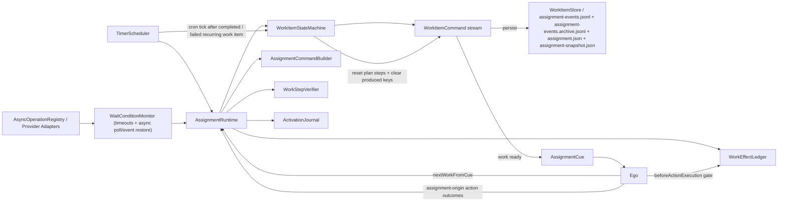
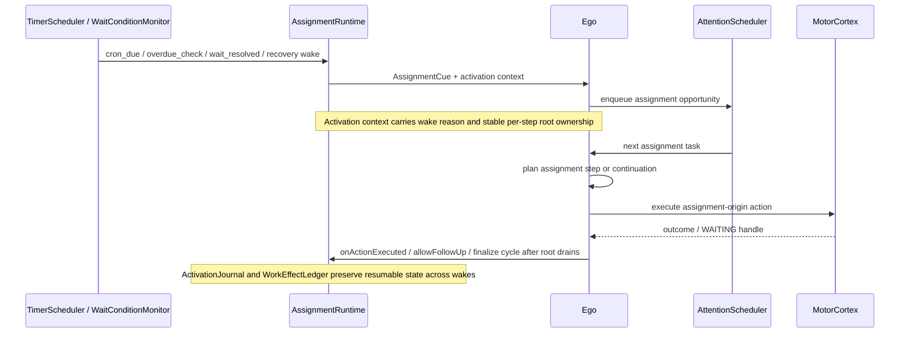

# Durable Work Diagram

This file covers assignment/runtime ownership, wake reasons, and plan handoff.
For planner-side assignment routing, see [../PLANNER_FLOW_DIAGRAM.md](../PLANNER_FLOW_DIAGRAM.md).

## L1: Plan Refinement and Durable Work Plan Ownership

```mermaid
flowchart TD
    subgraph "Inline Ego Plans"
        P1["Planner lane returns<br/>EgoDecision.EnqueuePlan"] --> PR1["PlanRefiner.refine()"]
        PR1 --> DD["DecisionDispatcher<br/>(hash / dedup / enqueue)"]
    end

    subgraph "Durable Work CREATE"
        GP["Assignment planner generates<br/>AssignmentCommand.Create<br/>with planSteps"] --> PR2["PlanRefiner.refine()"]
        PR2 --> FI["EgoDecision.FormIntention<br/>(CREATE payload with refined plan)"]
        FI --> AC["ActionControlService<br/>(stage with approvalContext)"]
        AC --> AR["ApprovalRuntime<br/>(shows plan in prompt)"]
        AR -->|"APPROVE"| DWR["AssignmentRuntime<br/>(uses pre-built plan)"]
        AR -->|"DENY_AND_REISSUE"| RI["Reissue to Ego<br/>(re-plan with feedback)"]
    end

    subgraph "Durable Work REVISE_PLAN"
        REV["Ego builds revised plan<br/>from work-item context"] --> PR3["PlanRefiner.refine()"]
        PR3 --> FI2["EgoDecision.FormIntention<br/>(REVISE_PLAN with plan)"]
        FI2 --> DWR2["AssignmentRuntime<br/>(applies supplied plan)"]
    end
```

## L1: Durable Work Boundary

## L2: Wake to Execution Feedback Loop

