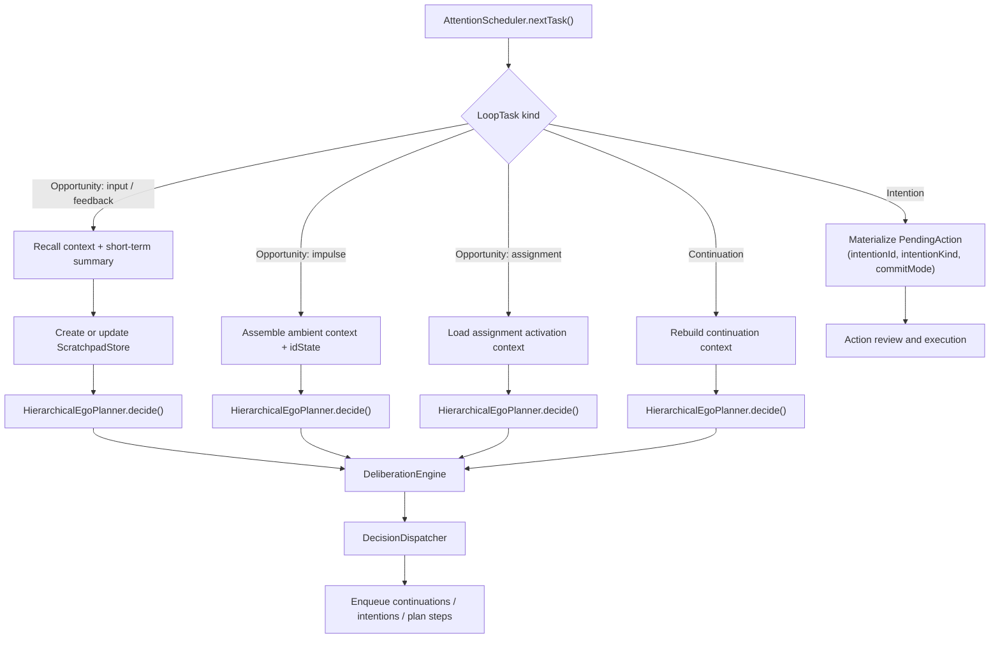
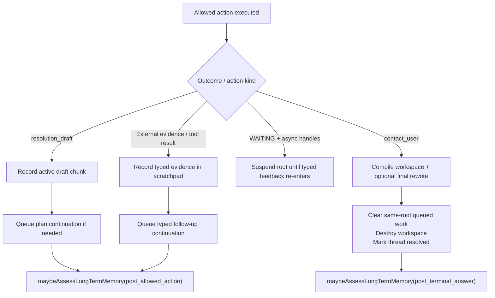
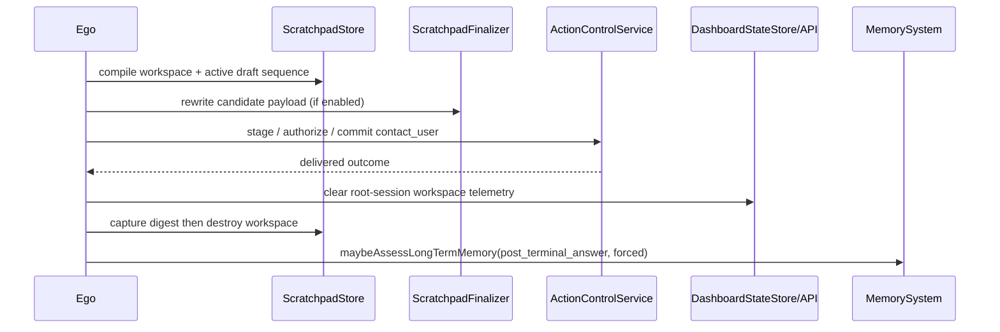

# Ego Loop Diagram

This file replaces the old single full-loop sequence with smaller stage diagrams.
For planner internals, see [../PLANNER_FLOW_DIAGRAM.md](../PLANNER_FLOW_DIAGRAM.md). For execution review, see [ACTION_REVIEW_AND_EXECUTION_DIAGRAM.md](ACTION_REVIEW_AND_EXECUTION_DIAGRAM.md).

## L1: Scheduler Branches

## L1: Action Result to Next Work

## L2: Terminal Answer Cleanup

