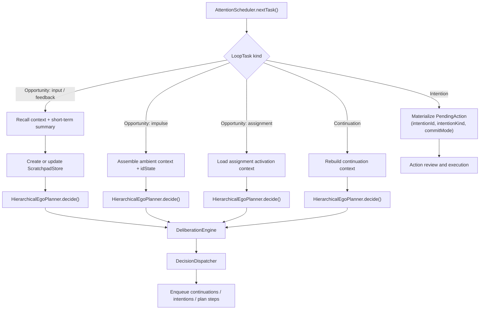
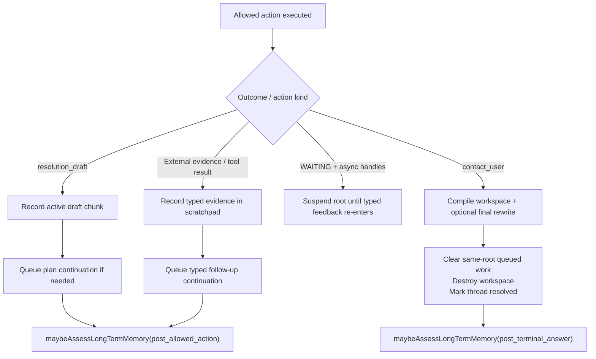
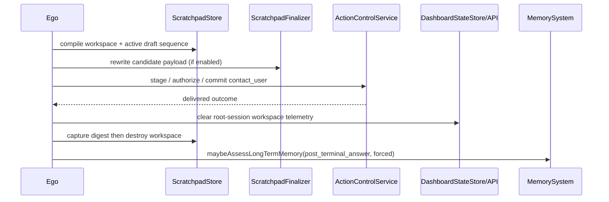

# Ego Loop Diagram

This file covers the interactive signal loop, scheduler behavior, queueing, and the split between opportunities, continuations, intentions, and actions.
For the unified runtime entrypoint, see [../../AGENT_RUNTIME_LOGIC.md](../../AGENT_RUNTIME_LOGIC.md). For Id specifics, see [ID_AND_IMPULSE_DIAGRAM.md](ID_AND_IMPULSE_DIAGRAM.md).

## L1: Ego (Main Loop)

- File: `src/main/kotlin/ai/neopsyke/agent/ego/Ego.kt`

### `runInteractive()`
- Pulls signals from `sensoryCortex.nextSignal()`.
- Routes `StimulusReceived` through `StimulusIngressCoordinator.ingest()` and then triggers `runLoop()`.
- Handles `ExitRequested`, `ShutdownRequested`, and `SourceClosed` to break the outer loop.

### `runLoop()`
- Bounded by `config.planner.maxLoopStepsPerInput`.
- Each iteration asks `scheduler.nextTask(isBlocked)` for a `LoopTask`.
- Task kinds:
  - `AttendOpportunity`
  - `ProcessContinuation`
  - `ProcessIntention`
  - `PerformAction`
- Each step activates session context, advances deliberation state, dispatches the task, and catches errors.
- `deliberation.maybeForceTerminalAnswer()` can enqueue forced `contact_user`.
- Queue-drain cleanup clears orphaned scratchpads, resets per-input state, and finalizes idle Id lifecycles.

### `StimulusIngressCoordinator`
- Appraises assignment-runtime cues through `AssignmentGateway.nextWorkFromCue(...)`.
- Binds thread/percept state.
- Shapes the opportunity contract before enqueue.
- Emits `ScheduledOpportunity` into the scheduler.

### L2: Scheduler and Priority Model

- File: `src/main/kotlin/ai/neopsyke/agent/ego/AttentionScheduler.kt`
- Four bounded priority queues: opportunities, continuations, intentions, actions.
- `nextTask(isBlocked)` returns opportunities first.
- Between continuations, intentions, and actions: higher urgency wins; at equal urgency, intentions outrank actions and continuations only outrank actions when their urgency is not lower.
- Opportunity ranking prefers `RESPOND` and `INTEGRATE_FEEDBACK`, then `EXECUTE`, then `RESUME`, `CLARIFY`, and `FINALIZE`, followed by salience.
- Blocked roots are skipped without being dropped.
- Queue saturation emits drop instrumentation warnings.

### L2: Opportunity Shaping and Policy Pre-filtering

- `CognitivePolicyShaper` applies policy scope, channel surface, principal role, and action-effect rules before planner choice.
- Control-plane actions are removed from non-admin and non-internal surfaces.
- Restricted scopes lose direct and autonomous commit semantics before planning.
- Planner-visible action availability is prefiltered by instruction trust and thread data trust.

### L2: Session and Thread Lifecycle

- `CognitiveThreadStore` is the live owner of thread state for active roots.
- Thread snapshots carry latest percept, latest opportunity, latest intention, wait state, and terminal summary.
- Async waits update the thread to `WAITING` with resume metadata.
- Normal completion marks the thread `RESOLVED` before cleanup.
- Terminal thread snapshots are retained after per-input ephemera is cleared.

## L1: Scheduler Branches

## L1: Continuation and Intention Path

### `processContinuation(continuation)`
- Drops when `passes >= maxContinuationPasses`; if fallback is allowed, enqueues a fallback `contact_user`.
- User, system, and assignment-origin continuation chains default to `allowFallbackExplanation=true`.
- Id-origin continuations rebuild convergence state and action filters; fallback stays disabled unless explicitly enabled upstream.
- Otherwise mirrors the input path: build context, run deliberation, call planner, dispatch the result.

### `processIntention(intention)`
- Action-carrying intentions convert into `PendingAction` with intention metadata and then flow into action review/execution.
- Runtime rejects intentions whose kind, action type, or commit mode fall outside the current opportunity contract.

## L1: Queueing Model
- Continuations and intentions are first-class scheduler items, separate from actions.
- `decision=intend` carries explicit `intention_kind` and optional `commit_mode_preference`.
- `decision=plan` yields queued `PlanStepContinuation` items.
- Scheduler operations are root-input aware: they can detect pending fallback and plan-context work and clear pending work for resolved inputs.
- Duplicate fallback `contact_user` enqueues are suppressed per `(rootInputId, sessionId)`.

## L1: Action Result to Next Work

## L2: Terminal Answer Cleanup

