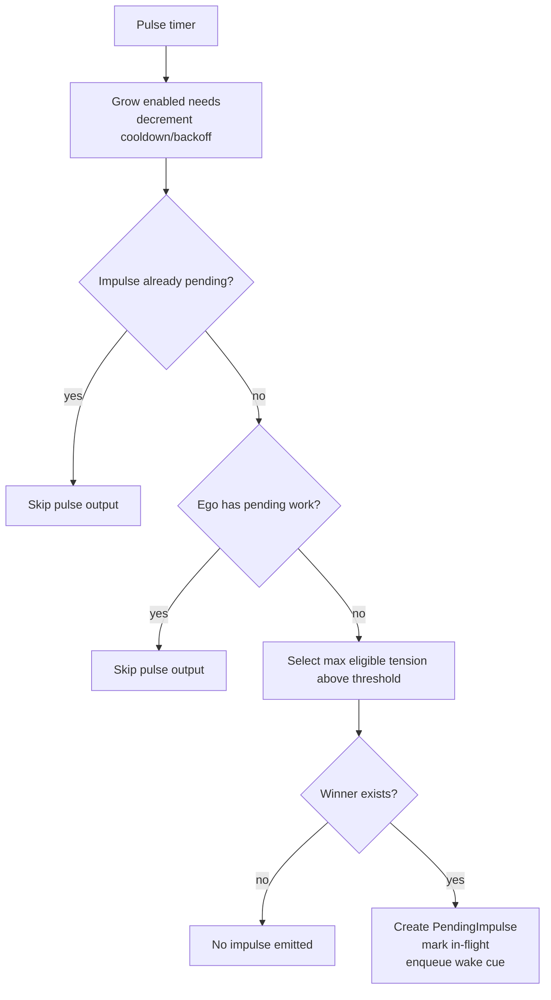
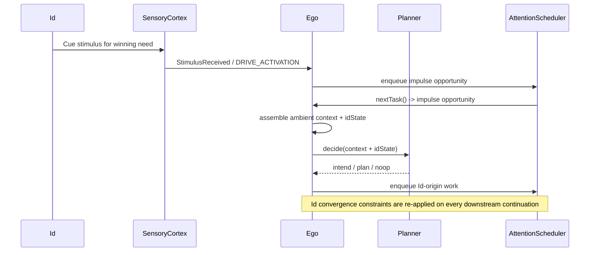

# Id and Impulse Diagram

This file covers the autonomous drive system, the impulse pulse loop, and the Ego-side lifecycle for Id-origin work.
For the main runtime entrypoint, see [../../AGENT_RUNTIME_LOGIC.md](../../AGENT_RUNTIME_LOGIC.md). For the general loop, see [EGO_LOOP_DIAGRAM.md](EGO_LOOP_DIAGRAM.md).

## L1: Id and Impulse Lifecycle

- Files: `src/main/kotlin/ai/neopsyke/agent/id/Id.kt`, `NeedState.kt`
- Config: `id-runtime.yaml` -> `IdConfig`
- Optional module; loaded only when enabled.

### Pulse Loop
1. Grow each configured need by `growthRate` and decrement cooldown, backoff, and in-flight timers.
2. Emit `id_pulse` telemetry.
3. Skip if an impulse is already pending.
4. Skip if Ego still has pending work.
5. Select the highest-tension eligible need, create `PendingImpulse`, enqueue it, and mark it in-flight.

### Need State
- `value` grows per pulse via `growthRate`, capped at `1.0`.
- `tension` is a curve-transformed view of value.
- Eligibility requires the need to be enabled, not in-flight, not cooling down, and not backed off.
- `ConvergenceMode` is either `CONTACT_USER` or `INTERNALIZE`.

### Ego-Side Lifecycle
- Each impulse root gets a lifecycle record keyed by `root_impulse_id`.
- Id-origin is propagated on every downstream enqueue path.
- Id convergence constraints are re-applied on every Id-origin thought.
- For satisfying actions, Ego clears remaining same-root work before follow-up.
- Id gets a final callback only when no pending scheduler work remains for the impulse root.

## L1: Impulse Pulse and Enqueue

## L2: Ambient Context Assembly

- Before planner/retrieval, Id assembles a shared ambient context snapshot:
  - Active assignments from `WorkItemRegistry`
  - Recent scratchpad themes from digests
  - Recent useful actions and updates from the logbook
  - Unresolved/open loops from active scratchpads
  - Recently explored exact learning topics (`recent_exact_learning_topics`)
- The snapshot is advisory only. It biases prompting and recall but does not force assignment alignment.
- Exact-repeat pressure is learning-specific. All needs can see recent exact learning topics, but only learning retrieval adds freshness guidance.

## L2: Denial Dynamics and Backoff

- `consecutiveDenials` tracks per need.
- `IdConfig.maxConsecutiveDenials` is authoritative for backoff thresholding.
- Backoff is exponential: `backoffPulses * 2^(denials / maxConsecutiveDenials)`, capped by `MAX_BACKOFF_ESCALATION`.
- Successful satisfaction decays need value via `value *= (1 - satisfactionDecay)`.
- Activity decay is configurable per event type.

## L1: Id-Origin Work Through Ego

