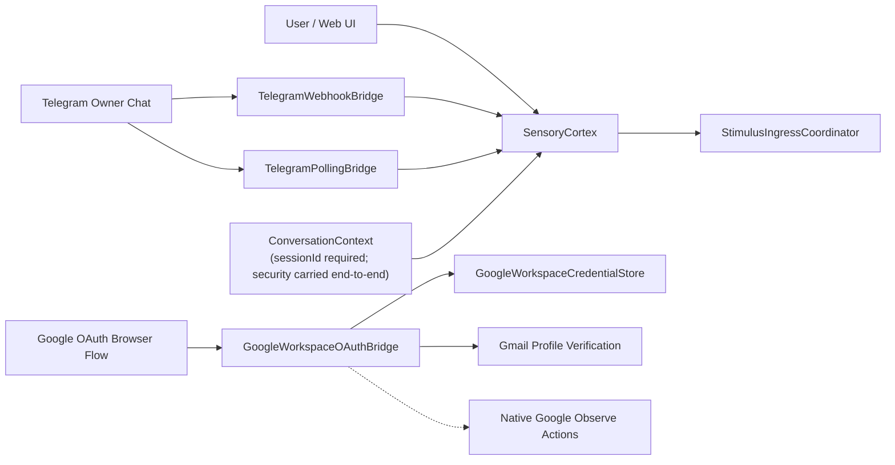
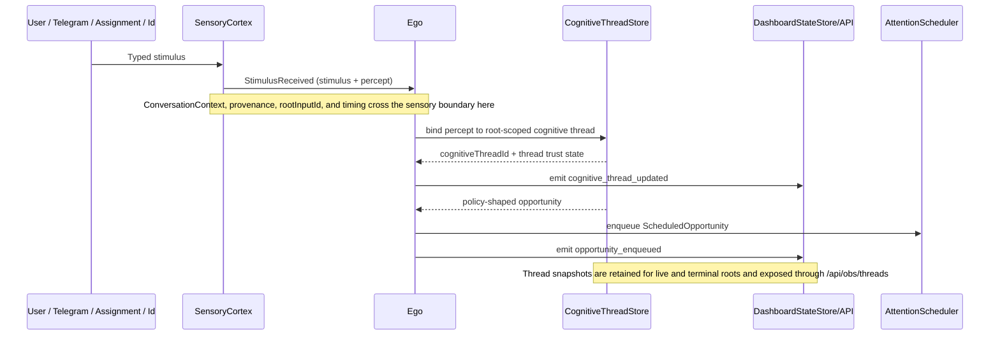
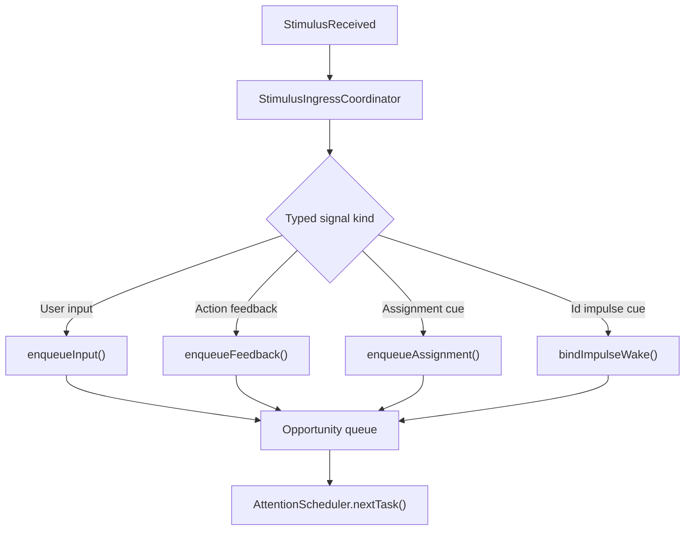

# Input and Threading Diagram

This file covers linguistic ingress, security/context binding, percept appraisal, and the handoff into the scheduler.
For the unified runtime entrypoint, see [../../AGENT_RUNTIME_LOGIC.md](../../AGENT_RUNTIME_LOGIC.md). For planner internals, see [PLANNER_FLOW_DIAGRAM.md](PLANNER_FLOW_DIAGRAM.md).

## L1: SensoryCortex and Input Path

- File: `src/main/kotlin/ai/neopsyke/agent/cortex/sensory/SensoryCortex.kt`
- Receives signals from `SignalSource`.
- Two signal planes:
  - `CognitiveSignal` — `StimulusReceived`, `FeedbackReceived`, `NoStimulus`
  - `RuntimeControlSignal` — `SourceClosed`, `ExitRequested`, `ShutdownRequested`, `ConfigReloaded`
- `nextSignal()` is the mandatory stimulus-to-percept boundary:
  - prioritizes synthetic signals over external signals
  - enriches and clamps stimuli
  - resolves session identity and interlocutor
  - appraises the envelope into a typed `Percept`
- Typed cognitive stimuli currently arrive as user chat, owner-only Telegram, Id cues, assignment-runtime cues, and action feedback cues.

## L1: Channel and Auth Ingress

### L2: Conversation Security Context

- `ConversationContext` is mandatory end-to-end and requires a non-blank `sessionId`.
- `ConversationContext.security` normalizes principal role, channel, instruction trust, and policy scope.
- Factory methods include `ownerDirect(...)`, `externalParticipant(...)`, and `internalAutomation(...)`.
- Current ingress defaults:
  - dashboard chat -> trusted owner direct-chat
  - stdin -> control-only, no chat stimuli
  - Telegram -> trusted owner after webhook-secret and allowlist checks
  - Id and assignment cues -> trusted internal automation
- Session replay reconstructs security from recorded signal fields.

### L2: Telegram Ingress

- Transport modes:
  - `webhook` -> Telegram POSTs to NeoPsyke
  - `polling` -> NeoPsyke calls `getUpdates` and clears any existing webhook on startup
- Requires exact `X-Telegram-Bot-Api-Secret-Token` match.
- Can require private chats only plus owner `chat_id` and `user_id`.
- Unauthorized traffic fails closed or is silently dropped depending on configuration.
- Sessions are derived via `<sessionIdPrefix>:<chatId>`.
- Owner chat traffic routes through the approval interceptor before normal sensory enqueue when a live approval is pending.

### L2: Google Workspace Auth

- OAuth starts via the local NeoPsyke HTTP endpoint and redirects to Google.
- Callback flow verifies signed state, consumes encrypted PKCE state, exchanges the code, verifies Gmail profile email against the configured owner, and stores encrypted credentials locally.
- Read-only Gmail and Calendar actions stay unavailable until authorization completes.

### L2: Perceptual Appraisal and Thread Binding

- `PerceptualAppraiser` maps stimulus families to percept families:
  - `LINGUISTIC` -> `REQUEST`
  - `OBSERVATION` -> `OBSERVATION`
  - `FEEDBACK` -> `FEEDBACK`
  - `CUE` -> `DRIVE_ACTIVATION` or `STATE_CHANGE`
- `StimulusEnvelope` carries id, family, source, content, timing, conversation context, trust level, provenance, and metadata.
- `Percept` carries id, family, summary, source, timing, conversation context, thread id, and provenance.
- `CognitiveThreadStore` binds percepts to root-scoped cognitive threads and tracks thread identity, status, latest percept, root-scoped trust, and observed-artifact trust degradation.

## L1: Sensory Boundary to Thread Binding

## L2: Stimulus Classification Before Planning

