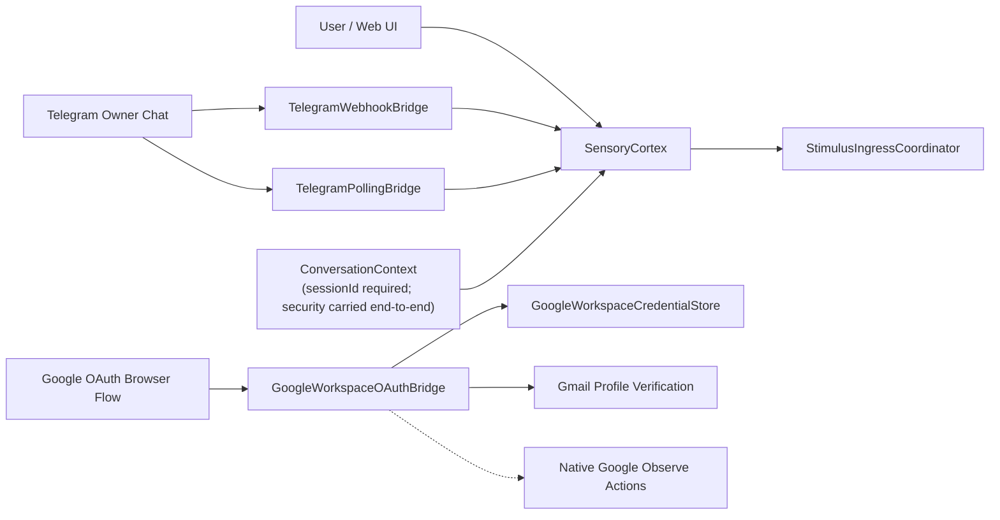
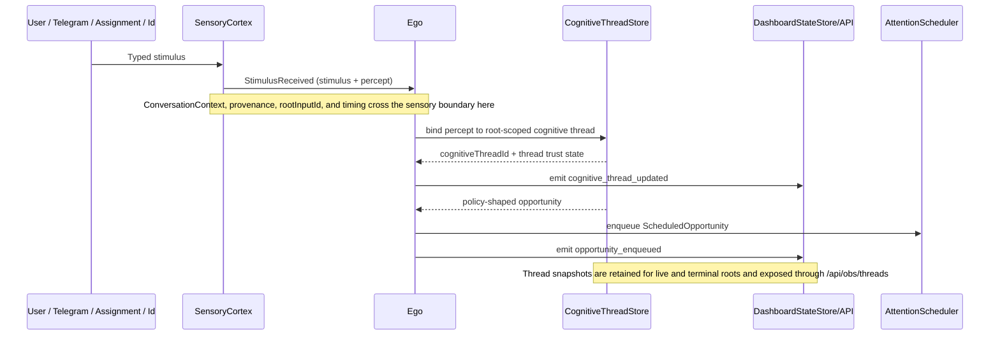
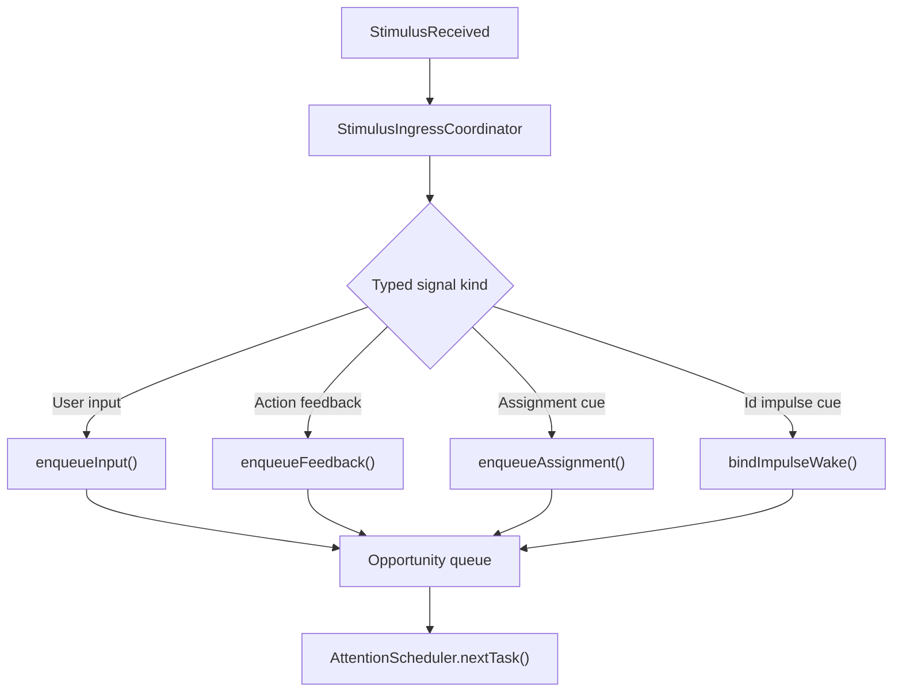

# Input and Threading Diagram

This file covers linguistic ingress, security/context binding, and the handoff into the scheduler.
For planner-internal routing, see [../PLANNER_FLOW_DIAGRAM.md](../PLANNER_FLOW_DIAGRAM.md). For later loop stages, see [EGO_LOOP_DIAGRAM.md](EGO_LOOP_DIAGRAM.md).

## L1: Channel and Auth Ingress

## L1: Sensory Boundary to Thread Binding

## L2: Stimulus Classification Before Planning

