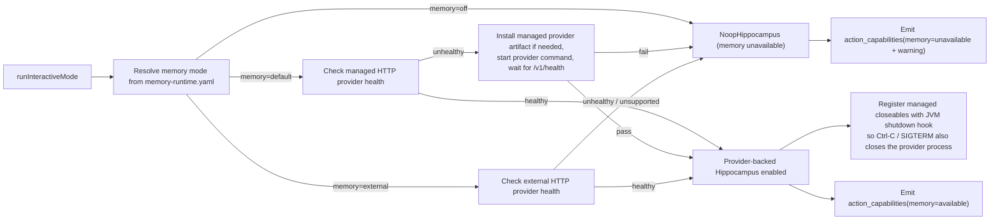
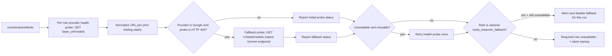
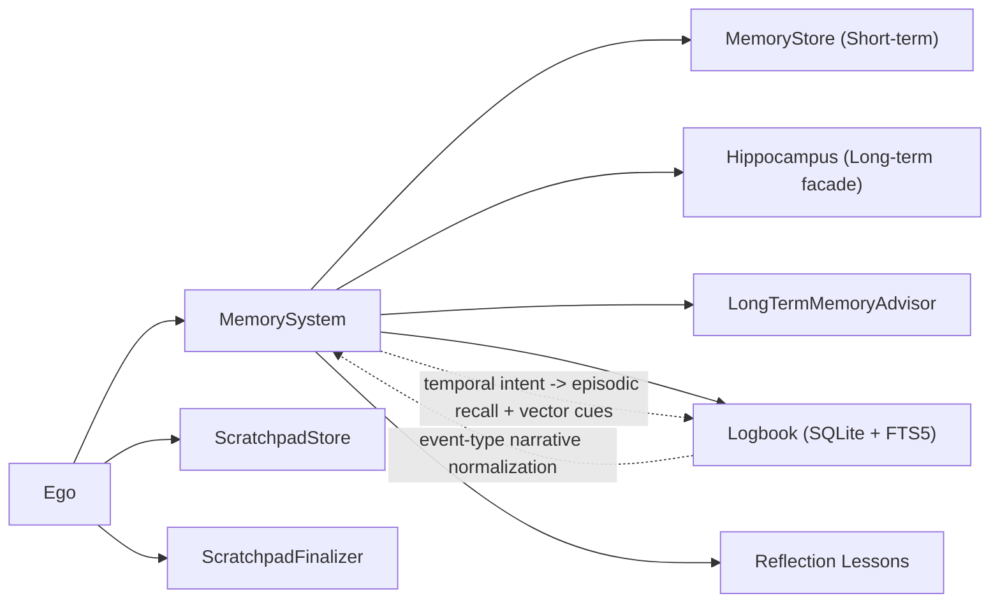
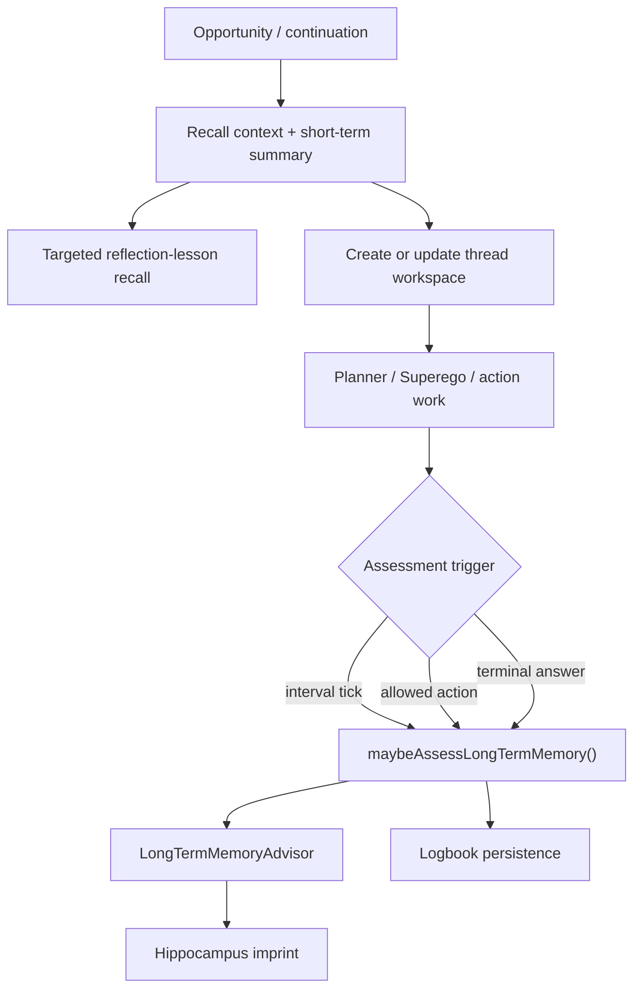

# Memory and Startup Diagram

This file covers provider startup gates, memory tiers, long-term persistence controls, and scratchpad behavior.
For the unified runtime entrypoint, see [../../AGENT_RUNTIME_LOGIC.md](../../AGENT_RUNTIME_LOGIC.md).

## L2: LLM Provider Configuration

- Each cognitive role can use an independent provider, API key, base URL, and model from `llm-runtime.yaml`.
- Supported providers: `anthropic`, `groq`, `google`, `mistral`, `ollama`, `openai`.
- `meta_reasoner_fallback` is optional and only used on repeated technical failures.
- Optional `model_catalog` adds `tier`, `token_weight`, and cost metadata.
- Superego and `LongTermMemoryAdvisor` read `token_weight` for dynamic completion-budget scaling.
- `web_search` routing is configured independently from cognitive roles.

## L2: Startup Memory Gate

- `memory=off` -> `NoopHippocampus`
- `memory=default` -> managed provider bootstrap and health wait
- `memory=external` -> external HTTP provider only, never auto-started
- Startup failures downgrade memory to noop for the run.
- Managed closeables are registered with the JVM shutdown hook.

## L2: Startup LLM Provider Health Gate

- Startup probes each role with `GET base_url/models`.
- URL joins are normalized.
- Google-specific HTTP 404 probes fall back to `/v1beta/models`.
- Transient failures are retried once.
- `meta_reasoner_fallback` is optional and can be disabled for the run without aborting startup.

## L1: Memory System

- File: `src/main/kotlin/ai/neopsyke/agent/ego/MemorySystem.kt`
- Four tiers:
  1. short-term `MemoryStore`
  2. long-term `Hippocampus` plus `LongTermMemoryAdvisor`
  3. episodic `Logbook`
  4. per-request `ScratchpadStore`

## L1: Memory Subsystem View

### L2: Short-Term Memory
- File: `src/main/kotlin/ai/neopsyke/agent/memory/shortterm/MemoryStore.kt`
- Recent turns live in an `ArrayDeque`; older turns are folded into `rolledSummary`.
- Per turn content is capped and compaction keeps promptable memory bounded.
- `summaryForPrompt(maxTokens)` builds the short-term planner summary.

### L2: Long-Term Recall and Consolidation
- `Hippocampus` exposes `recall`, `imprint`, `consolidate`, and `health`; admin methods include `stats`, `forget`, and `reset`.
- Default implementation is `NoopHippocampus`.
- `LongTermMemoryAdvisor` decides `save` or `skip` with confidence, tags, and summary text.
- Saved summaries use first-person agent perspective.
- Subject classification distinguishes `user` and `self`, and self-origin memories are normalized away from user-preference framing.
- Oversized dialogue and recall blocks are compressed before the advisor prompt.
- Persistence is guarded by interval, cooldown, confidence, duplicate-fingerprint, and parse-fallback protections.
- Every blocked persistence emits `long_term_memory_persistence_skipped`.

### L2: Episodic Logbook
- File: `src/main/kotlin/ai/neopsyke/agent/memory/episodic/Logbook.kt`
- SQLite + FTS5 backend for events like `INPUT_RECEIVED` and `REFLECTION_SESSION`.
- Entries carry active channel, principal, and policy-scope metadata.
- Recall defaults to cross-session unless the user explicitly asks for filters.
- Temporal intent maps into episodic recall plus vector cues.

### L2: Reflection Lessons
- `ReflectionLesson` entries are created for denied-action and repeated-denied loops.
- Persisted as `MemoryImprint(source=ego_reflection_lesson)`.
- Deduplicated by recent fingerprint window.
- Skipped for technical and system failures.
- Injected back into planner prompts as reflection-lesson context.

### L2: Scratchpad (Thread Workspace)
- File: `src/main/kotlin/ai/neopsyke/agent/memory/scratchpad/ScratchpadStore.kt`
- Enabled by default and gated by plan activation.
- Per-thread workspace survives waits and resumes.
- Draft sequences are internal, excluded from planner prompt summaries, and reset when cognition leaves answer drafting.
- `promptSummary(...)` builds planner-facing scratchpad context.
- `buildFinalCompilation(...)` assembles the terminal answer candidate.
- Confidence estimate combines sections, evidence, and assignment signal.
- `ScratchpadFinalizer` can rewrite the final answer but keeps the original payload on failure.
- Dashboard workspace telemetry carries `root_input_id` and `root_input_received_at_ms`, and full snapshots are served on demand.

## L1: Per-Loop Recall and Assessment

