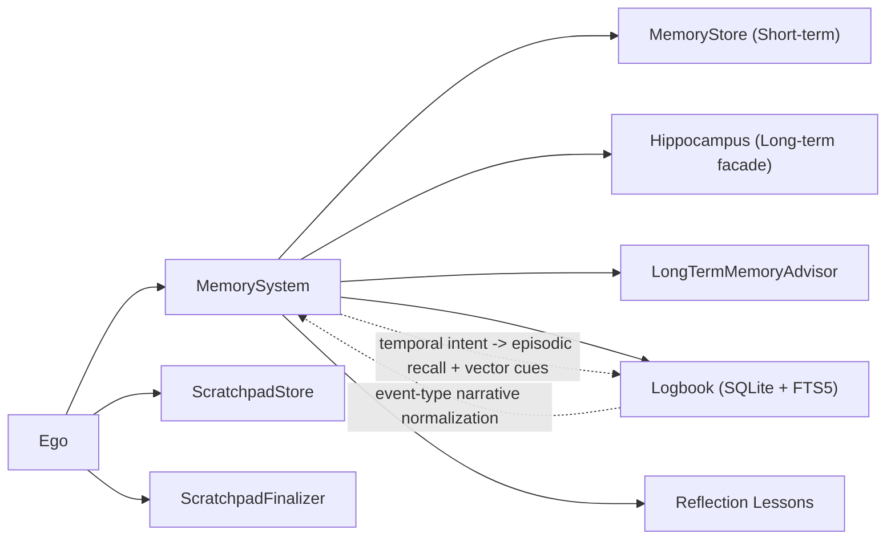
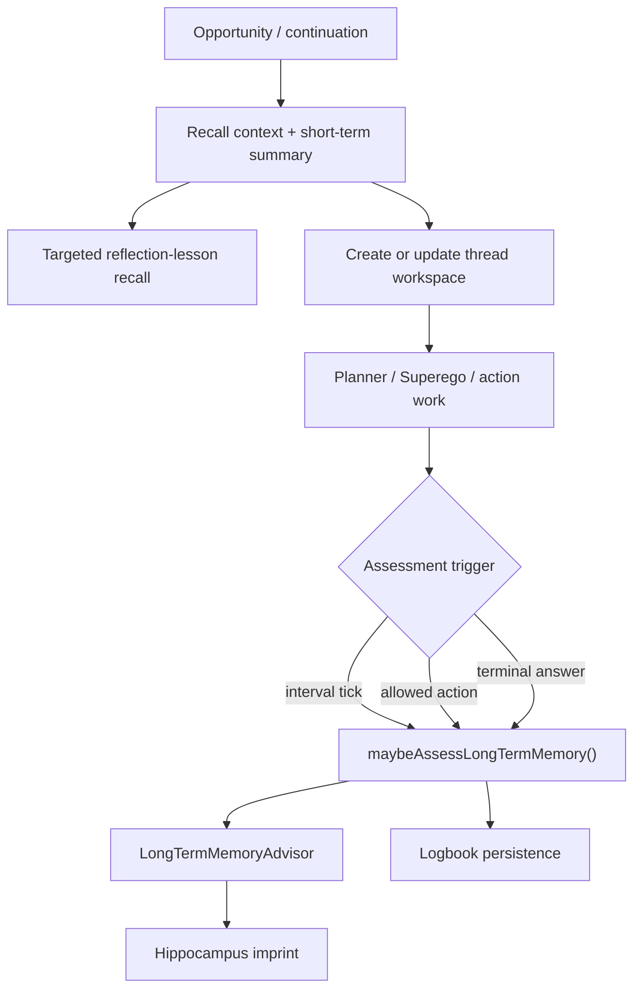
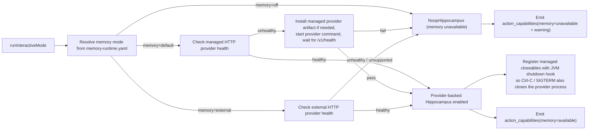
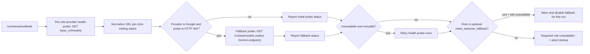

# Memory and Startup Diagram

This file covers memory components, per-loop memory touchpoints, and startup health gates.

## L1: Memory Subsystem View

## L1: Per-Loop Recall and Assessment

## L2: Startup Memory Gate

## L2: Startup LLM Provider Health Gate

