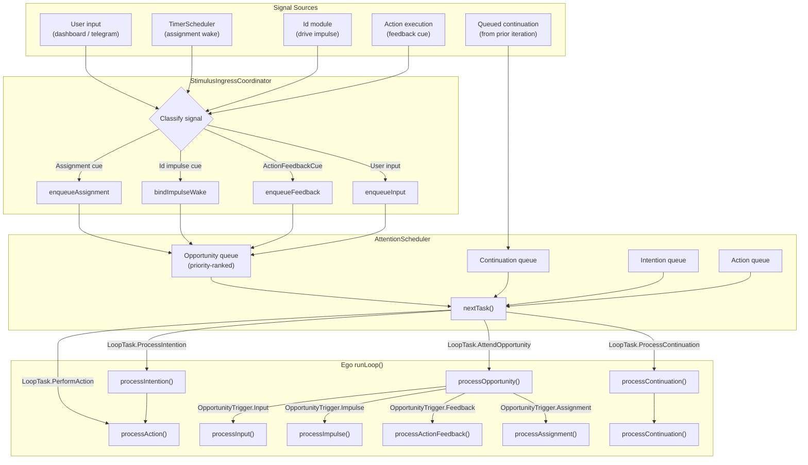
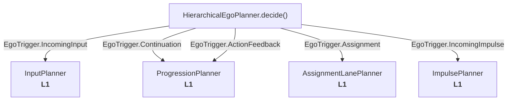
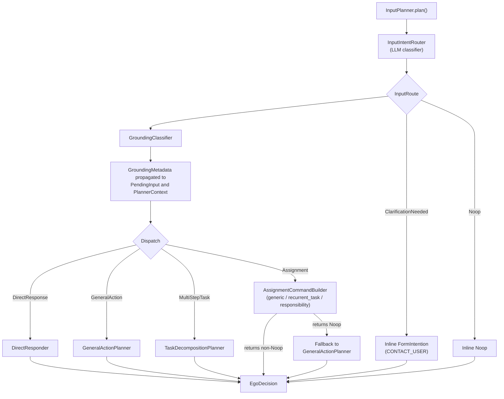
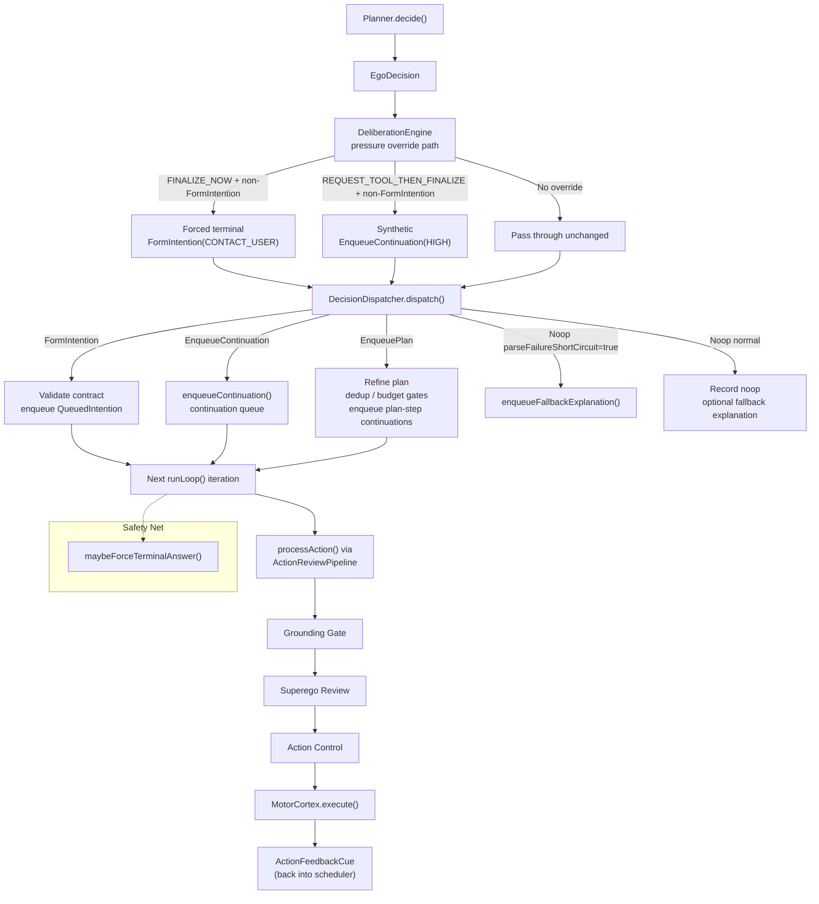
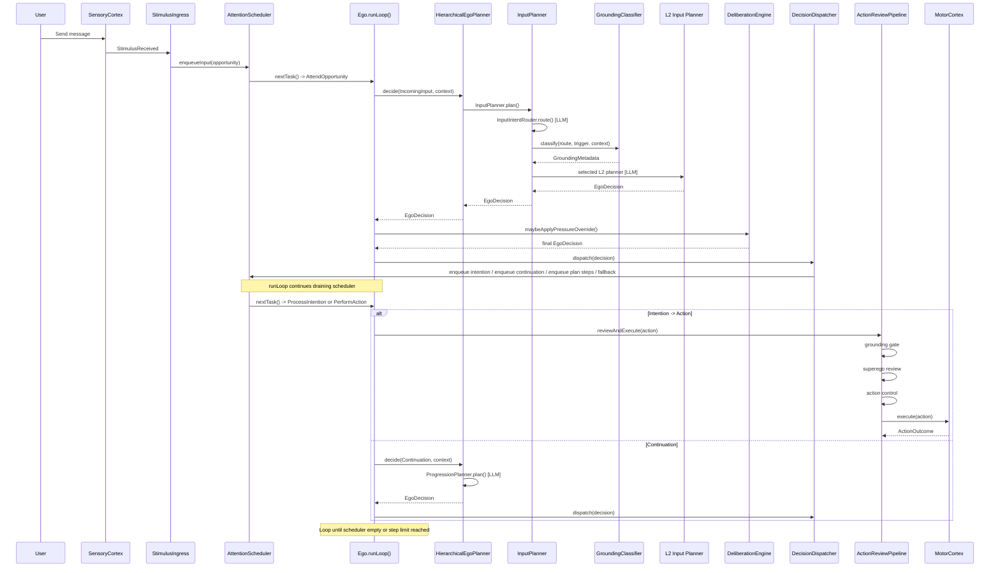

# Planner Flow Diagram

Current planner architecture as of 2026-04-19.

This file covers the planner slice of the runtime implemented under `src/main/kotlin/ai/neopsyke/agent/ego/planner/**`.
For the unified runtime entrypoint, see [../../AGENT_RUNTIME_LOGIC.md](../../AGENT_RUNTIME_LOGIC.md).

## L1: Planner (HierarchicalEgoPlanner)

- Files: `src/main/kotlin/ai/neopsyke/agent/ego/planner/**`
- The old monolithic `LlmEgoPlanner` has been deleted. A test-only shim remains under `src/test/kotlin/ai/neopsyke/agent/ego/LlmEgoPlanner.kt` for backward-compatible test signatures.

### Decision Types
- `FormIntention(urgency, intentionKind, commitModePreference, actionType, payload, summary)` -> execute an action
- `EnqueueContinuation(urgency, continuation)` -> queue typed resumable work
- `EnqueuePlan(urgency, assignment, steps)` -> multi-step typed plan
- `Noop(reason, parseFailureShortCircuit?, deniedActionType?, deniedActionPayload?, denialReasonCode?)` -> no action

### Plan Refinement
- File: `src/main/kotlin/ai/neopsyke/agent/ego/planner/PlanRefiner.kt`
- All plans, both inline Ego plans and assignment plans, pass through a single bounded refinement step before commit.
- `LlmPlanRefiner` makes one LLM call to repair or validate plans and follows the standard retry, validation, and fallback contract.
- `NoopPlanRefiner` is used for tests and when plan refinement is disabled.
- On failure, the runtime accepts the original plan when meaning is preserved and mechanical boundary checks still pass.

## Signal-to-Planner Pipeline

External events enter through `SensoryCortex`, are routed by `StimulusIngressCoordinator`, queued in `AttentionScheduler`, and dispatched by `Ego` to the planner. The planner returns an `EgoDecision`, which `DecisionDispatcher` turns into queued continuations, queued intentions, plan-step continuations, or fallback explanation behavior.

## L0: HierarchicalEgoPlanner (Entry Point)

- Single planner entry point behind `Ego.Planner`.
- Dispatch is typed: `when (trigger)` over the sealed `EgoTrigger` variants.
- No deterministic routing is performed on free text.
- Each L1 lane has its own runtime config entry and emits planner telemetry.

### Trigger-to-Lane Mapping

| Trigger | Origin | L1 lane | LaneId |
|---------|--------|---------|--------|
| `IncomingInput` | User / external chat ingress | `InputPlanner` | `INPUT_INTENT_ROUTER` |
| `Continuation` | Internal queue | `ProgressionPlanner` | `PROGRESSION` |
| `ActionFeedback` | Motor/action result cue | `ProgressionPlanner` | `PROGRESSION` |
| `Assignment` | Durable-work wake / step activation | `AssignmentLanePlanner` | `ASSIGNMENT` |
| `IncomingImpulse` | Id drive activation | `ImpulsePlanner` | `IMPULSE` |

## L1: Planner Lanes

| Lane | Trigger | File |
|------|---------|------|
| `InputPlanner` | `IncomingInput` | `lane/InputPlanner.kt` |
| `ProgressionPlanner` | `Continuation`, `ActionFeedback` | `lane/ProgressionPlanner.kt` |
| `AssignmentPlanner` | `Assignment` | `lane/AssignmentPlanner.kt` |
| `ImpulsePlanner` | `IncomingImpulse` | `lane/ImpulsePlanner.kt` |

Each lane:
- has its own narrower prompt asset under `config/prompts/planner/**`
- uses `PlannerRuntime` for model calls, retries, circuit breaking, and schema fallback
- parses typed lane-specific decision models before mapping back to `EgoDecision`
- validates allowed intentions, commit modes, and available actions
- emits per-lane prompt-budget telemetry

## InputPlanner (L1) -- Router, Grounding, L2 Dispatch

`InputPlanner` is the only L1 lane with an internal semantic routing stage. It calls `InputIntentRouter`, always calls `GroundingClassifier`, and then dispatches to the selected L2 sub-planner or handles clarification/noop inline.

### L2: InputPlanner Sub-Planners
- `InputIntentRouter` -> semantic classifier returning typed `InputRoute`
- `DirectResponder` -> terminal answers from current context
- `GeneralActionPlanner` -> single-action planning with full constraint validation
- `TaskDecompositionPlanner` -> multi-step plan decomposition
- `AssignmentCommandBuilder` -> typed assignment creation and management with LLM reference resolution

Dispatch from `InputRoute` to the sub-planner is deterministic on typed LLM output.

### InputIntentRouter Routes

| Route | Target / meaning | L2 handling | Typical result |
|-------|------------------|-------------|----------------|
| `DirectResponse` | Answer from current context | `DirectResponder` | `FormIntention(CONTACT_USER)` or `Noop` |
| `GeneralAction` | One explicit next action | `GeneralActionPlanner` | `FormIntention(...)` or `Noop` |
| `MultiStepTask` | Ordered multi-stage task | `TaskDecompositionPlanner` | `EnqueuePlan` or `Noop` |
| `Assignment` | Persistent work interaction | `AssignmentCommandBuilder` | `FormIntention(ASSIGNMENT_OPERATION)` or `FormIntention(CONTACT_USER)` or `Noop` |
| `ClarificationNeeded` | Missing or ambiguous intent | inline | `FormIntention(CONTACT_USER)` |
| `Noop` | No actionable intent | inline | `Noop` |

For `Assignment`, `assignment_target` is one of `generic`, `recurrent_task`, or `responsibility`.

### L2: Assignment Semantics (Typed)
- Assignment creation and management emit typed `AssignmentCommand` variants.
- Assignment references are LLM-resolved and represented as typed `WorkItemReference` variants.
- Planner payloads use a canonical serialized typed boundary: `SerializedAssignmentCommand`.
- `AssignmentOperationActionPlugin` validates and executes typed commands without text heuristics.
- Ambiguous or unresolved references trigger clarification or failure, never silent guessing.

### GroundingClassifier

- Runs after route selection and before L2 dispatch.
- Deterministic `NOT_REQUIRED` prefilter:
  - `InputRoute.Assignment`
  - `InputRoute.ClarificationNeeded`
  - `InputRoute.Noop`
- LLM classification for:
  - `InputRoute.DirectResponse`
  - `InputRoute.GeneralAction`
  - `InputRoute.MultiStepTask`
- Result is copied into grounded `PendingInput` and `PlannerContext.groundingMetadata`.

### L2: Prompt Budget and Assembly
- `PromptBudgetAllocator` reserves required-core and context floors with message-overhead accounting.
- `PromptCatalog` loads hot-reloadable prompt and schema assets from `config/prompts/**` or `NEOPSYKE_PROMPTS_DIR`.
- Static lane instructions, retry text, planner-facing action descriptor fragments, and migrated JSON schemas live as prompt assets.
- Ego persona prompts receive the typed `agent.persona.name` value at render time.
- Superego action directives are Kotlin-owned governance instructions, not hot-reloadable prompt assets.
- `SharedPromptSections` provides typed runtime context sections across lanes; prompt assets provide human-editable instruction and schema-framing text.
- Rendered LLM calls carry prompt/schema id and hash metadata for observability.
- `prompt_budget_allocation` telemetry is emitted per lane.

### L2: Structured Output and Parse Recovery
- Lanes request schema-enforced structured output from schema assets.
- `StructuredOutputHandler` parses JSON with escape-repair fallback.
- On parse failure: truncation retry, then strict-JSON retry.
- Per-lane circuit breaker short-circuits to `Noop` after repeated parse failures.
- `PlannerRuntime` owns retry, provider-side schema fallback, and circuit breaking.
- Invalid hot-reload edits keep the last valid in-memory prompt/schema and log a structured error; startup fails if the initial asset is invalid.

### L2: Action Verifier
- Removed from the redesigned planner path.
- Planner correctness comes from lane design, typed outputs, and downstream runtime controls.

### L2: Redundancy Handling
- Planner treats repeated external calls as low-value unless refresh or retry is explicitly needed.
- `Ego` emits `external_action_redundancy_signal` as a soft cost-control signal.

## L1 Lane Decision Capabilities

Planner lanes do not currently emit `EgoDecision.EnqueueContinuation` directly; that shape is introduced later by deliberation pressure overrides.

| EgoDecision | InputPlanner | ProgressionPlanner | AssignmentLanePlanner | ImpulsePlanner |
|-------------|:-----------:|:------------------:|:----------------------:|:-------------:|
| `FormIntention` | via L2 | yes | yes | yes |
| `EnqueuePlan` | via L2 | yes | yes | no |
| `Noop` | via L2 | yes | yes | yes |
| `EnqueueContinuation` | no | no | no | no |

### L2 Input Sub-Planner Capabilities

| L2 planner | Returns |
|-----------|---------|
| `DirectResponder` | `FormIntention(CONTACT_USER)` or `Noop` |
| `GeneralActionPlanner` | `FormIntention(...)` or `Noop` |
| `TaskDecompositionPlanner` | `EnqueuePlan` or `Noop` |
| `AssignmentCommandBuilder` | `FormIntention(ASSIGNMENT_OPERATION)` or `FormIntention(CONTACT_USER)` or `Noop` |

## Post-Planner Pipeline

After `planner.decide(...)`, `Ego` lets `DeliberationEngine` apply pressure overrides and then passes the final `EgoDecision` to `DecisionDispatcher`.

## Planner Slice Through One Input

## Circuit Breaker Coverage

Only some planner lanes use the per-root parse-failure circuit breaker in `PlannerRuntime`.

| LaneId | Circuit breaker |
|--------|:---------------:|
| `INPUT_INTENT_ROUTER` | no |
| `DIRECT_RESPONSE` | no |
| `GENERAL_ACTION` | yes |
| `TASK_DECOMPOSITION` | no |
| `ASSIGNMENT_GENERIC` | no |
| `ASSIGNMENT_RECURRENT_TASK` | no |
| `ASSIGNMENT_RESPONSIBILITY` | no |
| `PROGRESSION` | yes |
| `ASSIGNMENT` | yes |
| `IMPULSE` | yes |
| `GROUNDING_CLASSIFIER` | no |
| `PLAN_REFINER` | no |

When a circuit-backed lane trips, it returns `Noop(parseFailureShortCircuit = true)`, which routes directly to fallback explanation instead of ordinary noop handling.

## File Index

| Component | File |
|-----------|------|
| `HierarchicalEgoPlanner` | `src/main/kotlin/ai/neopsyke/agent/ego/planner/HierarchicalEgoPlanner.kt` |
| `PlannerLane` | `src/main/kotlin/ai/neopsyke/agent/ego/planner/PlannerLane.kt` |
| `LaneId` | `src/main/kotlin/ai/neopsyke/agent/ego/planner/LaneId.kt` |
| `InputPlanner` | `src/main/kotlin/ai/neopsyke/agent/ego/planner/lane/InputPlanner.kt` |
| `ProgressionPlanner` | `src/main/kotlin/ai/neopsyke/agent/ego/planner/lane/ProgressionPlanner.kt` |
| `AssignmentLanePlanner` | `src/main/kotlin/ai/neopsyke/agent/ego/planner/lane/AssignmentLanePlanner.kt` |
| `ImpulsePlanner` | `src/main/kotlin/ai/neopsyke/agent/ego/planner/lane/ImpulsePlanner.kt` |
| `InputIntentRouter` | `src/main/kotlin/ai/neopsyke/agent/ego/planner/input/InputIntentRouter.kt` |
| `GroundingClassifier` | `src/main/kotlin/ai/neopsyke/agent/ego/planner/input/GroundingClassifier.kt` |
| `DirectResponder` | `src/main/kotlin/ai/neopsyke/agent/ego/planner/input/DirectResponder.kt` |
| `GeneralActionPlanner` | `src/main/kotlin/ai/neopsyke/agent/ego/planner/input/GeneralActionPlanner.kt` |
| `TaskDecompositionPlanner` | `src/main/kotlin/ai/neopsyke/agent/ego/planner/input/TaskDecompositionPlanner.kt` |
| `AssignmentCommandBuilder` | `src/main/kotlin/ai/neopsyke/agent/ego/planner/input/AssignmentCommandBuilder.kt` |
| `InputRoute` | `src/main/kotlin/ai/neopsyke/agent/ego/planner/model/InputRoute.kt` |
| `EgoTrigger` / `EgoDecision` | `src/main/kotlin/ai/neopsyke/agent/model/CognitionModels.kt` |
| `DecisionDispatcher` | `src/main/kotlin/ai/neopsyke/agent/ego/DecisionDispatcher.kt` |
| `DeliberationEngine` | `src/main/kotlin/ai/neopsyke/agent/ego/DeliberationEngine.kt` |
| `ActionReviewPipeline` | `src/main/kotlin/ai/neopsyke/agent/ego/ActionReviewPipeline.kt` |
